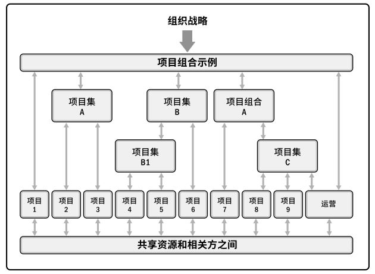
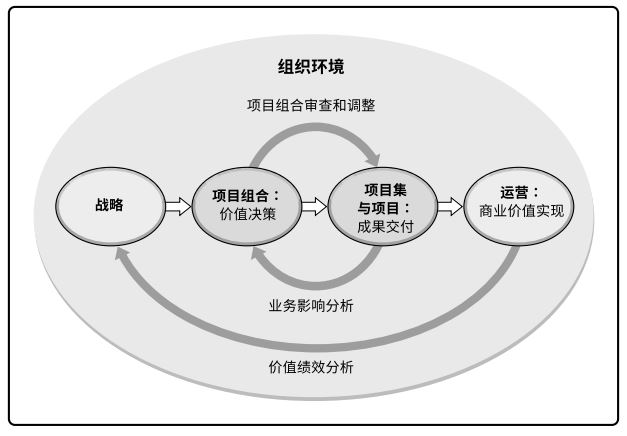
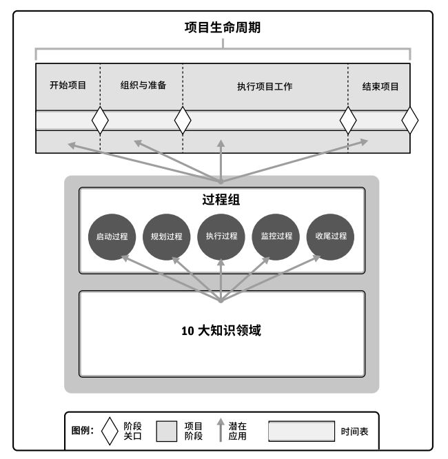

# 引论

## 1.1 指南概述和目的
 
《PMBOK指南》收录项目管理知识体系中被**普遍认可**为“**良好实践**”的那一部分知识体系(BOK)。  
> 普遍认可：指在大多数时候适用于大多数项目，并且其价值和有效性已获得一致认可。  
> 良好实践：指在项目管理过程中使用这些知识、技能、工具和技术，能够达到预期的商业价值和成果，从而提高很多项目成功的可能性。  

项目经理与项目团队和其他相关方，确定过程、输入、工具、技术、输出和生命周期的恰当组合以管理项目的过程，即指裁剪应用。  

### 1.1.1 项目管理标准
**标准**是基于权威、惯例或共识而建立并用作模式或范例的文件。  
项目管理标准和指南均基于**描述性实践**，而不是**规范性实践**。因此，标准确认了在大多数时候都被大多数项目视作良好实践的过程，还确认了通常与这些过程相关的输入和输出。  

### 1.1.2 通用词汇
通用词汇是专业学科的基本要素。《PMI项目管理术语词典》收录了基本的专业词汇，供组织、项目组合、项目集和项目经理及其他项目相关方统一使用。

### 1.1.3 道德与专业行为规范
全球项目管理业务定义的最重要的价值观是**责任**、**尊重**、**公正**和**诚实**。PMI发布的《道德与专业行为规范》确立了这四个价值观的基础地位。  
《道德与专业行为规范》包括期望标准和强制标准。  

## 1.2 基本要素

### 1.2.1 项目
**项目**是为创造独特的产品、服务或成果而进行的临时性工作。  
+ **独特性**。 
+ **临时性**。 
+ **渐进明细性**。 
 
开展项目是为了通过可交付成果达成项目目标。**可交付成果**指的是在某一过程、阶段或项目完成时，必须产出的任何独特并可核实的产品、成果或服务能力。  

项目的临时性是指项目有**明确的起点和终点**。临时性并不一定意味着项目的持续时间短。在以下一种或多种情况下，项目即宣告结束：  
+ 达成项目目标；
+ 不会或不能达到目标；
+ 资金耗尽或再无可分配给项目的资金；
+ 项目需求不复存在；
+ 无法获得所需人力或物力资源；
+ 出于法律或便利原因而终止项目。  

虽然项目是临时性工作，但其可交付成果可能会在项目的终止后依然存在。  
+ 项目驱动变革。  
从商业角度来看，项目旨在推动组织从一个状态(当前状态)转到另一个状态(将来状态)，从而达成特定目标。  
+ 项目创造商业价值。  
PMI将商业价值定义为从商业运作中获得的**可量化净效益**。项目的商业价值指特定项目的成果能够为相关方带来的有形的、无形的或两者兼有的效益。  
+ 项目启动背景。  
组织领导者启动项目是为了应对影响该组织的因素。这些因素说明了项目背景，大致分为四类：  
	- 符合法规、法律或社会要求；
	- 满足相关方的要求或需求；
	- 执行、变更业务或技术战略；
	- 创造、改进或修复产品、过程或服务。  
	
  
  
  **表 1-1 促成项目创建的因素示例**   
  
| 特定因素 | 特定因素示例 | 符合法规、法律或社会要求 | 满足相关方的要求或需求 | 创造、改进或修复产品、过程或服务 | 执行、变更业务或技术战略 |  
| :---- | :------ | :----: | :----: | :----: | :----: |  
| **新技术** | 某电子公司批准一个新项目，在计算机内存和电子技术发展基础上，开发一种高速、廉价的小型笔记本电脑 | | | X | X |  
| **竞争力** | 为保持竞争力，产品价格要低于竞争对手产品价格，需要降低生产成本 | | | | X |  
| **材料问题** | 某市政桥梁的一些支承构件出现裂缝，因此需要实施一个项目来解决问题 | X | | X |  |  
| **政治变革** | 在某新当选官员促动下，当前某项目经费发生变更 |  |  |  | X |  
| **市场需求** | 为应对汽油紧缺，某汽车公司批准一个低油耗车型的研发项目 |  | X | X | X |  
| **经济变革** | 经济滑坡导致当前项目优先级发送变更 |  |  |  | X |  
| **客户要求** | 为了给新工业园区供电，某电力公司批准一个新变电站建设项目 |  | X | X |  |  
| **相关方需求** | 某相关方要求组织进行新的输出 |  | X |  |  |  
| **法律要求** | 某化工制造商批准一个项目，为妥善处理一种新的有毒材料指定指南 | X |  |  |  |  
| **业务过程改进** | 某组织实施一个运用精益六西格玛价值流程的项目 |  |  | X |  |  
| **战略机会或业务需求** | 为增加授予，某培训公司批准一个项目，开发一门新课程 |  |  | X | X |  
| **社会需要** | 为应对传染病频发，某发展中国家的非政府组织批准一个项目，为社区建设饮用水系统和公共厕所，并开展卫生教育 |  | X |  |  |  
| **环境考虑** | 为减少污染，某上市公司批准一个项目，开创电动汽车共享服务 |  |  | X | X |  

### 1.2.2 项目管理的重要性  
项目管理就是将知识、技能、工具与技术应用于项目活动，以满足项目的要求。项目管理通过合理运用与整合特定项目所需的项目管理过程来实现。项目管理使组织能够有效且高效地开展项目。  

项目是组织**创造价值和效益**的主要方式。为了在全区经济中保持竞争力，公司日益广泛利用项目管理，来持续创造商业价值。有效和高效的项目管理应被视为组织的战略能力，它使组织能够：  
+ 将项目成果与业务目标联系起来；
+ 更有效地展开市场竞争；
+ 实现可持续发展；
+ 通过适当调整项目管理计划，以应对商业环境改变给项目带来的影响。  

### 1.2.3 项目、项目集、项目组合以及运行管理之间的关系

#### 1.2.3.1 概述
一个项目可以采用三种不同的模式进行管理：作为一个独立项目(不包括在项目组合或项目集中)、在项目集内或在项目组合内。如果在项目组合或项目集内管理某个项目，则项目经理需要与项目集和项目组合经理互动合作。  
**项目集**是一组相互关联且被协调管理的项目、子项目集和项目集活动，以便获得分别管理所无法获得的利益。  
**项目组合**是指为实现战略目标而组合在一起管理的项目、项目集、子项目组合和运营工作。  
  

从组织的角度来看项目、项目集合项目组合管理：  
+ **项目集管理**和**项目管理**的重点在于以“正确”的方式开展项目集和项目；
+ **项目组合管理**则注重于开展“正确”的项目集和项目。  

**表 项目、项目集、项目组合管理的比较概述**  
  
|  | 项目 | 项目集 | 项目组合 |   
| :------: | ----- | ---- | ------- |  
| **定义** | 项目是为创建独特的产品、服务或成果而进行的临时性工作。  | 项目集是一组相互关联且被协调管理的项目、子项目集和项目集活动，以便获得分别管理所无法获得的效益。 | 项目组合适为实现战略目标而组合在一起管理的项目、项目集、子项目组合和运营工作的集合。 |   
| **范围** | 项目具有明确的目标。范围在整个项目生命周期中是渐进明细的。 | 项目集的范围包括其项目集组件的范围。项目集通过确保各项目集组件的输出和成果协调互补，为组织带来效益。 | 项目组合的组织范围随着组织战略目标的变化而变化。 |   
| **变更** | 项目经理对变更和实施过程做出预期，实现对变更的管理和控制。 | 项目集的管理方法是，随着项目集各组件成果和/或输出的交付，在必要时接收和适应变更，优化效益实现。 | 项目组合经理持续监督更广泛内外部环境的变更。 |   
| **规划** | 在整个项目生命周期中，项目经理渐进明晰高层次信息，将其转化为详细的计划。 | 项目集的管理利用高层次计划，跟踪项目集组件的依赖关系和进展。项目集计划也用于在组件层级指导规划。 | 项目组合经理建立并维护与总体项目组合有关的必要过程和沟通。 |   
| **管理** | 项目经理为实现项目目标而管理项目团队。 | 项目集由项目集经理管理，其通过协调项目集组件的活动，确保项目集效益按预期实现。 | 项目组合经理可管理或协调项目组合管理人员或对总体项目组合负有报告之歌的项目集和项目人员。 |   
| **监督** | 项目经理监控项目开展中生产产品、提供服务或成果的工作。 | 项目集经理监督项目集组件的进展，确保整体目标、进度计划、预算和项目集效益的实现。 | 项目组合经理监督战略变更以及总体资源分配、绩效成果和项目组合风险。 |   
| **成功** | 成功通过产品和项目的质量、时间表、预算的依从性以及客户满意度水平进行衡量。 | 项目集的成功通过项目集向组织交付预期效益的能力以及项目集交付所述效益的效率和效果进行衡量。 | 成功通过项目组合的总体投资效果和实现的效益进行衡量。 |   
 
#### 1.2.3.2 项目集管理
**项目集管理**指在项目集中应用知识、技能与原则来实现项目集的目标，获得分别管理项目集组件所无法实现的利益和控制。项目管理注重**项目内部的相互依赖关系**，以确定管理项目的最佳方法。项目集管理注重**项目与项目以及项目与项目集之间的依赖关系**，以确保这些项目的最佳方法。项目集与项目间依赖关系的具体管理措施可能包括：  
+ 调整对项目集和项目的目的和目标有影响的组织或战略方向；
+ 将项目集范围分配到项目集组成部分；
+ 管理项目集组成部分之间的依赖关系，从而以最佳方式实施项目集；
+ 管理可能影响项目集内多个项目的项目集风险；
+ 解决影响项目集内多个项目的制约因素和冲突；
+ 解决作为组成部分的项目与项目集之间的问题；
+ 在同一个治理框架内管理变更请求；
+ 将预算分配到项目集内的多个项目；
+ 确保项目集及其包含的项目能够实现效益。  

#### 1.2.3.3 项目组合管理  
**项目组合**是指为实现战略目标而组合在一起管理的项目、项目集、子项目组合和运营工作。  

**项目组合管理**是指为了实现战略目标而对一个或多个项目组合进行的集中管理。项目组合中的项目集或项目不一定彼此依赖或直接相关。  

项目组合管理的目标是：  
+ 指导组织的投资决策；
+ 选择项目集与项目的最佳组合方式，以达成战略目标；
+ 提供决策透明度；
+ 确定团队和实物资源分配的优先顺序；
+ 提高实现预期投资回报的可能性；
+ 实现对所有组成部分的综合风险的集中式管理。  

#### 1.2.3.4 运营管理
运营管理关注产品的持续生产和(或)服务的持续运作。它使用最优资源满足客户要求，来保证业务运作的持续高效。它重点管理那些把各种输入(如材料、零件、能源和劳力)转变为输出(如产品、商品和服务)的过程。  

#### 1.2.3.5 运营与项目管理
业务或组织运营的改变也许就是某个项目的关注焦点，尤其当项目交付的新产品或新服务将导致业务运营的有实质性改变时。持续运营不属于项目的范畴，但是它们之间存在交叉。  
项目与运营会在产品生命周期的不同时点交叉，例如：  
+ 在新产品开发、产品升级或提高产量时；
+ 在改进运营或产品开发流程时；
+ 在产品生命周期结束阶段；
+ 在每个收尾阶段。  

在每个交叉点，可交付成果及知识在项目与运营之间转移，以完成工作交接。在这一过程中，将转移项目资源或知识到运营中，或转移运营资源到项目中。  

#### 1.2.3.6 组织级项目管理(OPM)和战略
项目组合、项目集和项目均需符合组织战略，或由组织战略驱动，并以不同的方式服务于战略目标的实现。  

OPM指为实现战略目标而整合项目组合、项目集和项目管理与组织驱动因素的框架。  

 

### 1.2.4 指南的组成部分
项目包含几个关键组成部分如果有效管理这些组成部分，项目才能成功完成。  

| 《PMBOK指南》关键组成部分 | 简介 |
| ------- | ------ | 
| **项目生命周期** |项目从开始到结束所经历的一系列阶段。 |
| **项目阶段** | 一组具有逻辑关系的项目活动的集合，通常以一个或多个可交付成果的完成为结束。 |
| **阶段关口** | 为做出进入下个阶段、进行整改或结束项目集或项目的决定，而开展的阶段末审查。 |
| **项目管理过程** | 旨在创造最终结果的系统化的系列活动，以便对一个或多个输入进行加工，生成一个或多个输出。 |
| **项目管理过程组** | 项目管理输入、工具和技术以及输出的逻辑组合。项目管理过程组包括启动、规划、执行、监控和收尾。项目管理过程组不同于项目阶段。 |
| **项目管理知识领域** | 按所需知识内容来定义的项目管理领域，并用其所含过程、做法、输入、输出、工具和技术进行描述。 |  

  

#### 1.2.4.1 项目和开发生命周期

**项目生命周期(Project Life Cycle)** 指项目从启动到完成、从开始到结束所经历的一系列阶段。项目生命周期可以是**预测型**或**适应型**。  
项目生命周期内通常有一个或多个阶段与产品、服务或成果的开发相关，这些阶段称为**开发生命周期**。开发生命周期分为：  
+ **预测型生命周期**，在生命周期的早期阶段确定项目范围、时间和成本。对任何范围的变更都要进行仔细管理。也称**瀑布型生命周期**。  
+ **迭代型生命周期**，项目范围通常于项目生命周期的早期确定，但时间及成本估算将随着项目团队对产品理解的不断深入而定期修改。通过一系列重复的循环活动来开发产品。（区分增量型）
+ **增量型生命周期**通过在预定的时间区间内渐进增加产品功能的一系列迭代来产出可交付成果。只有在最后一次迭代之后，可交付成果具有了必要和足够的能力，才能被视为完整的。渐进地增加产品的功能。（区分迭代型）
+ **适应性生命周期**，属于敏捷型、迭代型或增量型。详细范围在迭代开始之前就得到了定义和批准。适应型生命周期也称为**敏捷或变更驱动型生命周期**。  
+ **混合型生命周期**，是预测型生命周期和适应型生命周期的组合。充分了解或有确定需求的项目要素遵循预测型开发生命周期，仍在发展中的要素遵循适应型开发生命周期。  

项目生命周期需要足够灵活，能够应对项目包含的各种因素。实现生命周期的灵活性的方法：  
+ 确定需要在各个阶段实施的一个或多个过程。
+ 在合适的阶段实施确定的一个或多个过程。
+ 调整阶段的各种属性(例如名称、持续时间、退出标准和准入标注)。  

**产品生命周期**指一个产品从概念、交付、成长、成熟到衰退的整个演变过程的一系列阶段。  

#### 1.2.4.2 项目阶段
**项目阶段**是一组具有逻辑关系的项目活动的集合，通常以一个或多个可交付成果的完成为结束。对于特定阶段，属性是可测量且独特的，可能包括（但不限于）：名称、数量、持续时间、资源需求、项目进入某一阶段的准入标准、项目完成某一阶段的退出标注。  

分为多个阶段的方式有助于更好地掌控项目管理，同时还提供了评估项目绩效并在后续阶段采取必要的纠正或预防措施的机会。项目阶段的其中一个关键组成部分是阶段审查。  

#### 1.2.4.3 阶段关口
**阶段关口**设立在阶段结束点。在该时点，把项目的绩效及进展与各种项目文件及业务文件进行比较。在不同组织、行业或工作类型中，阶段关口可能被称为阶段审查、阶段门、关键决策点和阶段入口或阶段出口。  

#### 1.2.4.4 项目管理过程
项目生命周期是通过一系列项目管理活动进行的，即**项目管理过程**。各项目管理过程通过它们所产生的输出建立逻辑联系。一个过程的输出通常成为之一：另一个过程的输入；项目或项目阶段的可交付成功。  

过程通常分为三类：  
+ **仅开展一次或仅在项目预定义点开展的过程**。
+ **根据需要定期开展的过程**。
+ **在整个项目期间持续开展的过程**。

#### 1.2.4.5 项目管理过程组
项目管理过程组指对项目管理过程进行逻辑分组，以达成项目的特定目标。分为五个项目管理过程组：  
+ **启动过程组**。
+ **规划过程组**。
+ **执行过程组**。
+ **监控过程组**。
+ **收尾过程组**。

#### 1.2.4.6 项目管理知识领域
知识领域指按所需知识内容来定义的项目管理领域，并用其所含过程、实践、输入、输出、工具和技术进行描述。  

十个知识领域包括：项目整合管理、项目范围管理、项目进度管理、项目成本管理、项目质量管理、项目资源管理、项目沟通管理、项目风险管理、项目采购管理、项目相关方管理。  

#### 1.2.4.7 项目管理数据和信息
在各个过程中所收集的数据经过结合相关背景的分析、汇总，转化成项目信息。信息通过口头形式进行传达，或以各种格式的报告存储和分发。  
  
### 1.2.5 裁剪
应选择恰当的项目管理过程、输入、工具、技术、输出和生命周期阶段以管理项目，即裁剪。裁剪应处理关于范围、进度、成本、资源、质量和风险的相互竞争的制约因素。 

### 1.2.6 项目管理商业文件
项目经理需要确保项目管理方法紧扣商业文件的意图。  

| 项目商业文件 | 定义 |
| :--: | -- |
| **项目商论证** | 文档化的经济可行性研究报告，用来对尚缺乏充分定义的所选方案的收益进行有效性论证，是启动后续项目管理活动的依据。 |
| **项目效益管理计划** | 对创造、提高和保持项目效益的过程进行定义的书面文件。 |  

项目发起人通常负责项目商业论证文件的指定和维护。项目经理负责提供建议和见解，应适当地为项目裁剪上述项目管理文件。  

**项目效益管理计划**描述了项目实现效益的方式和时间，以及应制定的效益衡量机制。项目效益指为发起组织和项目预期受益方创造价值的行动、行为、产品、服务或成果的结果。项目效益管理计划的制定和维护是迭代的，是商业论证、项目章程和项目管理计划的补充性文件。  

**项目章程**是由项目发起人发布的，正式批准项目成立，并授权项目经理动用组织资源开展项目活动的文件。  

**项目管理计划**是描述如何执行、监督和控制项目的一份文件。  

时间、成本、范围和质量等项目管理测量指标被视为确定项目是否成功的最重要的因素。还应考虑项目目标的实现情况。  

[返回目录](../../00.目录.md)