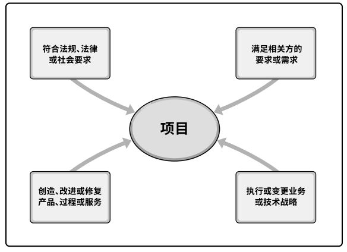

## 1.1 指南概述和目的
**项目成果**是领导者和项目经理在工作中应用项目管理**实践**、**原则**、**过程**、**工具**和**技术**的结果。  
PMI(Project Management Institute)将**项目管理知识体系**(PMBOK)定义为描述项目管理专业范围内知识的术语。项目管理知识体系包括已被验证并广泛应用的传统做法，以及本专业新近涌现的创新做法。  
《PMBOK指南》收录项目管理知识体系中被**普遍认可**为“**良好实践**”的那一部分知识体系(BOK)。  
> 普遍认可：指这些知识和做法在大多数时候适用于大多数项目，并且其价值和有效性已获得一致认可。  
> 良好实践：指人们普遍认为，在项目管理过程中使用这些知识、技能、工具和技术，能够达到预期的商业价值和成果，从而提高很多项目成功的可能性。  
确定过程、输入、工具、技术、输出和生命周期的恰当组合以管理项目的过程，即指本指南所述知识的裁剪应用。  
### 1.1.1 项目管理标准
**标准**是基于权威、惯例或共识而建立并用作模式或范例的文件。  
《项目管理标准》是PMI项目管理专业发展计划和项目管理实践的基本参考资料。由于项目管理需要根据项目需求进行调整，标准和指南均基于**描述性实践**，而不是**规范性实践**。因此，标准确认了在大多数时候都被大多数项目视作良好实践的过程，还确认了通常与这些过程相关的输入和输出。  

### 1.1.2 通用词汇
通用词汇是专业学科的基本要素。《PMI项目管理术语词典》收录了基本的专业词汇，供组织、项目组合、项目集和项目经理及其他项目相关方统一使用。

### 1.1.3 道德与专业行为规范
全球项目管理业务定义的最重要的价值观是**责任**、**尊重**、**公正**和**诚实**。PMI发布的《道德与专业行为规范》确立了这四个价值观的基础地位。  
《道德与专业行为规范》包括期望标准和强制标准。  

## 1.2 基本要素

### 1.2.1 项目
**项目**是为创造独特的产品、服务或成果而进行的临时性工作。  
+ **独特的产品、服务或成果**。  
  开展项目是为了通过可交付成果达成目标。**目标**指的是工作所指向的结果，要达到的战略地位，要达到的目的，要取得的成功过，要生产的产品，或者准备提供的服务。**可交付成果**指的是在某一过程、阶段或项目完成时，必须产出的任何独特并可核实的产品、成果或服务能力。  
+ **临时性工作**。  
  项目的临时性是指项目有明确的起点和终点。临时性并不一定意味着项目的持续时间短。在以下一种或多种情况下，项目即宣告结束：  
	- 达成项目目标；
	- 不会或不能达到目标；
	- 资金耗尽或再无可分配给项目的资金；
	- 项目需求不复存在；
	- 无法获得所需人力或物力资源；
	- 出于法律或便利原因而终止项目。  
	
  虽然项目是临时性工作，但其可交付成果可能会在项目的终止后依然存在。  
+ 项目驱动变革。  
  项目驱动组织进行变革。从商业角度来看，项目旨在推动组织从一个状态转到另一个状态，从而达成特定目标。在项目开始之前，通常将此事的组织描述为“当前状态”。项目驱动变革是为了获得期望的结果，即“将来状态”。  
+ 项目创造商业价值。  
  PMI将商业价值定义为从商业运作中获得的**可量化净效益**。项目的商业价值指特定项目的成果能够为相关方带来的效益。项目带来的效益可以是有形的、无形的或两者兼有之。  
+ 项目启动背景。  
  组织领导者启动项目是为了应对影响该组织的因素。这些因素说明了项目背景，大致分为四类：  
	- 符合法规、法律或社会要求；
	- 满足相关方的要求或需求；
	- 执行、变更业务或技术战略；
	- 创造、改进或修复产品、过程或服务。  
	
    
  
  **表 1-1 促成项目创建的因素示例**   
  
| 特定因素 | 特定因素示例 | 符合法规、法律或社会要求 | 满足相关方的要求或需求 | 创造、改进或修复产品、过程或服务 | 执行、变更业务或技术战略 |  
| :---- | :------ | :----: | :----: | :----: | :----: |  
| **新技术** | 某电子公司批准一个新项目，在计算机内存和电子技术发展基础上，开发一种高速、廉价的小型笔记本电脑 | | | X | X |  
| **竞争力** | 为保持竞争力，产品价格要低于竞争对手产品价格，需要降低生产成本 | | | | X |  
| **材料问题** | 某市政桥梁的一些支承构件出现裂缝，因此需要实施一个项目来解决问题 | X | | X |  |  
| **政治变革** | 在某新当选官员促动下，当前某项目经费发生变更 |  |  |  | X |  
| **市场需求** | 为应对汽油紧缺，某汽车公司批准一个低油耗车型的研发项目 |  | X | X | X |  

[返回目录](../../00.目录.md)