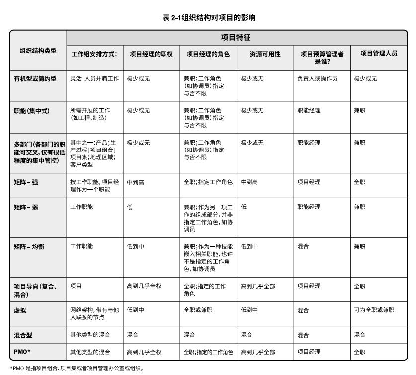

# 项目运行环境

## 2.1 概述
项目所处环境对项目的开展产生有利或不利的影响，两大主要来源：**事业环境因素EEFs**和**组织过程资产OPA**。  

## 2.2 事业环境因素
事业环境因素是指项目团队不能控制的，将对项目产生影响、限制或指令作用的各种条件。 
+ 大多数规划过程的输入
+ 可能提高或限制项目管理的灵活性
+ 可能对项目结果产生积极或消极的影响  
 
### 2.2.1 组织内部的事业环境因素
+ 组织文化、结构和治理
+ 设施和资源的地理分布
+ 基础设施
+ 信息技术软件
+ 资源可用性
+ 员工能力

### 2.2.2 组织外部的事业环境因素
+ 市场条件
+ 社会和文化影响与问题
+ 法律限制
+ 商业数据库
+ 学术研究
+ 政府或行业标准
+ 财务考虑因素
+ 物理环境要素

## 2.3 组织过程资产
组织过程资产是执行组织所特有并使用的计划、过程、政策、程序和知识库，会影响对具体项目的管理。分为两大类：
+ **过程、政策和程序**  
+ **组织知识库**  

### 2.3.1 过程、政策和程序
过程、政策和程序的更新通常不是项目工作的一部分，而是由项目管理办公室PMO或项目以外的其他职能部门完成。  
包括： 
+ 启动和规划的标准、流程、模板等
+ 执行和监控的标准、流程、模板等
+ 收尾的成果评估、验收资源转移等  

### 2.3.2 组织知识库
组织知识库在整个项目期间结合项目信息而更新。包括：  
+ 配置管理知识库
+ 财务数据库
+ 历史信息与经验教训知识库
+ 问题与缺陷管理数据库
+ 测量指标数据库
+ 以往项目的项目档案

## 2.4 组织系统
### 2.4.1 概述
项目经理了解组织内的职责、终责和职权的分配情况，有助于有效地利用其权力、影响力、能力、领导力和政治能力成功完成项目。  
系统是各种组件的集合，可以实现单个组件无法实现的成果。  
系统因素包括但不限于：**管理要素**、**治理框架**、**组织结构类型**。  

系统的几个原则：
+ 系统是动态的
+ 系统是能优化的
+ 系统组件是能优化的
+ 系统及其组件不能同时优化
+ 系统呈现非线性响应

### 2.4.2 组织治理框架
治理是在组织各个层级上的组织性或结构性安排，旨在决定和影响组织成员的行为。治理是多维概念：
+ 包括考虑人员、角色、结构和政策；
+ 要求通过数据和反馈提供指导和监督。  

#### 2.4.2.1 治理框架
治理是在组织内行使职权的框架，其内容包括但不限于：规则、政策、程序、规范、关系、系统、过程。  
治理框架会影响：  
+ 组织目标的设定和实现方式；
+ 风险监控和评估方式；
+ 绩效优化方法。  

#### 2.4.2.2 项目组合、项目集和项目治理
项目治理框架涉及的四个治理领域：一致性、风险、绩效和沟通。各个领域都具备以下职能部门：监督、控制、整合与决策。  

项目治理是指用于指导项目管理活动的框架、功能和过程，从而创造独特的产品、服务或结果以满足组织、战略和运营目标。  

### 2.4.3 管理要素
管理要素是组织中的关键职能或一般管理原则。组织根据其选择的治理框架和组织结构类型来确定一般的管理要素。  

### 2.4.4 组织结构类型

**项目管理办公室(PMO)**是与项目相关的治理过程进行标准化，并促进资源、方法论、工具和技术共享的一种组织结构。  
PMO根据对项目的控制和影响程度不同分为：  
+ 支持型：担当顾问，提供支持，控制程度很低。  
+ 控制型：不仅提供支持，且通过各种手段要求项目服从，控制程度中等。
+ 指令型：直接管理和控制项目。项目经理由PMO指定并向其报告。控制程度很高。  

[返回目录](../../00.目录.md)