## 项目整合管理

**项目整合管理**包括对隶属于项目管理过程组的各种过程和项目管理活动进行识别、定义、组合、统一和协调的各个过程。在项目管理中，整合兼具统一、合并、沟通和建立联系的性质，这些行动应该贯穿项目始终。   

## 4.1 制定项目章程  
**制定项目章程**是编写一份正式批准项目并授权项目经理在项目活动中使用组织资源的文件的过程。  
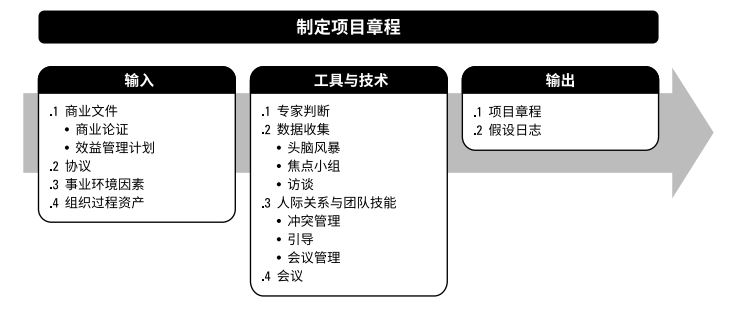  

项目章程一旦被批准，就标志着项目的正式启动。项目启动者或发起人应该具有一定的职权，能为项目获取资金并提供资源。

### 4.1.1 制定项目章程：输入

#### 4.1.1.1 商业文件
在商业论证和效益管理计划中，可以找到关于项目目标以及项目对业务目标的贡献的相关信息。虽然商业文件是在项目之前制定的，但需要定期审核。  
+ ***商业论证***。商业论证会包含商业需求和成本效益分析，以论证项目的合理性并确定项目边界。既然商业文件不是项目文件，项目经理就不可以对它们进行更新或修改，只可以提出相关建议。  

#### 4.1.1.2 协议
**协议**用于定义启动项目的初衷。协议有多种形式，包括合同、谅解备忘录、服务水平协议、协议书、意向书、口头协议、电子邮件或其他书面协议。为外部客户坐项目时，通常以合同的形式出现。  

#### 4.1.1.3 事业环境因素
#### 4.1.1.4 组织过程资产

### 4.1.2 制定项目章程：工具与技术
#### 4.1.2.1 专家判断
***专家判断***是指基于某应用领域、知识领域、学科和行业等的专业知识而做出的，关于当前活动的合理判断。  
本过程的关注主题：组织战略；效益管理；关于项目所在的行业以及项目关注的领域的技术知识；持续时间和成本估算；风险识别。

#### 4.1.2.2 数据收集
可用技术：头脑风暴、焦点小组、访谈。  

#### 4.1.2.3 人际关系与团队技能
可用技术：**冲突管理**、**引导**、**会议管理**。

#### 4.1.2.4 会议
举行会议的目的是：识别项目目标、成功标准、主要可交付成果、高层级需求、总体里程碑和其他概述信息。  

### 4.1.3 制定项目章程：输出
#### 4.1.3.1 项目章程
**项目章程**是由项目启动者或发起人发布的，正式批准项目成立，并授权项目经理使用组织资源开展项目活动的文件。  

#### 4.1.3.2 假设日志
在项目启动之前编制商业论证时，识别高层级的战略和运营假设条件与制约因素。假设日志用于记录整个项目生命周期中的所有假设条件和制约因素。  

## 4.2 制定项目管理计划
**制定项目管理计划**是定义、准备和协调项目计划的所有组成部分，并把它们整合为一份综合项目管理计划的过程。仅开展一次或仅在项目的预定义点开展。  
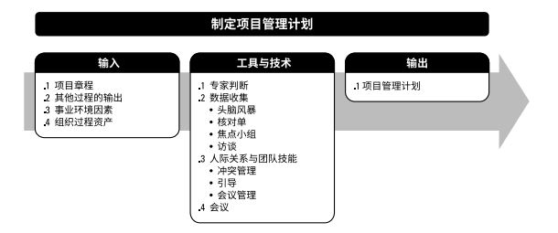  

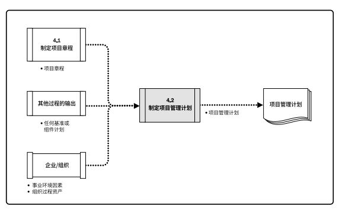  

项目管理计划确定项目的*执行*、*监控*和*收尾*方式。项目管理计划应基准化，在确定基准之前，可能要对项目管理计划进行措辞更新，且这些更新无需遵循正式流程。确定了基准后，只能通过实施整体变更控制过程进行更新。在项目收尾之前，项目管理计划需通过不断更新来渐进明细，并且这些更新需要得到控制和批准。  
### 4.2.1 制定项目管理计划：输入
#### 4.2.1.1 项目章程
#### 4.2.1.2 其他过程的输出
#### 4.2.1.3 事业环境因素
#### 4.2.1.4 组织过程资产

### 4.2.2 制定项目管理计划：工具与技术
#### 4.2.2.1 专家判断
#### 4.2.2.2 数据收集
头脑风暴、核对单、焦点小组、访谈。
#### 4.2.2.3 人际关系与团队技能
冲突管理、引导、会议管理。  
#### 4.2.2.4 会议  

### 4.2.3 制定项目管理计划：输出
#### 4.2.3.1 项目管理计划  
项目管理计划是说明项目执行、监控和收尾方式的一份文件，整合并综合了所有子管理计划和基准，以及项目管理所需的其他信息。  
+ **子管理计划**：范围管理计划、需求管理计划、进度管理计划、成本管理计划、质量管理计划、资源管理计划、沟通管理计划、风险管理计划、采购管理计划、相关方参与计划。  
+ **基准**：范围基准、进度基准、成本基准。  
+ **其他组件**：变更管理计划、配置管理计划、绩效测量计划、项目生命周期、开发方法、管理审查。  

## 4.3 指导与管理项目工作
**指导与管理项目工作**是为实现项目目标而领导和执行项目管理计划中所确定的工作，并实施已批准变更的过程。  
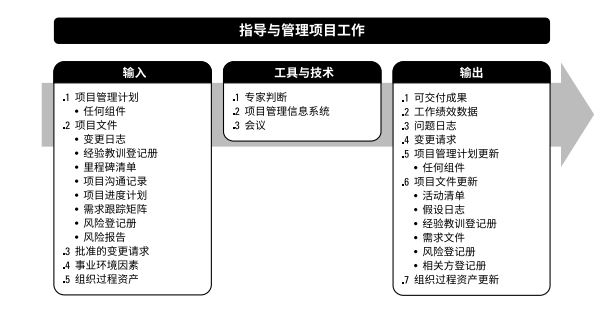  

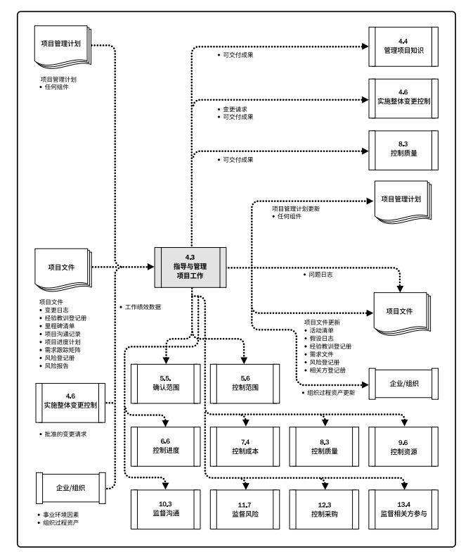  

指导与管理项目工作包括执行计划的项目活动，需要分配可用资源并管理其有效使用，也需要执行因分析工作绩效数据和信息而提出的项目计划变更。  

### 4.3.1 指导与管理项目工作：输入
#### 4.3.1.1 项目管理计划
#### 4.3.1.2 项目文件
包括：变更日志、经验教训登记册、里程碑清单、项目沟通记录、项目进度计划、需求跟踪矩阵、风险登记册、风险报告。  
#### 4.3.1.3 批准的变更请求  
实施整体变更控制过程的输出。批准的变更请求可能是纠正措施、预防措施或缺陷补救，并由项目团队纳入项目进度计划付诸实施。  

#### 4.3.1.4 事业环境因素
#### 4.3.1.5 组织过程资产

### 4.3.2 指导与管理项目工作：工具与技术
#### 4.3.2.1 专家判断
#### 4.3.2.2 项目管理信息系统(PMIS)  
PMIS提供信息技术软件工具，自动收集和报告关键绩效指标(KPI)可以是本系统的一项功能。  
#### 4.3.2.3 会议  

### 4.3.3 指导与管理项目工作：输出
#### 4.3.3.1 可交付成果
可交付成果是在某一过程、阶段或项目完成时，必须产出的任何可核实的产品、成果或服务能力。它通常是项目结果，并可包括项目管理计划的组成部分。  

#### 4.3.3.2 工作绩效数据
工作绩效数据是在执行项目工作的过程中，从每个正在执行的活动中收集到的**原始观察结果和测量值**。  

#### 4.3.3.3 问题日志
**问题日志**是一种记录和跟进所有问题的项目文文件，可帮助项目经理有效跟进和管理问题，确保它们得到调查和解决。  

#### 4.3.3.4 变更请求
变更请求是关于修改任何文件、可交付成果或基准的正式提议。可能包括：纠正措施、预防措施、缺陷补救、更新。  

#### 4.3.3.5 项目管理计划更新

#### 4.3.3.6 项目文件更新
活动清单、假设日志、经验教训登记册、需求文件、风险登记册、相关方登记册。  

#### 4.3.3.7 组织过程资产更新

## 4.4 管理项目知识
管理项目知识是使用现有知识并生成新知识，以实现项目目标，并帮助组织学习的过程。主要作用是：利用已有的组织知识来创造或改进项目成果，并且使当前项目创造的知识可用于支持组织运营和未来的项目阶段。  

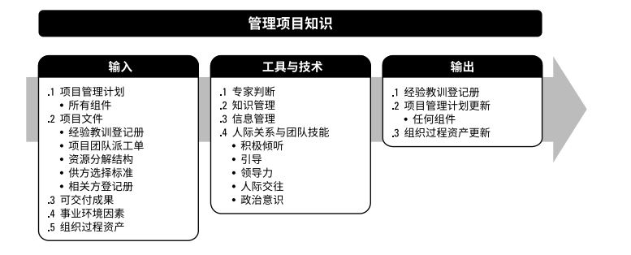  

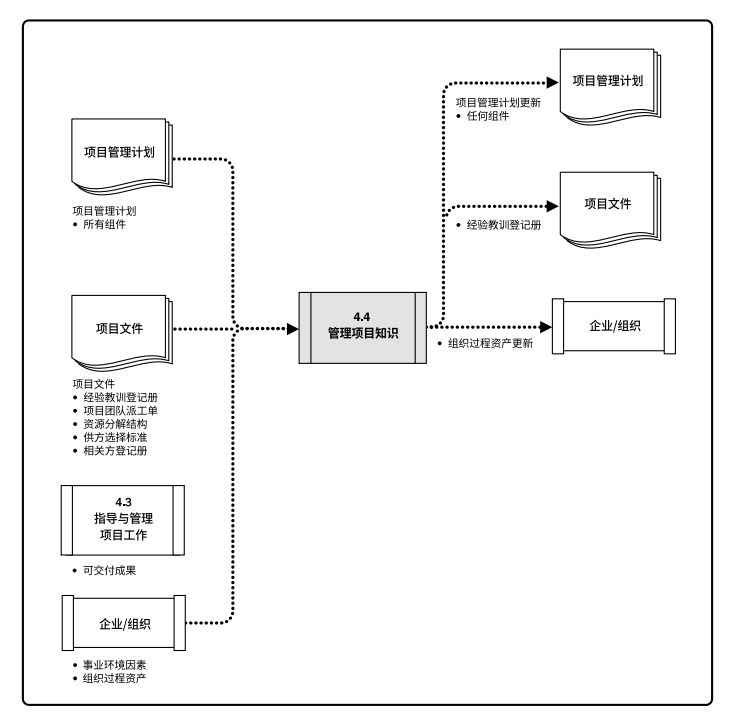  

知识通常分为“显性知识”和“隐形知识”两种。知识管理指管理显性和隐形知识，旨在重复使用现有知识并生成新知识。达成目标的关键活动是：知识分享和知识集成。  
知识管理最重要的环节是营造一种相互信任的氛围，激励人们分享知识或关注他人的知识。  

### 4.4.1 管理项目知识：输入
#### 4.4.1.1 项目管理计划
#### 4.4.1.2 项目文件
经验教训登记册、项目团队派工单、资源分解结构、相关方登记册。  
#### 4.4.1.3 可交付成果
#### 4.4.1.3 事业环境因素
#### 4.4.1.4 组织过程资产

### 4.4.2 管理项目知识：工具与技术
#### 4.4.2.1 专家判断
#### 4.4.2.2 知识管理
#### 4.4.2.3 信息管理
#### 4.4.2.4 人际关系与团队技能
积极倾听、引导、领导力、人际交往、政治意识

### 4.4.3 管理项目知识：输出
#### 4.4.3.1 经验教训登记册
经验教训登记册可以包含情况的类别和描述，经验教训登记册还可包括与情况相关的影响、建议和行动方案。  
#### 4.4.3.2 项目管理计划更新
#### 4.4.3.3 组织过程资产更新

## 4.5 监控项目工作
监控项目工作是跟踪、审查和报告整体项目进展，以实现项目管理计划中确定的绩效目标的过程。主要作用是，让相关方了解项目的当前状态并认可为处理绩效问题而采取行动，以及通过成本和进度预测，让相关方了解未来项目状态。本过程需要在整个项目期间开展。  

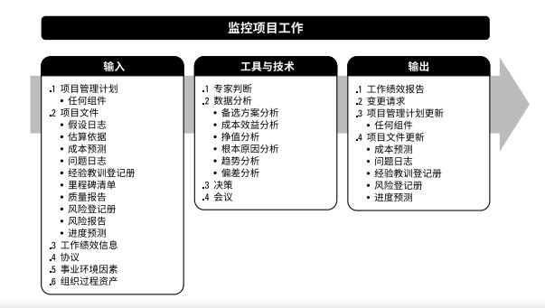  
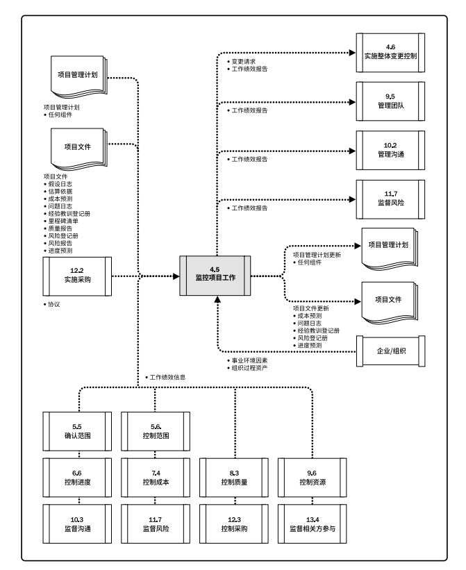  

监管是贯穿于整个项目的项目管理活动之一，包括收集、测量和分析测量结果，以及预测趋势，以便推送过程改进。控制包括制定纠正或预防措施或重新规划，并跟踪行动计划的实施过程，以确定它们能否有效解决问题。  

### 4.5.1 监控项目工作：输入
#### 4.5.1.1 项目管理计划
#### 4.5.1.2 项目文件
假设日志、估算依据、成本预测、问题日志、经验教训登记册、里程碑清单、质量报告、风险登记册、风险报告、进度预测。  
#### 4.5.1.3 工作绩效信息
在做过执行过程中收集工作绩效数据，再交由控制过程做进一步分析。工作绩效数据是产生不了价值的，通过与计划指标对比后产生的绩效信息才有衡量价值。  

#### 4.5.1.4 协议
#### 4.5.1.5 事业环境因素
#### 4.5.1.6 组织过程资产

### 4.5.2 监控项目工作：工具与技术
#### 4.5.2.1 专家判断
#### 4.5.2.2 数据分析
备选方案分析、成本效益分析、挣值分析、根本原因分析、趋势分析、根本原因分析、趋势分析、偏差分析。  
#### 4.5.2.3 决策
可用于本过程的决策技术包括(但不限于)投票：一致同意、大多数同意或相对多数原则。  
#### 4.5.2.4 会议

### 4.5.3 监控项目工作：输出
#### 4.5.3.1 工作绩效报告
基于工作绩效信息，以实体或电子形式编制工作绩效报告，以制定决策、采取行动或引起关注。  
#### 4.5.3.2 变更请求
变更可能包括(但不限于)：纠正措施、预防措施和缺陷补救。  
#### 4.5.3.3 项目管理计划更新
#### 4.5.3.4 项目文件更新
可在本过程更新的项目文件包括(但不限于)：成本预测、问题日志、经验教训登记册、风险登记册、进度预测。

## 4.6 实施整体变更控制
实施整体变更控制是审查所有变更请求、批准变更，管理对可交付成果、项目文件和项目管理计划的变更，并对变更处理结果进行沟通的过程。主要作用是确保对项目中已记录在案的变更做综合评审。本过程需要在整个项目期间开展。  

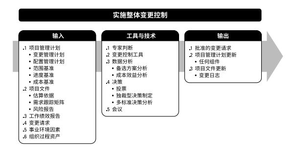  
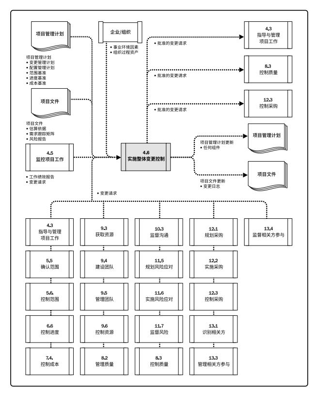  

实施整体变更控制过程贯穿项目始终，项目经理对此承担最终责任。在基准确定之前，变更无需正式受控于实施整体变更控制过程。尽管可以口头提出，但所有变更请求必须以书面形式记录，并纳入变更管理和配置管理系统中。变更请求得到批准后，可能需要新编或修订成本估算、活动排序、进度日期、资源需求和风险应对方案分析，这些变更可能要求调整项目管理计划和其他项目文件。  

### 4.6.1 实施整体变更控制：输入
#### 4.6.1.1 项目管理计划
变更管理计划、配置管理计划、范围基准、进度基准、成本基准。  
#### 4.6.1.2 项目文件
估算依据、需求跟踪矩阵、风险报告。  
#### 4.6.1.3 工作绩效报告
资源可用情况、进度和成本数据、挣值报告、燃烧图或燃尽图。  
#### 4.6.1.4 变更请求
#### 4.6.1.5 事业环境因素
#### 4.6.1.6 组织过程资产

### 4.6.2 实施整体变更控制：工具与技术
#### 4.6.2.1 专家判断
#### 4.6.2.2 变更控制工具
配置项管理活动：识别配置项、记录并报告配置项状态、进行配置项核实与审计。  
变更管理活动：识别变更、记录变更、做出变更决定、跟踪变更。  
#### 4.6.2.3 数据分析
备选方案分析、成本效益分析。  
#### 4.6.2.4 决策
+ **投票**：一致同意、大多数同意或相对多数原则的方式
+ **独裁型决策制定**
+ **多标准决策分析**
#### 4.6.2.5 会议

### 4.6.3 实施整体变更控制：输出
#### 4.6.3.1 批准的变更请求
批准的变更请求应通过指导与管理项目工作过程加以实施。对于推迟或否决的变更请求，应通知提出变更请求的个人或小组。  
#### 4.6.3.2 项目管理计划更新
#### 4.6.3.3 项目文件更新

## 4.7 结束项目或阶段
本过程的主要作用是：存档项目或阶段信息，完成计划的工作，释放组织团队资源以展开新的工作。它仅开展一次或仅在项目的预定义点开展。  
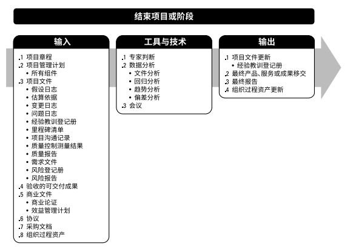  
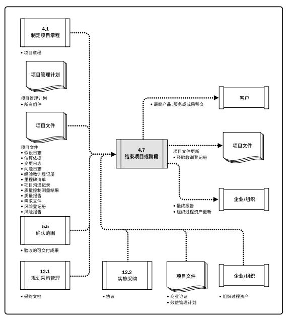  

在结束项目时，项目经理需要回顾项目管理计划，确保所有项目工作都已完成以及项目目标均已实现。  
如果项目在完工前就提前终止，结束项目或阶段过程还需要制定程序，来调查和记录提前终止的原因。  

### 4.7.1 结束项目或阶段：输入
#### 4.7.1.1 项目章程
#### 4.7.1.2 项目管理计划
#### 4.7.1.3 项目文件
假设日志、估算依据、变更日志、问题日志、经验教训登记册、里程碑清单、项目沟通记录、质量控制测量结果、需求文件、风险登记册、风险报告。  
#### 4.7.1.4 验收的可交付成果
验收的可交付成果可包括批准的产品规范、交货收据和工作绩效文件。对于分阶段实施的项目或提前取消的项目，还可能包括部分完成或中间的可交付成果。  
#### 4.7.1.5 商业文件
商业论证、效益管理计划
#### 4.7.1.6 协议
#### 4.7.1.7 采购文档
为关闭合同，需收集全部采购文档，并建立索引和加以归档。
#### 4.7.1.8 组织过程资产

### 4.7.2 结束项目或阶段：工具与技术
#### 4.7.2.1 专家判断
管理控制、审计、法律与采购、法律法规。  
#### 4.7.2.2 数据分析
文件分析、回归分析、趋势分析、偏差分析。  
#### 4.7.2.3 会议
会议类型包括(但不限于)：收尾报告会、客户总结会、经验教训总结会，以及庆祝会。  

### 4.7.3 结束项目或阶段：输出
#### 4.7.3.1 项目文件更新
#### 4.7.3.2 最终产品、服务或成果移交
#### 4.7.3.3 最终报告
总结项目绩效，其中可包含诸如以下信息：
+ 项目或阶段的概述；
+ 范围目标、范围的评估标准，以及证明达到完工标准的证据；
+ 质量目标、项目和产品质量的评估标准、相关核实信息和实际里程碑交付日期以及偏差原因；
+ 成本目标，包括可接受的成本区间、实际成本，以及产生任何偏差的原因；
+ 最终产品、服务或成果的确认信息的总结；
+ 进度计划目标包括成果是否实现项目所预期的效益；
+ 关于最终产品、服务或成果如何满足商业计划所述业务需求的概述；
+ 关于项目过程中发生的风险或问题及其解决情况的概述。  
#### 4.7.3.4 组织过程资产更新  
项目文件、运行和支持文件、项目或阶段收尾文件、经验教训知识库。  

[返回目录](../../00.目录.md)