# 项目范围管理

项目范围管理包括确保项目做且只做所需的全部工作，以成功完成项目的各个过程。项目范围管理过程包括：  
+ **规划范围管理** - 为记录如何定义、确认和控制项目范围及产品范围，而创建范围管理计划的过程。  
+ **收集需求** - 为实现项目目标而确定、记录并管理相关方的需要和需求的过程。
+ **定义范围** - 制定项目和产品详细描述的过程。
+ **创建WBS** - 将项目可交付成果和项目工作分解为较小的、更易于管理的组件的过程。
+ **确认范围** - 正式验收已完成的项目可交付成果的过程。 
+ **控制范围** - 监督项目和产品的范围状态，管理范围基准变更的过程。  

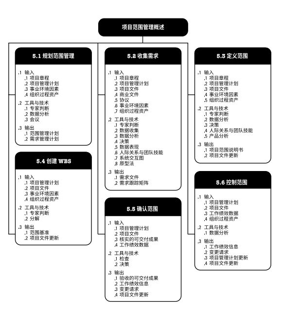  

## 项目范围管理的核心概念  
项目环境中“范围”术语有两种含义：  
+ **产品范围**。某项产品、服务或成果所具有的特征和功能。  
+ **项目范围**。为交付具有规定特性与功能的产品、服务或成果而必须完成的工作。  

在预测型项目中，经过批准的项目范围说明书、工作分解结构(WBS)和相应的WBS词典构成项目基准。只有通过正式变更控制程序，才能进行基准变更。采用适应型生命周期的项目，则使用未完成项反映当前需求。  
项目范围的完成情况是根据项目管理计划来衡量的，而产品范围的完成情况是根据产品需求来衡量的。  
在项目范围管理过程中，收集、记录和管理相关方需求。项目范围管理的发展趋势和新兴实践包括(但不限于)**注重与商业分析专业人士的合作**，以便：  
+ 确定问题并识别商业需要；
+ 识别并推荐能够满足这些需要的可行解决方案；
+ 收集、记录并管理相关方需求，以满足商业和项目目标；
+ 推动项目集或项目的产品、服务或最终成果的诚通应用。  

需求管理过程结束于需求关闭，即把产品、服务或成果移交给接收方，以便长期测量、监控、实现和维持效益。  

**裁剪时需要考虑的因素**  
+ **知识和需求管理**
+ **确认和控制**
+ **开发方法**
+ **需求的稳定性**
+ **治理**

## 5.1 规划范围管理
**规划范围管理**是为记录如何定义、确定和控制项目范围及产品范围，而创建范围管理计划的过程。主要作用是，在整个项目期间对如何管理范围提供指南和方向。本过程仅开展一次或仅在项目的预定义点开展。  

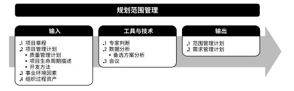  

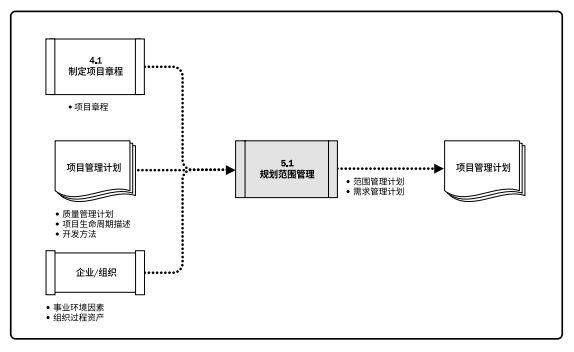  

范围管理计划是项目或项目集管理计划的组成部分，描述将如何定义、制定、监督、控制和确认项目范围。制定范围管理计划和细化项目范围始于对下列信息的分析：  
+ 项目章程中的信息；
+ 项目管理计划中已批准子计划；
+ 组织过程资产中的历史信息；
+ 相关事业环境因素。  

### 5.1.1 规划范围管理：输入

#### 5.1.1.1 项目章程
项目章程记录项目目的、项目概述、假设条件、制约因素，以及项目意图实现的高层级需求。  

#### 5.1.1.2 项目管理计划
项目管理计划组件包括但不限于：
+ **质量管理计划**。在项目中实施组织的质量政策、方法和标准的方式会影响管理项目和产品范围的方式。
+ **项目生命周期描述**。项目生命周期定义了项目从开始到完成所经历的一系列阶段。
+ **开发方法**。定义了项目是采用瀑布式、迭代型、适应型、敏捷型还是混合型开发方法。  

#### 5.1.1.3 事业环境因素
能够影响规划范围管理过程的事业环境因素包括：
+ 组织文化；
+ 基础设施；
+ 人事管理制度；
+ 市场条件。  
#### 5.1.1.4 组织过程资产
能够影响规划范围管理过程的组织过程资产包括：
+ 政策和程序；
+ 历史信息和经验教训知识库。

### 5.1.2 规划范围管理：工具与技术
#### 5.1.2.1 专家判断
+ 以往的类似项目；
+ 特定行业、学科和应用领域的信息。

#### 5.1.2.2 数据分析
适用于本过程的数据分析技术包括但不限于：**备选方案分析**。本技术用于评估收集需求、详述项目和产品范围、创造产品、确认范围和控制范围的各种方法。  
#### 5.1.2.3 会议
项目团队可以参加项目会议来制定范围管理计划。

### 5.1.3 规划范围管理：输出
#### 5.1.3.1 范围管理计划
范围管理计划是项目管理计划的组成部分，描述将如何定义、制定、监督、控制和确认项目范围。对将用于下列工作的管理过程作出规定：  
+ 制定项目范围说明书；
+ 根据详细项目范围说明书创建WBS；
+ 确定如何审批和维护范围基准；
+ 正式验收已完成的项目可交付成果。  

#### 5.1.3.2 需求管理计划  
需求管理计划是项目管理计划的组成部分，描述将如何分析、记录和管理项目和产品需求。又可称为“商业分析计划”。主要内容包括但不限于：  
+ 如何规划、跟踪和报告各种需求活动；
+ 配置管理活动；
+ 需求优先级排序过程；
+ 测量指标及使用这些指标的理由；
+ 反映哪些需求属性将被列入跟踪矩阵的跟踪结构。  

## 5.2 收集需求
**收集需求**是为实现目标而确定、记录并管理相关方的需要和需求的过程。主要作用是，为定义产品范围和项目范围奠定基础。本过程仅开展一次或仅在项目的预定义点开展。  

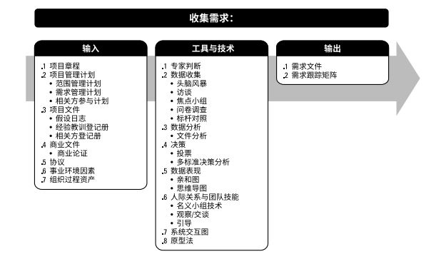  

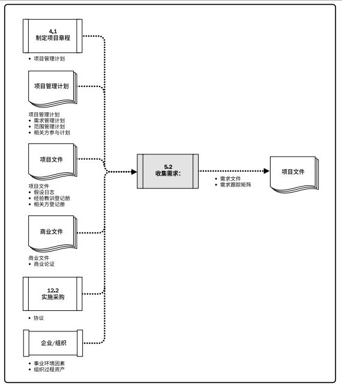  

相关方积极参与需求的探索和分解工作（分解成项目和产品需求），并仔细确定、记录和管理对产品、服务或成果的需求，能直接促进项目成功。需求是指根据特定协议或其他强制性规范，产品、服务或成果必须具备的条件或能力。包括发起人、客户和其他相关方的已量化且书面记录的需要和期望。

### 5.2.1 收集需求：输入
#### 5.2.1.1 项目章程
项目章程记录了项目概述以及将用于制定详细需求的高层级需求。  
#### 5.2.1.2 项目管理计划
项目管理计划组件包括(但不限于)：
+ **范围管理计划**。范围管理计划包含如何定义和制定项目范围的信息。
+ **需求管理计划**。需求管理计划包含如何收集、分析和记录项目需求的信息。
+ **相关方参与计划**。从相关方参与计划中了解相关方的沟通需求和参与程度，以便评估并适应相关方对需求活动的参与程度。  
#### 5.2.1.3 项目文件
可作为本过程输入的项目文件包括(但不限于)：
+ **假设日志**。假设日志识别了有关产品、项目、环境、相关方以及会影响需求的其他因素的假设条件。
+ **经验教训登记册**。经验教训登记册提供了有效的需求收集技术，尤其针对使用迭代型或适应型产品开发方法的项目。
+ **相关方登记册**。相关方登记册用于了解哪些相关方能够提供需求方面的信息，及记录相关方对项目的需求和期望。  
#### 5.2.1.4 商业文件
会影响收集需求过程的商业文件是**商业论证**，描述了为满足业务需要而应该达到的必要、期望及可选标准。  
#### 5.2.1.5 协议
协议会包含项目和产品需求。  
#### 5.2.1.6 事业环境因素
组织文化、基础设施、人事管理制度、市场条件。  
#### 5.2.1.7 组织过程资产
政策和程序；包含以往项目信息的历史信息和经验教训知识库。  

### 5.2.2 收集需求：工具与技术
#### 5.2.2.1 专家判断
#### 5.2.2.2 数据收集
+ **头脑风暴**。头脑风暴是一种用来产生和收集对项目需求与产品需求的多种创意的技术。
+ **访谈**。访谈是通过与相关方直接交谈，来获取信息的正式或非正式的方法。  
+ **焦点小组**。焦点小组是召集预定的相关方和主题专家，了解他们对所讨论的产品、服务或成果的期望和态度。
+ **问卷调查**。问卷调查是指设计一系列书面问题，向众多受访者快速收集信息。适用于：受众多样化、需要快速完成调查、受访者地理位置分散、并且适合开展统计分析。  
+ **标杆对照**。标杆对照将实际或计划的产品、过程和实践，与其他可比组织的实践进行比较，以便识别最佳实践，形成改进意见，并为绩效考核提供依据。  
   
#### 5.2.2.3 数据分析
可用于本过程的数据分析技术包括但不限于：**文件分析**。文件分析包括审核和评估任何相关的文件信息，识别与需求相关的信息来获取需求。可供分析的文件包括：
+ 协议。
+ 商业计划。
+ 业务流程或接口文档。
+ 业务规则库。
+ 现行流程。
+ 市场文献。
+ 问题日志。
+ 政策和程序。
+ 法规文件。
+ 建议邀请书。
+ 用例。  

#### 5.2.2.4 决策
+ **投票**。投票是一种为达到某种期望结果，而对多个未来行动方案进行评估的集体决策技术和过程。
+ **独裁型决策制定**。采用这种方法，将由一个人负责为整个集体制定决策。
+ **多标准决策分析**。借助决策矩阵，用系统方法建立多种标准，以对众多创意进行评估和排序。    

#### 5.2.2.5 数据表现
+ **亲和图**。用来对大量创意进行分组的技术，以便进一步审查和分析。
+ **思维导图**。把从头脑风暴中获得的创意整合成一张图，用以反映创意之间的共性和差异，激发新创意。  

#### 5.2.2.6 人际关系与团队技能
+ **名义小组技术**。名义小组技术是用于促进头脑风暴的一种技术，通过投票排列最有用的创意，以便进一步开展头脑风暴或优先排序。
+ **观察和交流**。观察和交流是指直接查看个人在各自的环境中如何执行工作和实施的过程。观察也称为“工作跟随”，通常由旁站观察者观察业务专家如何执行工作，以便挖掘隐藏的需求。  
+ **引导**。引导与主题研讨会结合使用，把主要相关方召集在一起定义产品需求。研讨会可用于快速定义跨职能需求并协调相关方的需求差异。  

#### 5.2.2.7 系统交互图
系统交互图示范围模型的一个例子，是对产品范围的可视化描绘，显示业务系统及其与人和系统之间的交互方式。  

#### 5.2.2.8 原型法
**原型法**是指在实际制造预期产品之前，先造出该产品的模型，并据此征求对需求的早期反馈。  
**故事板**是一种原型技术，通过一系列的图像或图示来展示顺序或导航路径。  

### 5.2.3 收集需求：输出
#### 5.2.3.1 需求文件
**需求文件**描述各种单一需求将如何满足与项目相关的业务需求。只有明确的（可测量和可测试的）、可跟踪的、完整的、相互协调的，且主要相关方愿意认可的需求，才能作为基准。  
把需求分成不同的类别，有利于对需求进行进一步完善和细化，需求的类别包括：
+ **业务需求**。整个组织的高层级需要。
+ **相关方需求**。相关方或相关方群体的需要。
+ **解决方案需求**。为满足业务需求和相关方需求，产品、服务或成果必须具备的特性、功能和特征。又分为：功能需求和非功能需求。  
+ **过渡和就绪需求**。描述从“当前状态”过渡到“将来状态”所需的临时能力。
+ **项目需求**。项目需要满足的行动、过程或其他条件。
+ **质量需求**。用于确认项目可交付成果的成功完成或其他项目需求的实现的任何条件或标准。  

#### 5.2.3.2 需求跟踪矩阵
**需求跟踪矩阵**是把产品需求从其来源连接到能满足需求的可交付成果的一种表格。把每个需求与业务目标或项目目标联系起来，有助于确保每个需求都具有商业价值。  

跟踪需求包括但不限于：
+ 业务需要、机会、目的和目标；
+ 项目目标；
+ 项目范围和WBS可交付成果；
+ 产品设计；
+ 产品开发；
+ 测试策略和测试场景；
+ 高层级需求到详细需求。  

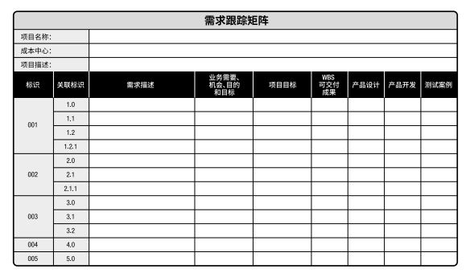  

## 5.3 定义范围
**定义范围**是制定项目和产品详细描述的过程。主要作用是，描述产品、服务或成果的边界和验收标准。本过程仅开展一次或仅在项目预定义点开展。  

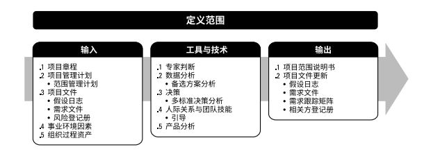  

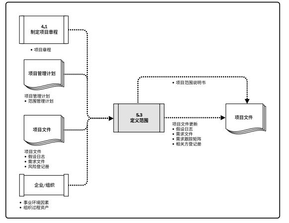  

由于在收集需求过程中识别出的所有需求未必都包含在项目中，所以定义范围过程就要从需求文件（收集需求过程的输出）中选取最终的项目需求，然后制定出关于项目及其产品、服务或成果的详细描述。  

应根据项目启动过程中记载的主要可交付成果、假设条件和制约因素来编制详细的项目范围说明书。同时需要分析现有风险、假设条件和制约因素的完整性，并做必要的增补或更新。  

### 5.3.1 定义范围：输入
#### 5.3.1.1 项目章程
项目章程中包含对项目的高层级描述、产品特征和审批要求。  
#### 5.3.1.2 项目管理计划
+ **范围管理计划**，其中记录了如何定义、确认和控制项目范围。  
#### 5.3.1.3 项目文件
包括但不限于：
+ **假设日志**。假设日志识别了有关产品、项目、环境、相关方以及会影响项目和产品范围的其他因素的假设条件和制约因素。
+ **需求文件**。需求文件识别了应纳入范围的需求。
+ **风险登记册**。风险登记册包含了可能影响项目范围的应对策略，以规避或缓解风险。  
  
#### 5.3.1.4 事业环境因素
包括：
+ **组织文化**；
+ **基础设施**；
+ **人事管理制度**；
+ **市场条件**。
  
#### 5.3.1.5 组织过程资产
包括：  
+ 用于指定项目范围说明书的政策、程序和模板；
+ 以往项目的项目档案；
+ 以往阶段或项目的经验教训。  

### 5.3.2 定义范围：工具与技术
#### 5.3.2.1 专家判断
应征求具备类似项目的知识或经验的个人或小组的意见。  

#### 5.3.2.2 数据分析
可用的数据分析技术包括但不限于：**备选方案分析**。备选方案分析可用于评估实现项目章程中所述的需求和目标的各种方法。  

#### 5.3.2.3 决策
可用的决策技术包括但不限于：**多标准决策分析**。多标准决策分析是一种借助决策矩阵来使用系统分析方法的技术，目的是建立多种标准来完善项目和产品范围。  

#### 5.3.2.4 人际关系与团队技能
**引导**技能协助具有不同期望或不同专业背景的关键相关方，使他们就项目可交付成果以及项目和产品边界达成跨职能的共识。  

#### 5.3.2.5 产品分析
产品分析可用于定义产品和服务，包括针对产品或服务提问并回答，以描述要交付的产品的用途、特征及其他方面。  

产品分析技术包括(但不限于)：产品分解；需求分析；系统分析；系统工程；价值分析；价值工程。  

### 5.3.3 定义范围：输出
#### 5.3.3.1 项目范围说明书
项目范围说明书是对项目范围、主要可交付成果、假设条件和制约因素的描述。记录了整个范围，包括项目和产品范围；详细描述了项目的可交付成果；还代表项目相关方之间就项目范围所达成的共识。  

详细的项目范围说明书包以下内容：  
+ **产品范围描述（渐进明细）**。
+ **可交付成果**。
+ **验收标准**。
+ **项目的除外责任**。  

项目章程和项目范围说明书的内容存在一定程度的重叠，但详细程度完全不同。项目章程包含高层级的信息，而项目范围说明书则是对范围组成部分的详细描述。  

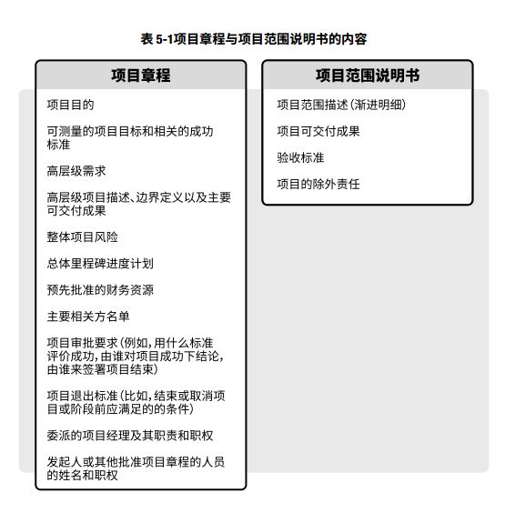  
#### 5.3.3.2 项目文件更新
可更新的文件包括：
+ **假设日志**。随同本过程识别出更多的假设条件或制约因素而更新假设日志。
+ **需求文件**。可以通过增加或修改需求而更新需求文件。
+ **需求跟踪矩阵**。应该随同需求文件的更新而更新需求跟踪矩阵。
+ **相关方登记册**。如果在本过程中收集到了现有或新相关方的更多信息，则记录到相关方登记册中。  

## 5.4 创建WBS
**创建工作分解结构(WBS)**是把项目可交付成果和项目工作分解成较小、更易于管理的组件的过程。主要作用是，为所要交付的内容提供架构。本过程仅开展一次或仅在项目的预定义点开展。  

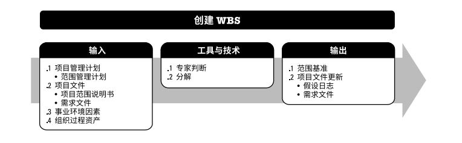  

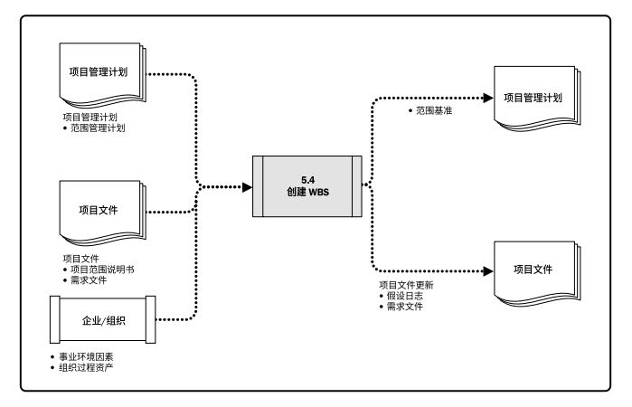  

WBS是对项目团队为实现项目目标、创建所需可交付成果而需要实施的全部工作范围的**层级分解**。WBS组织并定义了项目的总范围，代表着经批准的当前项目范围说明书中所规定的工作。  
WBS最低层的组成部分称为**工作包**，其中包含计划的工作。工作包对相关活动进行归类，以便对工作安排进度、进行评估、开展监督与控制。在“工作分解结构”中，“工作”  是指作为活动结果的工作产品或可交付成果，而不是活动本身。  

### 5.4.1 创建WBS：输入
#### 5.4.1.1 项目管理计划
**范围管理计划**定义了如何根据项目范围说明书创建WBS。

#### 5.4.1.2 项目文件 
项目文件包括：
+ **项目范围说明书**。项目范围说明书描述了需要实施的工作及不包含在项目中的工作。
+ **需求文件**。需求文件详细描述了各种单一需求如何满足项目的业务需要。  
  
#### 5.4.1.3 事业环境因素
**项目所在行业的WBS标准**可作为创建WBS的外部参考资料。
#### 5.4.1.4 组织过程资产
包括但不限于：
+ 用于创建WBS的政策、程序和模板；
+ 以往项目的项目档案；
+ 以往项目的经验教训。
  
### 5.4.2 创建WBS：工具与技术
#### 5.4.2.1 专家判断
应征求具备类似项目知识或经验的个人或小组的意见。  
#### 5.4.2.2 分解
**分解**是一种把项目范围和项目可交付成果逐步划分为更小、更便于管理的组成部分的技术；工作包是WBS最低层的工作，可对其成本和持续时间进行估算和管理。  
要把整个项目工作分解为工作包，通常需要开展以下活动：  
+ 识别和分析可交付成果及相关工作；
+ 确定WBS的结构和编排方法；
+ 自上而下逐层细化分解；
+ 为WBS组成部分制定和分配标识编码；
+ 核实可交付成果分解的程度是否恰当。  

通过确认WBS较低层组件是完成上层相应可交付成果的必要且充分的工作，来核实分解的正确性。要在未来远期才能完成的可交付成果或组件，当前可能无法分解。项目管理团队因而通常需要等待对该可交付成果或组成部分达成一致意见，才能够制定出WBS中的相应细节。这种技术有时称作滚动式规划。  
通过把WBS底层的所有工作逐层向上汇总，来确保既没有遗漏的工作，也没有多余的工作。这有时被称为100%规则。  
### 5.4.3 创建WBS：输出
#### 5.4.3.1 范围基准
包括：项目范围说明书、WBS、工作包、规划包、WBS词典。   
#### 5.4.3.2 项目文件更新
包括：假设日志、需求文件。  

## 5.5 确认范围
确认范围是正式验收已完成的项目可交付成果的过程。主要作用是：使验收过程具有客观性；同时通过确认每个可交付成果，来提高最终产品、服务或成果获得验收的可能性。本过程根据需要在整个项目期间定期开展。  

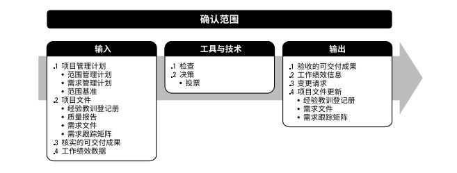  

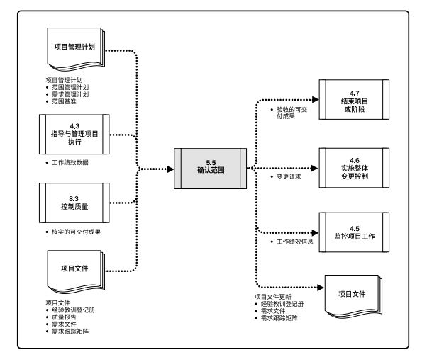  

由客户或发起人审查从控制质量过程输出的核实的可交付成果，确认这些可交付成果已经圆满完成并通过正式验收。确认范围过程与控制质量过程的不同之处在于，前者关注可交付成果的验收，而后者关注可交付成果的正确性及是否满足质量要求。  

### 5.5.1 确认范围：输入
#### 5.5.1.1 项目管理计划
包括：范围管理计划、需求管理计划、范围基准。  
#### 5.5.1.2 项目文件
包括：经验教训登记册、质量报告、需求文件、需求跟踪矩阵。  
#### 5.5.1.3 核实的可交付成果
指已经完成，并被控制质量过程检查为正确的可交付成果。  
#### 5.5.1.4 工作绩效数据
可能包括符合需求的程度、不一致的数量、不一致的严重性或在某时间段内开展确认的次数。  

### 5.5.2 确认范围：工具与技术
#### 5.5.2.1 检查
检查是指开展测量、审查与确认等活动，来判断工作和可交付成果是否符合需求和产品验收标准。有时也可被称为审查、产品审查和巡检等。   
#### 5.5.2.2 决策
包括(但不限于)投票。  

### 5.5.3 确认范围：输出
#### 5.5.3.1 验收的可交付成果
符合验收标准的可交付成果应该由客户或发起人正式签字批准。
#### 5.5.3.2 工作绩效信息
包括项目进展信息。应该被急流下来并传递给相关方。  
#### 5.5.3.3 变更请求
对已经完成但未通过正式验收的可交付成果及其未通过验收的原因，应该记录在案。可能需要针对这些可交付成果提出变更请求，开展缺陷补救。变更请求应该由实施整体变更控制过程进行审查与处理。  
#### 5.5.3.4 项目文件更新
包括：经验教训登记册、需求文件、需求跟踪矩阵。  

## 5.6 控制范围
控制范围是监督项目和产品的范围状态，管理范围基准变更的过程。主要作用是：在整个项目期间保持对范围基准的维护，且需要在整个项目期间开展。  

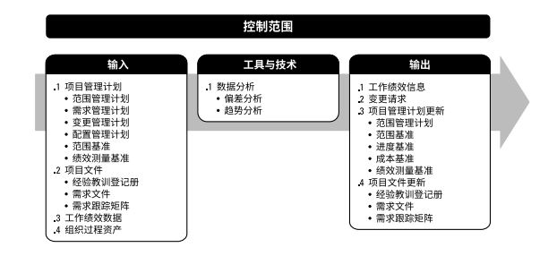  

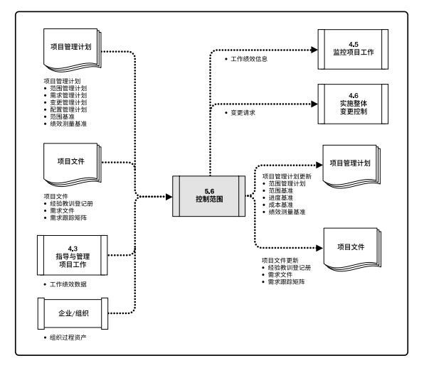  

控制项目范围确保所有变更请求、推荐的纠正措施或预防措施都通过实施整体变更控制过程进行处理。未经控制的产品或项目范围的扩大被称为范围蔓延。  

### 5.6.1 控制范围：输入
#### 5.6.1.1 项目管理计划
包括：范围管理计划、需求管理计划、变更管理计划、配置管理计划、范围基准、绩效测量基准。  
#### 5.6.1.2 项目文件
包括：经验教训登记册、需求文件、需求跟踪矩阵。  
#### 5.6.1.3 工作绩效数据
包括收到的变更请求的数量、接受的变更请求的数量，以及核实、确认和完成的可交付成果的数量。  
#### 5.6.1.4 组织过程资产OPA
包括：现有的、正式和非正式的，与范围控制相关的政策、程序和指南；可用的监督和报告的方法与模板。  

### 5.6.2 控制范围：工具与技术
#### 5.6.2.1 数据分析
包括：偏差分析、趋势分析。  

### 5.6.3 控制范围：输出
#### 5.6.3.1 工作绩效信息
#### 5.6.3.2 变更请求
#### 5.6.3.3 项目管理计划更新
包括：范围管理计划、范围基准、进度基准、成本基准、绩效测量基准。  
#### 5.6.3.4 項目文件更新
包括：经验教训登记册、需求文件、需求跟踪矩阵。  

[返回目录](../../00.目录.md)

