# 项目进度管理
项目进度管理包括为管理项目按时完成所需的各个过程。其过程包括：  
+ **规划进度管理** - 为规划、编制、管理、执行和控制项目进度而制定政策、程序和文档的过程。  
+ **定义活动** - 识别和记录为完成项目可交付成果而需采取的具体行动的过程。  
+ **排列活动顺序** - 识别和记录项目活动之间的关系的过程。  
+ **估算活动持续时间** - 根据资源估算的结果，估算完成单项活动所需工作时段数的过程。  
+ **制定进度计划** - 分析活动顺序、持续时间、资源需求和进度制约因素，创建项目进度模型，从而落实项目执行和监控的过程。  
+ **控制进度** - 监督项目状态，以更新项目进度和管理进度基准变更的过程。  

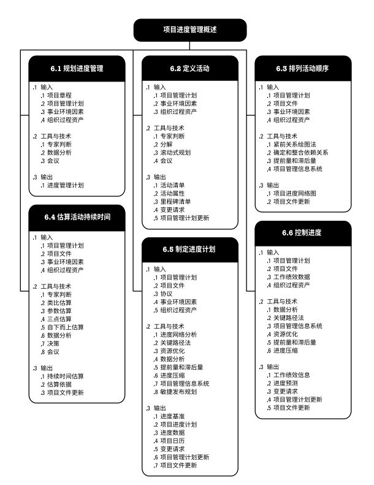  

## 项目进度管理的核心概念
通过项目进度规划制定详尽的计划，说明项目如何以及何时交付项目范围中定义的产品、服务和成果，并作为一种用于沟通和管理相关方期望的工具，以及报告绩效的基础。项目管理团队选择进度计划方法(如**关键路径法**或**敏捷方法**)之后，将项目特定数据输入进度计划编制工具，以创建项目进度模型。这件工作的成果就是项目进度计划。  

在小型项目中，定义活动、排列活动顺序、估算活动持续时间及制定进度模型等过程之间的联系非常密切，可视为一个过程并由一个人在较短时间内完成。在可能的情况下，应在整个项目期间保持项目进度计划的灵活性，使其可以随着知识的获得、对风险理解的加深，以及增值活动的设计而调整。  

## 项目进度管理的发展趋势和新兴实践
适应型规划虽然制定了计划，但也意识到工作开始之后，优先级可能发生改变，需要修改计划以反映新的优先级。  

有关项目进度计划方法的新兴实践包括但不限于：  
+ **具有未完项的迭代型进度计划**。  
一种基于适应型生命周期的滚动式规划。该方法将需求记录在用户故事中，然后在建造之前按优先级排序并优化用户故事，最后在规定的时间盒内开发产品功能。该方法通常用于向客户交付增值价值，或多个团队并行开发大量内部关联较小的功能。好处在于，允许在整个开发生命周期期间进行变更。   
+ **按需进度计划**。  
通常用于看板体系，基于制约理论和来自精益生产的拉动式进度计划概念，根据团队的交付能力来限制团队正在开展的工作。按需进度计划方法不依赖与以前为产品开发或产品增量制定的进度计划，而是在资源可用时立即从未完项和工作序列中提取出来开展。用于：在运营或持续环境中以增量方式研发产品，且任务的规模或范围相对类似，或者，可以按照规模或范围对任务进行组合的项目。  

## 裁剪考虑因素
项目进度管理过程裁剪时应考虑的因素包括： 
+ **生命周期方法**。
+ **资源可用性**。  
+ **项目维度**。  
+ **技术支持**。  

## 关于敏捷/适应型环境的考虑因素
适应型方法采用短周期来开展工作、审查结果，并在必要时做出调整。通常表现为**迭代型进度计划**和**拉动式按需进度计划**。  

要成功实施适应型方法，项目经理需要了解如何高效使用相关的工具和技术。  

## 6.1 规划进度管理
**规划进度管理**是为规划、编制、管理、执行和控制项目进度而制定政策、程序和文档的过程。主要作用是，为如何在整个项目期间管理项目进度提供指南和方向。本过程仅开展一次或仅在项目的预定义点开展。  

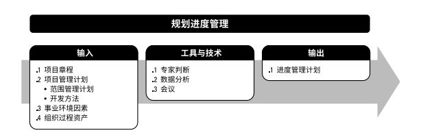

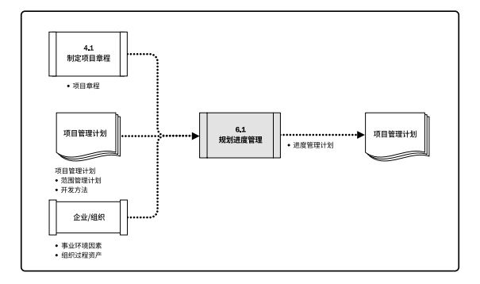

### 6.1.1 规划进度管理：输入
#### 6.1.1.1 项目章程
项目章程中规定的**总体里程碑进度计划**会影响项目的进度管理。  
#### 6.1.1.2 项目管理计划
包括但不限于：  
+ **范围管理计划**。范围管理计划描述如何定义和制定范围，并提供有关如何制定进度计划的信息。  
+ **开发方法**。产品开发方法有助于定义进度计划方法、估算技术、进度计划编制工具以及用来控制进度的技术。
#### 6.1.1.3 事业环境因素
包括但不限于：
+ 组织文化和结构；
+ 团队资源可用性、技能以及物质资源可用性；
+ 进度计划软件；
+ 指南和标准，用于裁剪组织标准过程和程序以满足项目的特定要求；
+ 商业数据库。  
#### 6.1.1.4 组织过程资产
包括但不限于；
+ 历史信息和经验教训知识库；
+ 现有与制定进度计划以及管理和控制进度相关的正式和非正式的政策、程序和指南；
+ 模板和表格；
+ 监督和报告工具。  

### 6.1.2 规划进度管理：工具与技术
#### 6.1.2.1 专家判断
应征求具有专业知识或在以往类似项目中接受过相关培训的个人或小组的意见。  
#### 6.1.2.2 数据分析
包括但不限于：
+ **备选方案分析**。备选方案分析可包括确定采用哪些进度计划方法，以及如何将不同方法整合到项目中；还可以包括确定进度计划的详细程度、滚动式规划的持续时间，以及审查和更新频率。
#### 6.1.2.3 会议
项目团队可能举行规划会议来制定进度管理计划。  

### 6.1.3 规划进度管理：输出
#### 6.1.3.1 进度管理计划
进度管理计划是项目管理计划的组成部分，为编制、监督和控制项目进度建立准则和明确活动，其中应包括合适的控制临界值。进度管理计划会规定：  
+ **项目进度模型制定**。规定用于制定项目进度模型的进度规划方法论和工具。
+ **进度计划的发布和迭代长度**。使用适应型生命周期时，应指定固定时间的发布时段、阶段和迭代。固定时间段指项目团队稳定地朝着目标前进的持续时间。
+ **准确度**。定义了需要规定活动持续时间估算的可接受区间，以及允许的应急储备数量。
+ **计量单位**。需要规定每种资源的计量单位。 
+ **组织程序链接**。工作分解结构WBS为进度管理计划提供了框架，保证了与估算及相应进度计划的协调性。
+ **项目进度模型维护**。需要规定在项目执行期间，将如何在进度模型中更新项目状态，记录项目进展。
+ **控制临界值**。需要规定偏差临界值，用于监督进度绩效。是在需要采取某种措施前，允许出现的最大差异。临界值通常用偏离基准计划中的参数的某个百分数来表示。
+ **绩效测量规则**。需要规定用于绩效测量的挣值管理EVM规则或其他测量规则。
+ **报告格式**。需要规定各种进度报告的格式和编制频率。

## 6.2 定义活动
**定义活动**是识别和记录为完成项目可交付成果而须采取的具体行动的过程。主要作用是，将工作包分解为进度活动，作为对项目工作进行进度估算、规划、执行、监督和控制的基础。本过程需要在整个项目期间开展。  

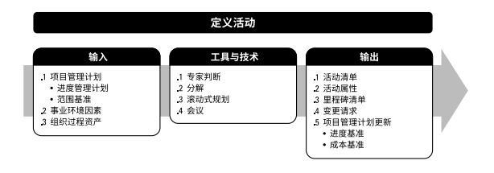  

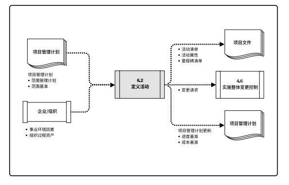  

### 6.2.1 定义活动：输入
#### 6.2.1.1 项目管理计划
包括但不限于：
+ **进度管理计划**。进度管理计划定义进度计划方法、滚动式规划的持续时间，以及管理工作所需的详细程度。
+ **范围基准**。在定义活动时，需明确考虑范围基准中的项目WBS、可交付成果、制约因素和假设条件。

#### 6.2.1.2 事业环境因素
包括但不限于：
+ **组织文化和结构**。
+ **商业数据库中发布的商业信息**。
+ **项目管理信息系统(PMIS)**。

#### 6.2.1.3 组织过程资产
包括但不限于：
+ **经验教训知识库**。
+ **标准化的流程**。
+ **以往项目中包含标准活动清单或部分活动清单的模板**。
+ **现有与活动规划相关的正式和非正式的政策、程序和指南**。

### 6.2.2 定义活动：工具与技术
#### 6.2.2.1 专家判断
应征求了解以往类似项目和当前项目的个人或小组的专业意见。  

#### 6.2.2.2 分解
分解是一种把项目范围和项目可交付成果逐步划分为更小、更便于管理的组成部分的技术。活动表示完成工作包所需的投入。定义活动过程的最终输出是活动而不是可交付成果，可交付成果是创建WBS过程的输出。  

WBS、WBS词典和活动清单可依次或同时编制，其中WBS和WBS词典是制定最终活动清单的基础。WBS中的每个工作包都需分解成活动，以便通过这些活动来完成相应的可交付成果。  

#### 6.2.2.3 滚动式规划
**滚动式规划**是一种迭代式的规划技术，即*详细规划近期*要完成的工作，同时在*较高层级上粗略规划远期*工作。它是一种渐进明细的规划方式，适用于工作包、规划包以及采用敏捷或瀑布式方法的发布规划。  
在项目生命周期的不同阶段，工作的详细程度会有所不同。在早期的战略规划阶段，信息尚不够明确，工作包只能分解到已知的详细水平；而后，随着了解到更多的信息，近期即将实施的工作包就可以分解到具体的活动。  

#### 6.2.2.4 会议
会议可以是面对面或虚拟会议、正式或非正式会议。  

### 6.2.3 定义活动：输出
#### 6.2.3.1 活动清单
活动清单包含项目所需的进度活动。对于使用滚动式规划或敏捷技术的项目，活动清单会在项目进展过程中得到定期更新。活动清单包括每个活动的标识及工作范围详述，使项目团队成员知道需要完成什么工作。  

#### 6.2.3.2 活动属性
活动属性是指每项活动所具有的多重属性，用来扩充对活动的描述。活动属性随时间演进。在项目初始阶段，活动属性包括唯一活动标识（ID）、WBS标识和活动标签或名称；在活动属性编制完成时，活动属性可能包括活动描述、紧前活动、紧后活动、逻辑关系、提前量和滞后量、资源需求、强制日期、制约因素和假设条件。  
活动属性可用于识别开展工作的地点、编制开展活动的项目日历，以及相关的活动类型。活动属性还可用于编制进度计划。  

#### 6.2.3.3 里程碑清单
里程碑是项目中的重要时点或事件，持续时间为零。里程碑清单列出了所有项目里程碑，并指明每个里程碑是强制性的还是选择性的。  

#### 6.2.3.4 变更请求
一旦定义项目的基准后，在将可交付成果渐进明细为活动的过程中，可能会发现原本不属于项目基准的工作，这样就会提出变更请求。  

#### 6.2.3.5 项目管理计划更新
项目管理计划的任何变更都以变更请求的形式提出，且通过组织的变更控制过程进行处理。可能需要变更请求的项目管理计划组成部分包括：  
+ **进度基准**。在整个项目期间，工作包逐渐细化为活动。在这个过程中可能会发现原本不属于项目基准的工作，从而需要修改作为进度基准一部分的交付日期或其他重要的进度里程碑。  
+ **成本基准**。在针对进度活动的变更获得批准后，需要对成本基准做出相应的变更。  

## 6.3 排列活动顺序
排列活动顺序是识别和记录项目活动之间的关系的过程。主要作用是定义工作之间的逻辑顺序，以便在既定的所有项目制约因素下获得最高的效率。本过程需要在整个项目期间开展。  

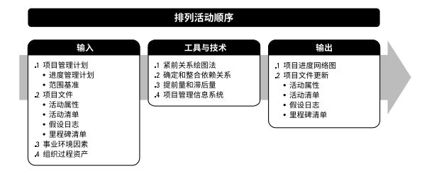  

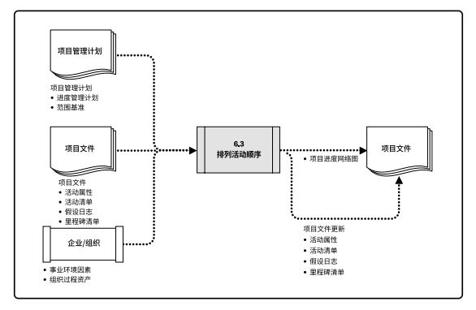

除了首尾两项，每项活动都至少有一项紧前活动和一项紧后活动，并且逻辑关系适当。通过设计逻辑关系来创建一个切实的项目进度计划，可能有必要在活动之间使用提前量或滞后量，使项目进度计划更为切实可行；可以使用项目管理软件、手动技术或自动技术，来排列活动顺序。排列活动顺序过程旨在将项目活动**列表转化为图表**，作为发布进度基准的第一步。  

### 6.3.1 排列活动顺序：输入
#### 6.3.1.1 项目管理计划
包括但不限于：
+ **进度管理计划**。进度管理计划规定了排列活动顺序的方法和准确度，以及所需的其他标准。
+ **范围基准**。在排列活动顺序时，需要明确考虑范围基准中的项目WBS、可交付成果、制约因素和假设条件。  

#### 6.3.1.2 项目文件
包括但不限于：
+ **活动清单**。活动清单列出了项目所需的、待排序的全部进度活动，这些活动的依赖关系和其他制约因素会对活动排序产生影响。
+ **活动属性**。活动属性中可能描述了事件之间的必然顺序或确定的紧前或紧后关系，以及定义的提前量与滞后量、和活动之间的逻辑关系。
+ **假设日志**。假设日志所记录的假设条件和制约因素可能影响活动排序的方式、活动之间的关系，以及对提前量和滞后量的需求，并且有可能生成一个会影响项目进度的单个项目风险。
+ **里程碑清单**。里程碑清单中可能已经列出特定里程碑的计划实现日期，可能影响活动排序的方式。  

#### 6.3.1.3 事业环境因素
包括但不限于：
+ **政府或行业标准**。
+ **项目管理信息系统(PMIS)**。
+ **进度规划工具**。
+ **组织的工作授权系统**。

#### 6.3.1.4 组织过程资产
包括但不限于：
+ **项目组合与项目集规划，以及项目之间的依赖关系与关联**。
+ **现有与活动规划相关的正式和非正式的政策、程序和指南**。
+ **有助于加快项目活动网络图编制的各种模板**。
+ **经验教训知识库**。  

### 6.3.2 排列活动顺序：工具与技术
#### 6.3.2.1 紧前关系绘图法
**紧前关系绘图法(PDM)**是创建进度模型的一种技术，用节点表示活动，用一种或多种逻辑关系连接活动，以显示活动的实施顺序。  
PDM包括四种依赖关系或逻辑关系：  
+ **完成到开始(FS)**。只有紧前活动完成，紧后活动才能开始的逻辑关系。  
+ **完成到完成(FF)**。只有紧前活动完成，紧后活动才能完成的逻辑关系。  
+ **开始到开始(SS)**。只有紧前活动开始，紧后活动才能开始的逻辑关系。  
+ **开始到完成(SF)**。只有紧前活动开始，紧后活动才能完成的逻辑关系。  

在PDM图中，FS是最常用的逻辑关系类型，SF关系则很少使用。虽然两个活动之间可能同时存在两种逻辑关系，但不建议相同的活动之间存在多种关系，必须选择一种最有意义的逻辑关系。**不建议**采用闭环的逻辑关系。  

  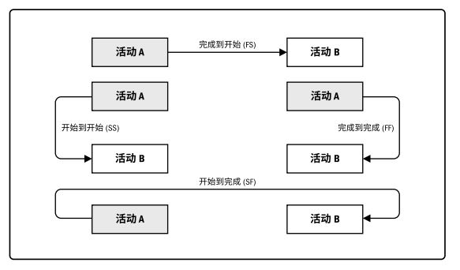  

#### 6.3.2.2 确定和整合依赖关系
依赖关系可能是强制或选择的、内部或外部的。四种依赖关系可组合成强制性外部依赖关系、强制性内部依赖关系、选择性外部依赖关系或选择性内部依赖关系：  
+ **强制性依赖关系**。又称硬逻辑关系或硬依赖关系，是法律或合同要求的或工作的内在性质决定的依赖关系，往往与客观限制有关。不应把强制性依赖关系和进度计划编制工具中的进度制约因素相混淆。  
+ **选择性依赖关系**。有时又称首选逻辑关系、优先逻辑关系或软逻辑关系。应基于具体应用领域的最佳实践或项目的某些特殊性质对活动顺序的要求来创建。选择性依赖关系会影响总浮动时间，并限制后续的进度安排。
+ **外部依赖关系**。是项目活动与非项目活动之间的依赖关系，往往不在项目团队的控制范围内。  
+ **内部依赖关系**。是项目活动之间的紧前关系，通常在项目团队的控制之中。  

#### 6.3.2.3 提前量和滞后量
**提前量**是相对于紧前活动，紧后活动可以提前的时间量。在进度计划软件中，提前量往往表示为负滞后量。**滞后量**是相对于紧前活动，紧后活动需要推迟的时间量。  
项目管理团队应该明确哪些依赖关系中需要加入提前量或滞后量，以便准确地表示活动之间的逻辑关系。提前量和滞后量的使用不能替代进度逻辑关系，而且持续时间估算中不包括任何提前量或滞后量，同时还应该记录各种活动及与之相关的假设条件。

#### 6.3.2.4 项目管理信息系统(PMIS)
项目管理信息系统包括**进度计划软件**，有助于规划、组织和调整活动顺序，插入逻辑关系、提前和滞后值，以及区分不同类型的依赖关系。  

### 6.3.3 排列活动顺序：输出
#### 6.3.3.1 项目进度网络图
**项目进度网络图**是表示项目进度活动之间的逻辑关系（也叫依赖关系）的图形。项目进度网络图可手工或借助PMIS绘制，应附有简要文字描述，说明活动排序所使用的基本方法。在文字描述中，还应该对任何异常的活动序列做出详细说明。  
带有多个紧前活动的活动代表**路径汇聚**，而带有多个紧后活动的活动则代表**路径分支**。带汇聚和分支的活动受多个活动的影响或能够影响多个活动，因此存在更大的风险。  
#### 6.3.3.2 项目文件更新
包括但不限于：
+ **活动清单**。在排列活动顺序时，活动清单可能会受到项目活动关系变更的影响。
+ **活动属性**。活动属性中可能描述了事件之间的必然顺序或确定的紧前或紧后关系，以及定义的提前量与滞后量、和活动之间的逻辑关系。
+ **假设日志**。根据活动排序、关系确定以及提前量和滞后量，可能需要更新假设日志中的假设条件和制约因素，并且有可能生成一个会影响项目进度的风险。
+ **里程碑清单**。在排列活动顺序时，特定里程碑的计划实现日期可能会受到项目活动关系变更的影响。  

## 6.4 估算活动持续时间
估算活动持续时间是根据资源估算的结果，估算完成单项活动所需工作时段数的过程。主要作用是，确定完成每个活动所需花费的时间量。本过程需要在整个项目期间开展。  

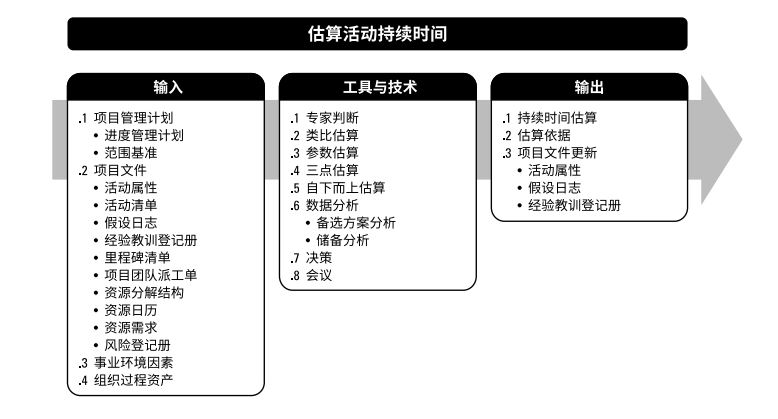  

  

估算活动持续时间依据的信息包括：工作范围、所需资源类型与技能水平、估算的资源数量和资源日历，而可能影响持续时间估算的其他因素包括对持续时间受到的约束、相关人力投入、资源类型以及所采用的进度网络分析技术。应该由项目团队中最熟悉具体活动的个人或小组提供持续时间估算所需的各种输入，对持续时间的估算也应该渐进明细，取决于输入数据的数量和质量。  

在本过程中，应该首先估算出完成活动所需的工作量和计划投入该活动的资源数量，然后结合项目日历和资源日历，据此估算出完成活动所需的工作时段数（活动持续时间）。估算持续时间时需要考虑的其他因素包括：  
+ **收益递减规律**。在保持其他因素不变的情况下，增加一个用于确定单位产出所需投入的因素（如资源）会最终达到一个临界点，在该点之后的产出或输出会随着增加这个因素而递减。
+ **资源数量**。增加资源数量，使其达到初始数量的两倍不一定能缩短一半的时间。
+ **技术进步**。在确定持续时间估算时，这个因素也可能发挥重要作用。
+ **员工激励**。项目经理还需要了解“学生综合征”（即拖延症）和帕金森定律，前者指出，人们只有在最后一刻，即快到期限时才会全力以赴；后者指出，只要还有时间，工作就会不断扩展，直到用完所有的时间。

### 6.4.1 估算活动持续时间：输入
#### 6.4.1.1 项目管理计划
包括但不限于：
+ **进度管理计划**。进度管理计划规定了用于估算活动持续时间的方法和准确度，以及所需的其他标准。
+ **范围基准**。范围基准包含WBS词典，后者包括可能影响人力投入和持续时间估算的技术细节。  
#### 6.4.1.2 项目文件
可作为本过程输入的项目文件包括但不限于：
+ **活动清单**。活动清单列出了项目所需的、待估算的全部进度活动，这些活动的依赖关系和其他制约因素会对持续时间估算产生影响。
+ **活动属性**。活动属性可能描述了确定的紧前或紧后关系、定义的提前量与滞后量以及可能影响持续时间估算的活动之间的逻辑关系。
+ **假设日志**。假设日志所记录的假设条件和制约因素有可能生成一个会影响项目进度的单个项目风险。
+ **经验教训登记册**。项目早期获得的与人力投入和持续时间估算有关的经验教训，可以运用到项目后续阶段，以提高人力投入和持续时间估算的准确性。
+ **里程碑清单**。里程碑清单中可能已经列出特定里程碑的计划实现日期，这可能影响持续时间估算。
+ **项目团队派工单**。将合适的人员分派到团队，为项目配备人员。
+ **资源分解结构**。资源分解结构按照资源类别和资源类型，提供了已识别资源的层级结构。
+ **资源日历**。资源日历中的资源可用性、资源类型和资源性质，都会影响进度活动的持续时间。资源日历规定了在项目期间特定的项目资源何时可用及可用多久。
+ **资源需求**。估算的活动资源需求会对活动持续时间产生影响。对于大多数活动来说，所分配的资源能否达到要求，将对其持续时间有显著影响。
+ **风险登记册**。单个项目风险可能影响资源的选择和可用性。风险登记册的更新包括在项目文件更新中。

#### 6.4.1.3 事业环境因素
能够影响估算活动持续时间过程的事业环境因素包括（但不限于）：
+ **持续时间估算数据库和其他参考数据**。
+ **生产率测量指标**。
+ **发布的商业信息**。
+ **团队成员的所在地**。

#### 6.4.1.4 组织过程资产
能够影响估算活动持续时间过程的组织过程资产包括（但不限于）：
+ **关于持续时间的历史信息**。
+ **项目日历**。
+ **估算政策**。
+ **进度规划方法论**。
+ **经验教训知识库**。

### 6.4.2 估算活动持续时间：工具与技术
#### 6.4.2.1 专家判断
应征求具备专业知识或接受过相关培训的个人或小组的意见。

#### 6.4.2.2 类比估算
类比估算是一种使用相似活动或项目的历史数据，来估算当前活动或项目的持续时间或成本的技术。类比估算以过去类似项目的参数值（如持续时间、预算、规模、重量和复杂性等）为基础，来估算未来项目的同类参数或指标。在估算持续时间时，类比估算技术以过去类似项目的实际持续时间为依据，来估算当前项目的持续时间。  

相对于其他估算技术，类比估算通常成本较低、耗时较少，但准确性也较低。  

#### 6.4.2.3 参数估算
参数估算是一种基于历史数据和项目参数，使用某种算法来计算成本或持续时间的估算技术。它是指利用历史数据之间的统计关系和其他变量（如建筑施工中的平方英尺），来估算诸如成本、预算和持续时间等活动参数。把需要实施的工作量乘以完成单位工作量所需的工时，即可计算出持续时间。

参数估算的准确性取决于参数模型的成熟度和基础数据的可靠性。

#### 6.4.2.4 三点估算
通过考虑估算中的不确定性和风险，可以提高持续时间估算的准确性。使用三点估算有助于界定活动持续时间的近似区间：
+ **最可能时间 (tM)**。基于最可能获得的资源、最可能取得的资源生产率、对资源可用时间的现实
预计、资源对其他参与者的可能依赖关系及可能发生的各种干扰等，所估算的活动持续时间。
+ **最乐观时间 (tO)**。基于活动的最好情况所估算的活动持续时间。
+ **最悲观时间 (tP)**。基于活动的最差情况所估算的持续时间。

基于持续时间在三种估算值区间内的假定分布情况，可计算期望持续时间 tE。  
一个常用公式为三角分布：  
> tE = (tO + tM + tP) / 3.  
	
> 活动历时均值(或估计值)=(乐观估计+4×最可能估计+悲观估计)/6  
活动历时标准差=(悲观估计值- 乐观估计值)/6  
活动历时方差=活动历时标准差的平方根   

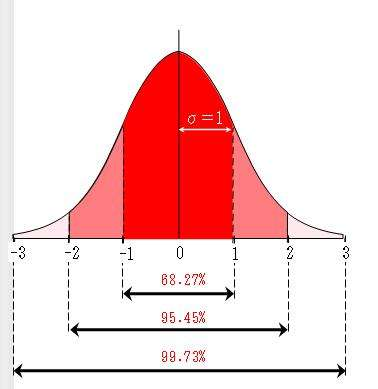  

#### 6.4.2.5 自下而上估算
自下而上估算是一种估算项目持续时间或成本的方法，通过从下到上逐层汇总 WBS 组成部分的估算而得到项目估算。

#### 6.4.2.6 数据分析
可用作本过程的数据分析技术包括（但不限于）：
+ **备选方案分析**。备选方案分析用于比较不同的资源能力或技能水平、进度压缩技术、不同工具（手动和自动），以及关于资源的创建、租赁或购买决策。这有助于团队权衡资源、成本和持续时间变量，以确定完成项目工作的最佳方式。
+ **储备分析**。储备分析用于确定项目所需的应急储备量和管理储备。
	- **应急储备**是**包含在进度基准中**的一段持续时间，用来应对已经接受的已识别风险。应急储备与“已知 — 未知”风险相关，需要加以合理估算，用于完成未知的工作量。随着项目信息越来越明确，可以动用、减少或取消应急储备，应该在项目进度文件中清楚地列出应急储备。也可以估算项目进度管理所需要的管理储备量。
	- **管理储备**是为管理控制的目的而特别留出的项目预算，用来应对项目范围中不可预见的工作。管理储备用来应对会影响项目的“未知 — 未知”风险，它**不包括在进度基准中**，但属于项目总持续时间的一部分。依据合同条款，使用管理储备可能需要变更进度基准。

#### 6.4.2.7 决策
适用于本过程的决策技术包括（但不限于）**投票**。	
	
#### 6.4.2.8 会议
项目团队可能会召开会议来估算活动持续时间。

### 6.4.3 估算活动持续时间：输出
#### 6.4.3.1 持续时间估算
持续时间估算是对完成某项活动、阶段或项目所需的工作时段数的定量评估，其中并不包括任何滞后量，但可指出一定的变动区间。

#### 6.4.3.2 估算依据
持续时间估算所需的支持信息的数量和种类，因应用领域而异。持续时间估算的支持信息可包括：
+ 关于估算依据的文件（如估算是如何编制的）；
+ 关于全部假设条件的文件；
+ 关于各种已知制约因素的文件；
+ 对估算区间的说明（如“±10%”），以指出预期持续时间的所在区间；
+ 对最终估算的置信水平的说明；
+ 有关影响估算的单个项目风险的文件。

#### 6.4.3.3 项目文件更新
可在本过程更新的项目文件包括（但不限于）：
+ **活动属性**。本过程输出的活动持续时间估算将记录在活动属性中。
+ **假设日志**。这包括为估算持续时间而制定的假设条件，如资源的技能水平、可用性，以及估算依据，此外还记录了进度计划方法论和进度计划编制工具所带来的制约因素。
+ **经验教训登记册**。在更新经验教训登记册时，可以增加能够有效和高效地估算人力投入和持续时间的技术。

## 6.5 制定进度计划
制定进度计划是分析活动顺序、持续时间、资源需求和进度制约因素，创建*进度模型*，从而落实项目执行和监控的过程。主要作用是，为完成项目活动而制定具有计划日期的进度模型。本过程需要在整个项目期间开展。

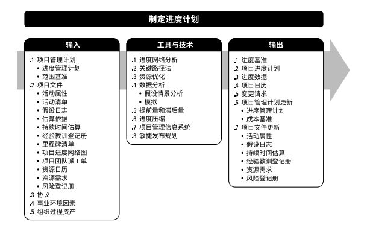   

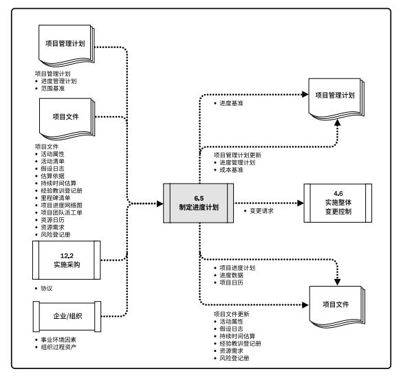

制定可行的项目进度计划是一个*反复进行*的过程。基于获取的最佳信息，使用进度模型来确定各项目活动和里程碑的计划开始日期和计划完成日期。编制进度计划时，需要审查和修正持续时间估算、资源估算和进度储备，以制定项目进度计划，并在经批准后作为基准用于跟踪项目进度。  

### 6.5.1 制定进度计划：输入
#### 6.5.1.1 项目管理计划
项目管理计划组件包括（但不限于）：
+ **进度管理计划**。进度管理计划规定了用于制定进度计划的进度计划编制方法和工具，以及推算进度计划的方法。
+ **范围基准**。范围说明书、 WBS 和 WBS 词典包含了项目可交付成果的详细信息，供创建进度模型时借鉴。

#### 6.5.1.2 项目文件
可作为本过程输入的项目文件包括（但不限于）：
+ **活动属性**。活动属性提供了创建进度模型所需的细节信息。
+ **活动清单**。活动清单明确了需要在进度模型中包含的活动。
+ **假设日志**。假设日志所记录的假设条件和制约因素可能造成影响项目进度的单个项目风险。
+ **估算依据**。持续时间估算所需的支持信息的数量和种类，因应用领域而异。不论其详细程度如何，支持性文件都应该清晰、完整地说明持续时间估算是如何得出的。
+ **持续时间估算**。持续时间估算包括对完成某项活动所需的工作时段数的定量评估，用于进度计划的推算。
+ **经验教训登记册**。在项目早期获得的与创建进度模型有关的经验教训，可以运用到项目后期阶段，以提高进度模型的有效性。
+ **里程碑清单**。里程碑清单列出特定里程碑的计划实现日期。
+ **项目进度网络图**。项目进度网络图中包含用于推算进度计划的紧前和紧后活动的逻辑关系。
+ **项目团队派工单**。项目团队派工单明确了分配到每个活动的资源。
+ **资源日历**。资源日历规定了在项目期间的资源可用性。
+ **资源需求**。活动资源需求明确了每个活动所需的资源类型和数量，用于创建进度模型。
+ **风险登记册**。风险登记册提供了会影响进度模型的全部已识别风险的详细信息及特征。进度储备则通过预期或平均风险影响程度，反映了与进度有关的风险信息。

#### 6.5.1.3 协议
在制定如何执行项目工作以履行合同承诺的详细信息时，供应商为项目进度提供了输入。  

#### 6.5.1.4 事业环境因素
能够影响制定进度计划过程的事业环境因素包括（但不限于）：
+ 政府或行业标准；
+ 沟通渠道。
#### 6.5.1.5 组织过程资产
能够影响制定进度计划过程的组织过程资产包括（但不限于）：
+ 进度计划方法论，其中包括制定和维护进度模型时应遵循的政策；
+ 项目日历。

### 6.5.2 制定进度计划：工具与技术
#### 6.5.2.1 进度网络分析
进度网络分析是创建项目进度模型的一种综合技术，它采用了其他几种技术，例如关键路径法、资源优化技术和建模技术。其他分析包括（但不限于）：
+ 当多个路径在同一时间点汇聚或分叉时，**评估汇总进度储备的必要性**，以减少出现进度延误的可能性。
+ 审查网络，看看**关键路径**是否存在高风险活动或具有较多提前量的活动，是否需要使用进度储备或执行风险应对计划来降低关键路径的风险。  

进度网络分析是一个反复进行的过程，一直持续到创建出可行的进度模型。

#### 6.5.2.2 关键路径法
**关键路径法**用于在进度模型中估算项目最短工期，确定逻辑网络路径的进度灵活性大小。这种进度网络分析技术在不考虑任何资源限制的情况下，沿进度网络路径使用顺推与逆推法，计算出所有活动的**最早开始、最早结束、最晚开始和最晚法完**日期。  
关键路径是项目中时间最长的活动顺序，决定着可能的项目最短工期。关键路径法用来计算进度模型中的关键路径、总浮动时间和自由浮动时间，或逻辑网络路径的进度灵活性大小。  
进度活动可以从最早开始日期推迟或拖延的时间，而不至于延误项目完成日期或违反进度制约因素，就是**总浮动时间**或**进度灵活性**。正常情况下，关键路径的总浮动时间为零。  

[返回目录](../../00.目录.md)

