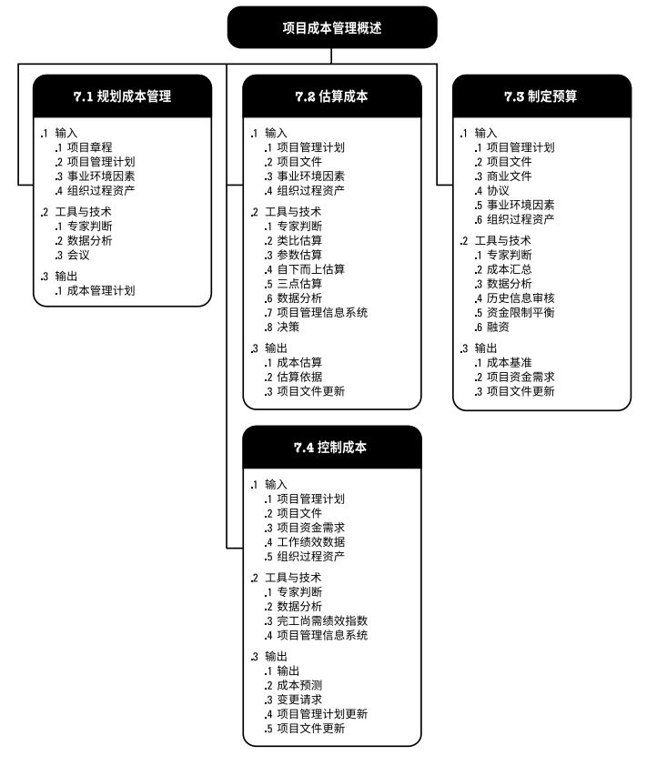
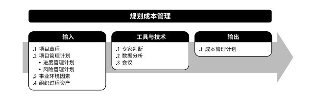
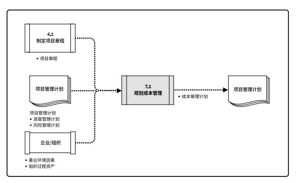
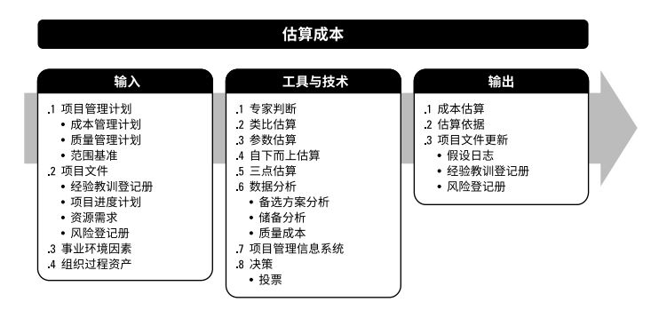
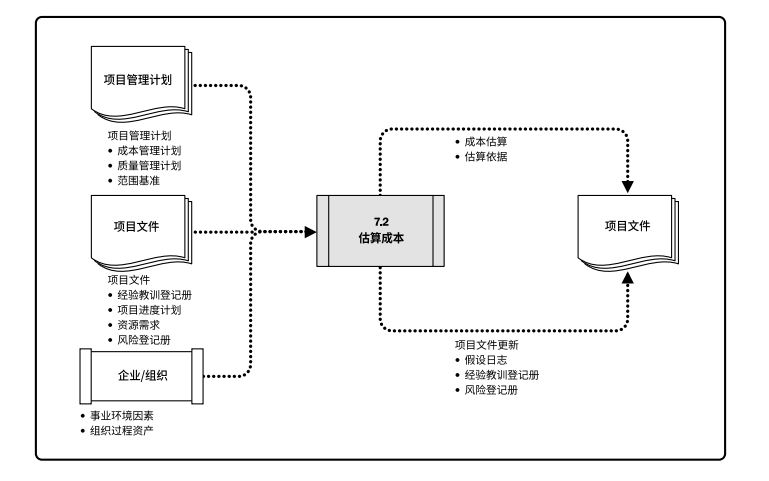

## 项目成本管理

**项目成本管理**包括为使项目在批准的预算内完成而对成本进行规划、估算、预算、融资、筹资、管理和控制的各个过程，从而确保项目在批准的预算内完工。包括：  
+ **规划成本管理** - 确定如何估算、预算、管理、监督和控制项目成本的过程。  
+ **估算成本** - 对完成项目活动所需货币资源进行近似估算的过程。  
+ **制定预算** - 汇总所有单个活动或工作包的估算成本，建立一个经批准的成本基准的过程。  
+ **控制成本** - 监督项目状态，以便更新项目成本和管理成本基准变更的过程。  

  

项目成本管理重点关注完成项目活动所需资源的成本，但同时也应考虑项目决策对项目产品、服务或成果的使用成本、维护成本和支持成本的影响。成本管理的另一个方面是认识到不同的相关方会在不同的时间，用不同的方法测算项目成本。  

**挣得进度**(**ES**)是**挣值管理**(**EVM**)理论和实践的延伸。挣得进度理论用ES和实际时间(**AT**)替代了传统EVM所使用的进度偏差测量指标(挣值-计划价值)，计算进度偏差ES-AT，如果挣得进度大于0，则表示项目进度提前了。挣得进度测量指标的进度绩效指数(SPI)为ES与AT之比，表示完成项目的工作效率。  

裁剪项目成本管理过程的因素包括：  
+ **知识管理**  
+ **估算和预算**  
+ **挣值管理**  
+ **敏捷方法的使用**  
+ **治理**  

对于易变性高、范围并未完全明确、经常发生变更的项目，可以采用轻量级估算方法快速生成对项目人力成本的高层级预测，在出现变更时容易调整预测；详细的估算适用于采用准时制的短期规划。  

## 7.1 规划成本管理
规划成本管理使确定如何估算、预算、管理、监督和控制项目成本的过程。主要作用是在整个项目期间为如何管理项目成本提供指南和方向。本过程仅开展一次或仅在项目的预定义点开展。  

  

  

应该在项目规划阶段的早期就对成本管理工作进行规划，建立各成本管理过程的基本框架，以确保各过程的有效性和协调性。  

### 7.1.1 规划成本管理：输入
#### 7.1.1.1 项目章程
项目章程规定了预先批准的财务资源，可据此确定详细的项目成本。项目章程所规定的项目审批要求，也对项目成本管理有影响。  
#### 7.1.1.2 项目管理计划
+ **进度管理计划**。进度管理计划确定了编制、监督和控制项目进度的准则和活动，同时也提供了影响成本估算和管理的过程及控制方法。  
+ **风险管理计划**。风险管理计划提供了识别、分析和监督风险的方法，同时也提供了影响成本估算和管理的过程及控制方法。  
#### 7.1.1.3 事业环境因素
能够影响规划成本管理过程的事业环境因素包括：  
+ 能够影响成本管理的组织文化和组织结构；  
+ 市场条件，决定着在当地及全球市场上课获取哪些产品、服务或成果；  
+ 货币汇率，用于换算发生在多个国家的项目成本；  
+ 发布的商业信息；  
+ 项目管理信息系统，可为管理成本提供多种方案；  
+ 不同地区的生产率差异，可能会对项目成本造成巨大影响。  
#### 7.1.1.4 组织过程资产
能够影响规划成本管理过程的组织过程资产包括：  
+ 财务控制程序；
+ 历史信息和经验教育知识库；
+ 财务数据库；
+ 现有的正式和非正式的与成本估算和预算有关的政策、程序和指南。  

### 7.1.2 规划成本管理：工具和技术
#### 7.1.2.1 专家判断
应征求具备以下专业知识或接受过相关培训的个人或小组的意见：以往类似项目；来自行业、学科和应用领域的信息；成本估算和预算；挣值管理。  
#### 7.1.2.2 数据分析
数据分析技术包括(但不限于)备选方案分析。备选方案分析可包括审查筹资的战略方法，还可以包括对获取项目资源的方法的考量。  
#### 7.1.2.3 会议
项目团队可能举行规划会议来制定成本管理计划。

### 7.1.3 规划成本管理：输出
#### 7.1.3.1 成本管理计划
成本管理计划是项目管理计划的组成部分，描述将如何规划、安排和控制项目成本。成本管理过程及其工具与技术应记录在成本管理计划中。  

## 7.2 估算成本
估算成本是对完成项目工作所需资源成本进行近似估算的过程。本过程的主要作用是，确定项目所需的资金。本过程应根据需要在整个项目期间定期开展。  

  

成本估算是对完成活动所需资源的可能成本的量化评估，是在某特定时点，根据已知信息所做出的成本预测。  
在项目过程中，应该随着更详细信息的呈现和假设条件的验证，对成本估算进行审查和优化。在项目生命周期中，项目估算的准确性亦将随着项目的进展而逐步提高。  

### 7.2.1 估算成本：输入
#### 7.2.1.1 项目管理计划
包括但不限于：  
+ **成本管理计划**。成本管理计划描述了可使用的估算方法以及成本估算需要达到的准确度和精确度。    
+ **质量管理计划**。质量管理计划描述了项目管理团队为实现一系列项目质量目标所需的活动和资源。  
+ **范围基准**。包括范围说明书、WBS和WBS字典。  
#### 7.2.1.2 项目文件
包括但不限于：  
+ **经验教训登记册**。项目早期与制定成本估算有关的经验教训可以运用到项目后期阶段，以提高成本估算的准确度和精确度。  
+ **项目进度计划**。进度计划包括项目可用的团队和实物资源的类型、数量和可用时间长短。进度计划还为包含融资成本（包括利息）的项目提供有用信息。  
+ **资源需求**。资源需求明确了每个工作包或活动所需的资源类型和数量。  
+ **风险登记册**。风险登记册包含了已识别并按优先顺序排列的单个项目风险的详细信息，及针对这些风险采取的应对措施。风险登记册提供了可用于估算成本的详细信息。  
#### 7.2.1.3 事业环境因素
包括但不限于：
+ 市场条件。
+ 发布的商业信息。  
+ 汇率和通货膨胀率。  
#### 7.2.1.4 组织过程资产
包括但不限于；成本估算政策；成本估算模板；历史信息和经验教训知识库。  

### 7.2.2 估算成本：工具和技术
#### 7.2.2.1 专家判断
应征求具备以下专业知识或接受过相关培训的个人或小组的意见：以往类似项目；来自行业、学科和应用领域的信息；成本估算方法。  
#### 7.2.2.2 类比估算
成本类比估算使用以往类似项目的参数值或属性来估算。项目的参数值和属性包括但不限于：范围、成本、预算、持续时间和规模指标。  
#### 7.2.2.3 参数估算
参数估算是指利用历史数据之间的统计关系和其他变量，来进行项目工作的成本估算，参数估算的准确性取决于参数模型的成熟度和基础数据的可靠性。  
#### 7.2.2.4 自下而上估算
自下而上估算是对工作组成部分进行估算的一种方法。候选对单个工作包或活动的成本进行最具体、细致的估算，然后把这些细节性成本向上汇总或“滚动”到更高层次，用于后续报告和跟踪。  
#### 7.2.2.5 三点估算
通过考略估算中的不确定性与风险，使用三种估算值来界定活动成本的近似区间，可以提高单点成本估算的准确性：**最可能成本（cM）**、**最乐观成本(cO)**、**最悲观成本(cP)**。基于活动成本在三种估算值区间内的假定分布情况，使用公式来计算**预期成本(cE)**。两种常用的公式是：  
+ **三角分布**。cE=(cO+cM+cP)/3   
+ **贝塔分布**。cE=(cO+4cM+cP)/6  
#### 7.2.2.6 数据分析
包括但不限于：  
+ **备选方案分析**。  
+ **储备分析**。
+ **质量成本**。  
#### 7.2.2.7 项目管理信息系统（PMIS）
项目管理信息系统可包括电子表单、模拟软件以及统计分析工具，可用来辅助成本估算。  
#### 7.2.2.8 决策
包括但不限于：投票。投票是为达成某种期望结果，而对多个未来行动方案进行评估的过程。  

### 7.2.3 估算成本：输出
#### 7.2.3.1 成本估算
成本估算包括对完成项目工作可能需要的成本、应对已识别风险的应急储备，以及应对计划外工作的管理储备的量化估算。  
#### 7.2.3.2 估算依据
成本估算所需的支持信息的数量和种类，因应用领域而异，不论其详细程度如何，支持性文件都应该清晰、完整地说明成本估算是如何得出的。  
#### 7.2.3.3 项目文件更新
包括但不限于：
+ 假设日志。  
+ 经验教训登记册。  
+ 风险登记册。  

[返回目录](../../00.目录.md)