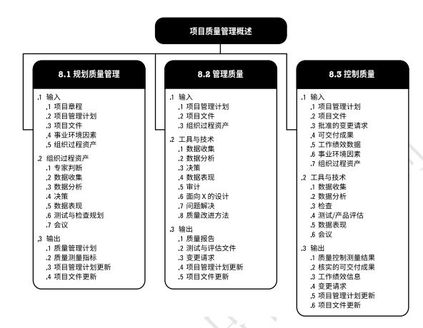
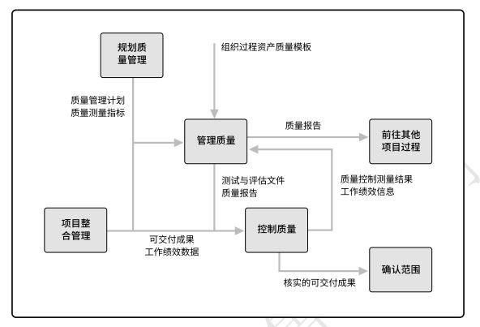
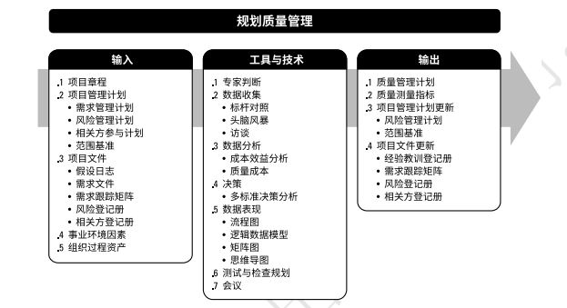
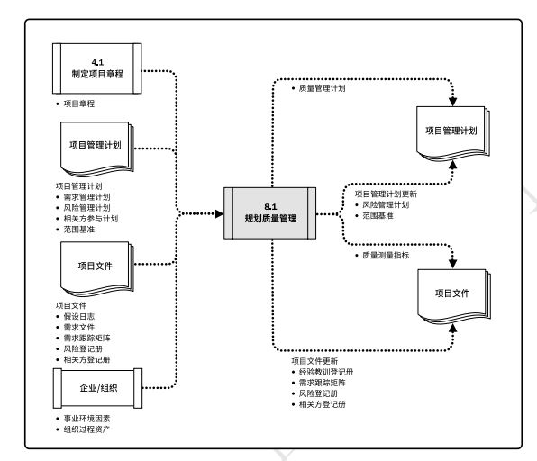
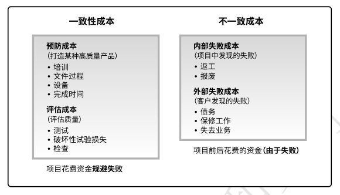
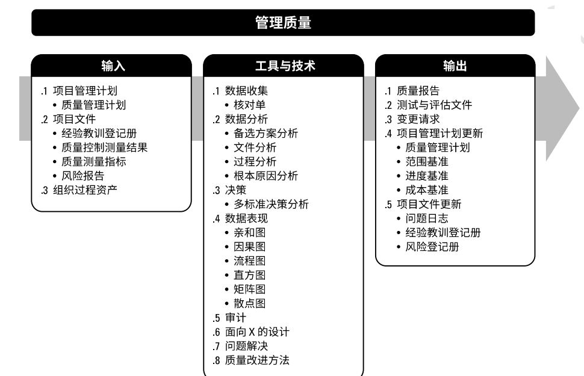
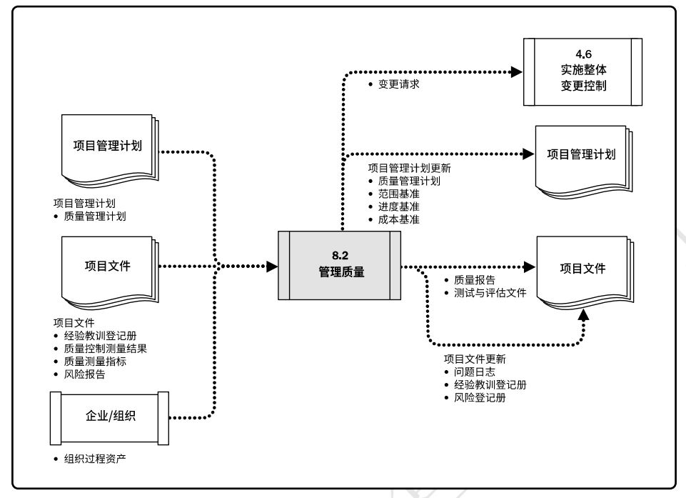
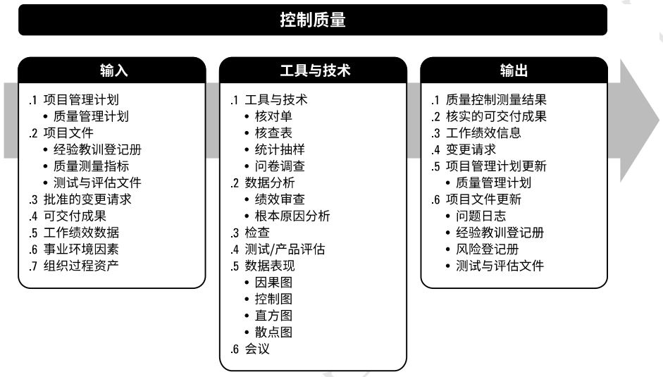
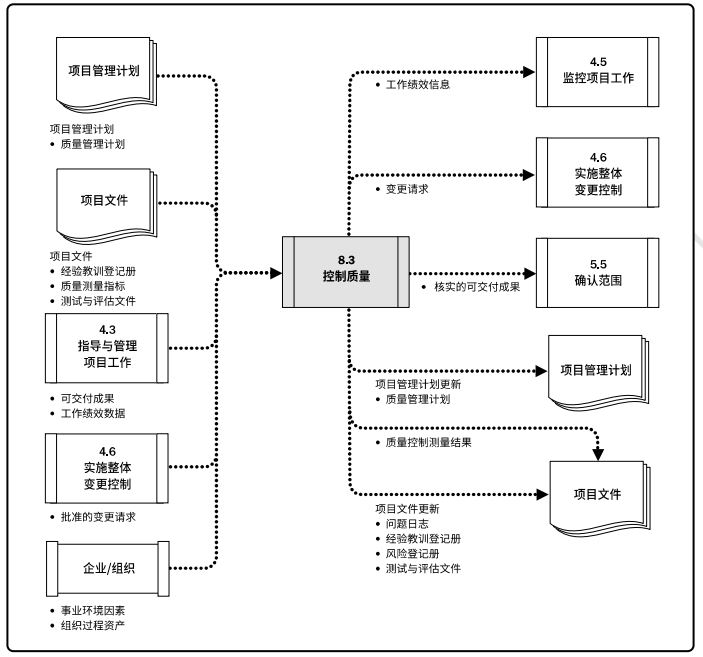

# 项目质量管理
 项目质量管理包括吧组织的质量政策应用于规划、管理、控制项目和产品质量要求，以满足相关方目标的各个过程。项目质量管理过程包括：  
 + **8.1 规划质量管理** - 识别项目及其可交付成果的质量要求和/或标准，并书面描述项目将如何证明符合质量要求和/或标准的过程。  
 + **8.2 管理质量** - 把组织的质量政策应用于项目，并将质量管理计划转化为可执行的质量活动的过程。  
 + **8.3 控制质量** - 为了评估绩效，确保项目输出完整、正确，并满足客户期望，而监督和记录质量管理活动执行结果的过程。  
 
  

规划质量管理过程关注于工作需要达到的质量，管理质量则关注管理整个项目期间的质量过程。在管理质量过程期间，把在规划质量管理过程中识别的质量要求转化成测试与评估工具，将用于控制质量过程，以确认项目是否达到这些质量要求。控制质量关注工作成果与质量要求的比较，确保结果可接受。项目质量管理知识领域有连个用于其他知识领域的特定输出，即核实的可交付成果和质量报告。  

  

项目质量管理需要兼顾项目管理与项目可交付成果两个方面，适用于所有项目，无论项目的可交付成果具有何种特性。质量的测量方法和技术则需专门针对项目所产生的可交付成果类型而定。  
质量和等级：项目经理及项目管理团队负责权衡，以便同时达到所要求的质量与等级水平。  
预防胜于检查。最好将质量设计到可交付成果中，而不是在检查时发现质量问题。预防错误的成本通常远低于在检查或使用中发现并纠正错误的成本。  
**质量成本COQ**包括在产品生命周期中为预防不符合要求、为评价产品或服务是否符合要求，以及因未达到要求(返工)而发生的所有成本。失败成本通常分为内部(项目团队发现的)和外部(客户发现的)两类，也称为劣质成本。
按有效性递增排列的五种质量管理水平如下：  
+ 通常，代价最大的方法是让客户发现缺陷。可能导致担保问题、召回、商誉受损和返工成本。  
+ 控制质量过程包括先检测和纠正缺陷，再将可交付成果发送给客户。会带来相关成本，主要是评估成本和内部失败成本。  
+ 通过质量保证检查并纠正过程本身，而不仅仅是特殊缺陷。  
+ 将质量融入项目和产品的规划和设计中。  
+ 在整个组织内创建一种关注并致力于实现过程和产品质量的文化。  

项目质量管理的趋势包括但不限于：客户满意；持续改进；管理层的责任；与供应商的互利合作关系。  
裁剪考虑因素包括但不限于：政策合规与审计；标准与法规合规性；持续改进；相关方参与。  

## 8.1 规划质量管理
**规划质量管理**是识别项目及其可交付成果的质量要求和标准，并书面描述项目将如何证明符合质量要求和(或)标准的过程。主要作用是，为在整个项目期间如何管理和核实质量提供指南和方向。本过程仅开展一次或仅在项目的预定义点开展。  

  
  

质量规划应与其他规划过程并行开展。  
### 8.1.1 规划质量管理：输入
#### 8.1.1.1 项目章程
项目章程中包含对项目和产品特征的高层级描述，还包括可以影响项目质量管理的项目审批要求、可测量的项目目标和相关的成功标准。  
#### 8.1.1.2 项目管理计划
包括但不限于：  
+ 需求管理计划。提供了识别、分析和管理需求的方法，以供质量管理计划和质量测量指标借鉴。  
+ 风险管理计划。提供了识别、分析和监督风险的方法。将风险管理计划和质量管理计划的信息相结合，有助于成功交付产品和项目。  
+ 相关方参与计划。提供了记录相关方需求和期望的方法，为质量管理奠定了基础。  
+ 范围基准。在确定适用于项目的质量标准和目标时，以及在确定要求质量审查的项目可交付成果和过程时，需要考虑WBS和项目范围说明书中记录的可交付成果。范围说明书包含可交付成果的验收标准。该标准的界定可能导致质量成本并进而导致项目成本的显著升高或降低。满足所有的验收标准意味着满足相关方的需求。  
#### 8.1.1.3 项目文件
包括但不限于：  
+ 假设日志。记录与质量要求和标准合规性有关的所有假设条件和制约因素。  
+ 需求文件。记录项目和产品为满足相关方的期望应达到的要求，包括但不限于针对项目和产品的质量要求。  
+ 需求跟踪矩阵。将产品需求连接到可交付成果，有助于确保需求文件中的各项需求都得到测试。  
+ 风险登记册。包含可能影响质量要求的各种威胁和机会的信息。  
+ 相关方登记册。有助于识别对质量有特别兴趣或影响的相关方，尤其注重客户和项目发起人的需求和期望。  
#### 8.1.1.4 事业环境因素
包括但不限于：  
政府法规；特定应用领域的相关规则、标准和指南；地理分布；组织结构；市场条件；项目或可交付成果的工作条件或运行条件；文化观念。  
#### 8.1.1.5 组织过程资产
包括但不限于：  
+ 组织的质量管理体系，包括政策、程序及指南；
+ 质量模板，例如核查表、跟踪矩阵及其它；
+ 历史数据库和经验教训知识库。  

### 8.1.2 规划质量管理：工具与技术
#### 8.1.2.1 专家判断
应征求具备以下专业知识或接受过相关培训的个人或小组的意见：  
质量保证；质量控制；质量测量结果；质量改进；质量体系。  
#### 8.1.2.2 数据收集
包括但不限于：  
+ **标杆对照**。
+ **头脑风暴**。
+ **访谈**。
#### 8.1.2.3 数据分析
包括但不限于：  
+ **成本效益分析**。是用来估算备选方案优势和劣势的财务分析工具，以确定可以创造最佳效益的备选方案。可帮助项目经理确定规划的质量活动是否具有成本有效性。达到质量要求的主要效益包括减少返工、提高生产率、降低成本、提升相关方满意度及提升赢利能力。  
+ **质量成本**。与项目有关的质量成本(COQ)包含：  
  - *预防成本*。预防特定项目的产品、可交付成果或服务质量低劣所带来的相关成本。  
  - *评估成本*。评估、测量、审计和测试特定项目的产品、可交付成果或服务所带来的相关成本。  
  - *失败成本（内部/外部）*。因产品、可交付成果或服务与相关方需求或期望不一致而导致的相关成本。
  
  最优COQ能够在预防成本和评估成本之间找到恰当的投资平衡点，以规避失败成本。  
  
  
#### 8.1.2.4 决策
适用于本过程的决策技术包括但不限于：多标准决策分析。多标准决策分析可用于识别关键事项和合适的备选方案，并对备选方案排出优先顺序，作为供执行的决策。  
#### 8.1.2.5 数据表现
包括但不限于：  
+ 流程图。也称为过程图，用来显示在一个或多个输入转化为一个或多个输出的过程中，所需要的步骤顺序和可能分支。通过映射水平价值链的过程细节来显示活动、决策点、分支循环、并行路径及整体处理顺序。可帮助改进过程并识别可能出现质量缺陷或可以纳入质量检查的地方。  
+ 逻辑数据模型。逻辑数据模型把组织数据可视化，以商业语言加以描述，不依赖任何特定技术。可用于识别会出现数据完整性或其他质量问题的地方。  
+ 矩阵图。在行列较差的位置展示因素、原因和目标之间的关系强弱。有助于识别对项目成功至关重要的质量测量指标。  
+ 思维导图。是一种用于可视化组织信息的绘图法。可以有助于快速收集项目质量要求、制约因素、依赖关系和联系。  
#### 8.1.2.6 测试与检查规划
在规划阶段，项目经理和项目团队决定如何测量或检查产品、可交付成果或服务，以满足相关方的需求和期望，以及如何满足产品的绩效和可靠性目标。  
#### 8.1.2.7 会议

### 8.1.3 规划质量管理：输出
#### 8.1.3.1 质量管理计划
质量管理计划是项目管理计划的组成部分，描述如何实施适用的政策、程序和指南以实现质量目标。描述了项目管理团队为实现一系列项目质量目标所需的活动和资源。质量管理计划包括但不限于：  
+ 项目将采用的质量标准；  
+ 项目的质量目标；  
+ 质量角色与职责；  
+ 需要质量审查的项目可交付成果和过程；  
+ 为项目规划的质量控制和质量管理活动；  
+ 项目将使用的质量工具；  
+ 与项目有关的主要程序，例如处理不符合要求的情况、纠正措施程序，以及持续改进程序。  
#### 8.1.3.2 质量测量指标
质量测量指标专用于描述项目或产品属性，以及控制质量过程将如何验证质量符合测量指标程度。  
#### 8.1.3.3 项目管理计划更新
项目管理计划的任何变更都以变更请求的形式提出，且通过组织的变更控制过程进行处理。可能需要变更请求的项目管理计划组成部分包括但不限于：  
+ 风险管理计划。在确定质量管理方法时可能需要更改已商定的项目风险管理方法，这些变更会记录在风险管理计划中。  
+ 范围基准。如果需要增加特定的质量管理活动，范围基准可能因本过程而变更。
#### 8.1.3.4 项目文件更新
更新的项目文件包括但不限于： 
+ 经验教训登记册。
+ 需求跟踪矩阵。
+ 风险登记册。
+ 相关方登记册。

## 8.2 管理质量
管理质量是把组织的质量政策用于项目，并将质量管理计划转化为可执行的质量活动的过程。主要作用是，提高实现质量目标的可能性，以及识别无效过程和导致质量低劣的原因。管理质量使用控制质量过程的数据和结果向相关方展示项目的总体质量状态。本过程需要在整个项目期间开展。  

  

  

质量管理有时被称为“质量保证”，但范围更广，因其可用于非项目工作。在项目管理中，质量保证着眼于项目使用的过程，旨在高效地执行项目过程，包括遵守和满足标准，向相关方保证最终产品可以满足他们的需求、期望和要求。管理质量包括所有质量保证活动，还与产品设计和过程改进有关。管理质量的工作属于质量成本框架中的一致性工作。  
管理质量过程执行在项目质量管理计划中所定义的一系列有计划、有系统的行动和过程，有助于：  
+ 通过执行有关产品特定方面的设计准则，设计出最优的成熟产品；  
+ 建立信心，相信通过质量保证工具和技术可以使未来输出在完工时满足特定的需求和期望；  
+ 确保使用质量过程并确保其使用能够满足项目的质量目标；  
+ 提高过程和活动的效率与效果，以获得更好的成果和绩效并提高相关方的满意程度。  

管理质量被认为是所有人的共同职责，包括项目经理、项目团队、项目发起人、执行组织的管理层，甚至是客户。

### 8.2.1 管理质量：输入
#### 8.2.1.1 项目管理计划
项目管理计划组件包括但不限于质量管理计划。
#### 8.2.1.2 项目文件
包括但不限于：  
+ 经验教训登记册。
+ 质量控制测量结果。
+ 质量测量指标。
+ 风险报告。
#### 8.2.1.3 组织过程资产
包括但不限于：  
+ 包括政策、程序及指南的组织质量管理体系；
+ 质量模板，例如核查表、跟踪矩阵、测试计划、测试文件及其他模板；
+ 以往审计的结果；
+ 包含类似项目信息的经验教训知识库。
### 8.2.2 管理质量：工具和技术
#### 8.2.2.1 数据收集
包括但不限于：核对单。核对单是一种结构化工具，通常列出特定组成部分，用来核实所要求的一系列步骤是否已得到执行或检查需求列表是否已得到满足。  
#### 8.2.2.2 数据分析
包括但不限于：  
+ *备选方案分析*。用于评估已识别的可选方案，以选择那些最合适的质量方案或方法。  
+ *文件分析*。分析项目控制过程所输出的不同文件，可以重点指出可能超出控制范围之外并阻碍项目团队满足特定要求或相关方期望的过程。  
+ *过程分析*。可以识别过程改进机会，同时检查在过程期间遇到的问题、制约因素，以及非增值活动。  
+ *根本原因分析(RCA)*。根本原因分析是确定引起偏差、缺陷或风险的根本原因的一种分析技术，可用于识别问题的根本原因并解决问题。  
#### 8.2.2.3 决策
包括但不限于：多标准决策分析。
#### 8.2.2.4 数据表现
包括但不限于：  
+ 亲和图。
+ 因果图。
+ 流程图。
+ 直方图。
+ 矩阵图。
+ 散点图。
#### 8.2.2.5 审计
审计是用于确定项目活动是否遵循了组织和项目的政策、过程与程序的一种结构化且独立的过程。通常由项目外部的团队开展。质量审计包括但不限于：  
+ 识别全部正在实施的良好及最佳实践；
+ 识别所有违规做法、差距及不足；
+ 分享所在组织和/或行业中类似项目的良好实践；
+ 积极、主动地提供协助，以改进过程的执行，从而帮助团队提高生产效率；
+ 强调每次审计都应对组织经验教训知识库的积累做出贡献。  

#### 8.2.2.6 面向X的设计
面向X的设计(DfX)是产品设计期间可采用的一系列技术指南，旨在优化设计的特定方面，可以控制或提高产品最终特性。  
#### 8.2.2.7 问题解决
问题解决是指找到解决问题或应对挑战的解决方案。包括收集其他信息、具有批判性思维的、创造性的、量化的和/或逻辑性的解决方法。使用结构化的问题解决方法有助于消除问题和制定长久有效的解决方案。包括以下因素：  
+ 定义问题；
+ 识别根本原因；
+ 生成可能的解决方案；
+ 选择最佳解决方案；
+ 执行解决方案；
+ 验证解决方案的有效性。 
#### 8.2.2.8 质量改进方法
质量改进的开展，可基于质量控制过程的发现和建议、质量审计的发现，或管理质量过程的问题解决。计划-实施-检查-行动和六西格玛是最常用于分析和评估改进机会的两种质量改进工具。  
### 8.2.3 管理质量：输出
#### 8.2.3.1 质量报告
质量报告可能是图形、数据或定性文件，其中包含的信息可帮助其他过程和部门采取纠正措施，以实现项目质量期望。质量报告的信息可包含团队上报的全部质量管理问题，针对过程、项目和产品的改善建议，纠正措施建议（包括返工、缺陷/漏洞补救、100%检查等），以及在控制质量过程中发现的情况的概述。  
#### 8.2.3.2 测试与评估文件
可基于行业需求和组织模板创建测试与评估文件。是控制质量过程的输入，用于评估质量目标的实现情况。可能包括专门的核对单和详尽的需求跟踪矩阵。  
#### 8.2.3.3 变更请求
如果管理质量过程期间出现了可能影响项目管理计划任何组成部分、项目文件或项目/产品管理过程的变更，项目经理应提交变更请求并遵循实施整体变更控制过程。   
#### 8.2.3.4 项目管理计划更新
项目管理计划的任何变更都以变更请求的形式提出，且通过组织的变更控制过程进行处理。 包括但不限于：  
+ 质量管理计划。
+ 范围基准。
+ 进度基准。
+ 成本基准。  
#### 8.2.3.5 项目文件更新
包括但不限于：  
+ 问题日志。
+ 经验教训登记册。
+ 风险登记册。  

## 8.3 控制质量
控制质量是为了评估绩效，确保项目输出完整、正确且满足客户期望，而监督和记录质量管理活动执行结果的过程。主要作用是，核实项目可交付成果和工作已经达到主要相关方的质量要求，可供最终验收。控制质量过程确定项目输出是否达到预期目的，这些输出需要满足所有适用标准要求、法规和规范。本过程需要在整个项目期间开展。  

  

  

控制质量过程的目的是在用户验收和最终交付之前测量产品或服务的完整性、合规性和适用性。本过程通过测量所有步骤、属性和变量，来核实与规划阶段所描述规范的一致性和合规性。  
在整个项目期间应执行质量控制，用可靠的数据来证明项目已经达到发起人和/或客户的验收标准。  
控制质量所需的努力程度和执行程序可能会因所在行业和项目管理风格而不同。  

### 8.3.1 控制质量：输入
#### 8.3.1.1 项目管理计划
包括但不限于：质量管理计划。质量管理计划定义了如何在项目中开展质量控制。  
#### 8.3.1.2 项目文件
包括但不限于：  
+ 经验教训登记册。
+ 质量测量指标。
+ 测试与评估文件。
#### 8.3.1.3 批准的变更请求
批准的变更请求的实施需要核实，并需要确认完整性、正确性，以及是否重新测试。  
#### 8.3.1.4 可交付成果
作为指导与管理项目工作过程的输出的可交付成果将得到检验，并与项目范围说明书定义的验收标准做比较。  
#### 8.3.1.5 工作绩效数据
工作绩效数据包括产品状态数据，以及关于进度绩效和成本绩效的项目质量信息。  
#### 8.3.1.6 事业环境因素
包括但不限于：  
+ 项目管理信息系统，质量管理软件可用于跟进过程或可交付成果中的错误和偏差；  
+ 政府法规；
+ 特定应用领域的相关规则、标准和指南。  
#### 8.3.1.7 组织过程资产
包括但不限于：  
+ 质量标准和政策；
+ 质量模板，例如核查表、核对单等；
+ 问题与缺陷报告程序与沟通政策。  
### 8.3.2 控制质量：工具和技术
#### 8.3.2.1 数据收集
包括但不限于：  
+ *核对单*。核对单有助于以结构化方式管理控制质量活动。  
+ *核查表*。又称计数表，用于合理排列各种事项，以便有效地收集关于潜在质量问题的有用数据。  
+ *统计抽样*。统计抽样是指从目标总体中选取部分样本用于检查。样本用于测量控制和确认质量。抽样的频率和规模应在规划质量管理过程中确定。  
+ *问卷调查*。问卷调查可用于在部署产品或服务之后收集关于客户满意度的数据。
#### 8.3.2.2 数据分析
包括但不限于：  
+ *绩效审查*。
+ *根本原因分析(RCA)*。
#### 8.3.2.3 检查
检查是值检验工作产品，以确定是否符合书面标准。检查的结果通常包括相关的测量数据。
#### 8.3.2.4 测试/产品评估
测试是一种有组织的、结构化的调查，旨在根据项目需求提供有关被测产品或服务质量的客观信息。测试的目的是找出产品或服务中存在的错误、缺陷、漏洞或其他不合规问题。  
不同应用领域需要不同测试。  
#### 8.3.2.5 数据表现
包括但不限于：  
+ 因果图。
+ 控制图。  
+ 直方图。
+ 散点图。  
#### 8.3.2.6 会议
审查已批准的变更请求；回顾/经验教训。
### 8.3.3 控制质量：输出
#### 8.3.3.1 质量控制测量结果
控制质量的测量结果是对质量控制活动的结果的书面记录，应以质量管理计划所确定的格式加以记录。
#### 8.3.3.2 核实的可交付成果
控制质量过程的一个目的是确认可交付成果的正确性。开展控制质量过程的结果是核实的可交付成果，也是确认范围过程的一项输入，以便正式验收。
#### 8.3.3.3 工作绩效信息

#### 8.3.3.4 变更请求

#### 8.3.3.5 项目管理计划
包括但不限于:质量管理计划。
#### 8.3.3.6 项目文件更新
包括但不限于：问题日志；经验教训登记册；风险登记册；测试与评估文件。

[返回目录](../../00.目录.md)

