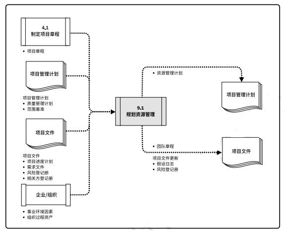

## 项目资源管理

项目资源管理包括识别、获取和管理所需资源以成功完成项目的各个过程，这些过程有助于确保项目经理和项目团队在正确的时间和地点使用正确的资源。  
项目资源管理过程包括：  
+ **9.1 规划资源管理** - 定义如何估算、获取、管理和利用实物以及团队项目资源的过程。  
+ **9.2 估算活动资源** - 估算执行项目所需的团队资源，以及材料、设备和用品的类型和数量的过程。  
+ **9.3 获取资源** - 获取项目所需的团队成员、设施、设备、材料、用品和其他资源的过程。  
+ **9.4 建设团队** - 提高工作能力，促进团队成员互动，改善团队整体氛围，以提高项目绩效的过程。  
+ **9.5 管理团队** - 跟踪团队成员工作表现，提供反馈，解决问题并管理团队变更，以优化项目绩效的过程。  
+ **9.6 控制资源** - 确保按计划为项目分配实物资源，以及根据资源使用计划监督资源实际使用情况，并采取必要纠正措施的过程。  

  

团队资源管理相对于实物资源管理，对项目经理提出了不同的技能和能力要求。实物资源包括：设备、材料、设施和基础设施，而团队资源或人员指的是人力资源。  

### 项目资源管理的核心概念
项目团队由承担特定角色和职责的个人组成，他们为实现项目目标而共同努力。项目经理因此应在获取、管理、激励和增强项目团队方面投入适当的努力。  
项目经理既是项目团队的领导者又是项目团队的管理者。除了项目管理活动，项目经理还负责建设高效的团队。项目经理应留意能够影响团队的不同因素，例如：  
+ 团队环境；
+ 团队成员的地理位置；
+ 相关方之间的沟通；
+ 组织变更管理；
+ 内外部政治氛围；
+ 文化问题和组织的独特性；
+ 其他可能改变项目绩效的因素。  

实物资源管理着眼于以有效和高效的方式，分配和使用成功完成项目所需的实物资源。为此，组织应当拥有如下数据：*（当前和合理的未来的）资源需求*、*（可以满足这些需求的）资源配置*，以及*资源供应*。  
不能有效管理和控制资源是项目成功完成的风险来源，例如：  
+ 未能确保关键设备或基础设施按时到位，可能会推迟最终产品的制造；  
+ 订购低质量材料可能会损害产品质量，导致大量召回或返工；
+ 保存太多库存可能会导致高运营成本，使组织盈利下降；另一方面，如果库存量太低，就可能无法满足客户需求，同样会造成组织盈利下降。  

**项目资源管理的趋势和新兴实践**  
项目管理风格正在从管理项目的命令和控制结构，转向更加协作和支持性的管理方法，通过将决策权分配给团队成员来提高团队能力。  
有关项目资源管理的趋势和新兴实践包括（但不限于）：  
+ **资源管理方法**。  
+ **情商(EI)**。  
+ **自组织团队**。  
+ **虚拟团队/分布式团队**。  

**裁剪考虑因素**包括（但不限于）：  
+ *多元化*。
+ *物理位置*。
+ *行业特定资源*。
+ *团队成员的获得*。
+ *团队管理*。
+ *生命周期方法*。  

## 9.1 规划资源管理
规划资源管理使定义如何估算、获取、管理和利用团队以及实物资源的过程。作用是：根据项目类型和复杂程度确定适用于项目资源的管理方法和管理程度。本过程仅开展一次或仅在项目的预定义点开展。  

  

  

资源规划用于确定和识别一种方法，以确保项目的成功完成有足够的可用资源。项目资源可能包括团队成员、用品、材料、设备、服务和设施。有效的资源规划需要考虑稀缺资源的额可用性和竞争，并编制相应的计划。  
资源可以从组织内部资产获得，或者通过采购过程从组织外部获取。其他项目可能在同一时间和地点竞争项目所需的相同资源。  

### 9.1.1 规划资源管理：输入
#### 9.1.1.1 项目章程
项目章程提供项目的高层级描述和要求，此外还包括可能影响项目资源管理的关键相关方名单、里程碑概况，以及预先批准的财务资源。  
#### 9.1.1.2 项目管理计划
项目管理计划组件包括但不限于：  
+ **质量管理计划**。质量管理计划有助于定义项目所需的资源水平，以实现和维护已定义的质量水平并达到项目测量指标。  
+ **范围基准**。范围基准识别了可交付成果，决定了需要管理的资源的类型和数量。  

#### 9.1.1.3 项目文件
包括但不限于：  
+ **项目进度计划**。项目进度计划提供了所需资源的时间轴。  
+ **需求文件**。需求文件指出了项目所需的资源的类型和数量，并可能影响管理资源的方式。  
+ **风险登记册**。风险登记册包含可能影响资源规划的各种威胁和机会的信息。  
+ **相关方登记册**。相关方登记册有助于识别对项目所需资源有特别兴趣或影响的那些相关方，以及会影响资源使用偏好的相关方。  

#### 9.1.1.4 事业环境因素
包括但不限于：  
+ 组织文化和结构。  
+ 设施和资源的地理分布。  
+ 现有资源的能力和可用性。  
+ 市场条件。  

#### 9.1.1.5 组织过程资产
包括但不限于： 人力资源政策和程序；实物资源管理政策和程序；安全政策；安保政策；资源管理计划模板；类似项目的历史信息。  

### 9.1.2 规划资源管理：工具和技术
#### 9.1.2.1 专家判断
具备以下专业知识或接受过相关培训：  
+ 协调组织内部的最佳资源；
+ 人才管理和员工发展；
+ 确定为实现项目目标所需的初步投入水平；
+ 根据组织文化确定报告要求；
+ 根据经验教训和市场条件，评估获取资源所需的提前量；
+ 识别与资源获取、留用和遣散计划有关的风险；
+ 遵循适用的政府和工会法规；
+ 管理卖方和物流工作，确保在需要时能够提供材料和用品。  

#### 9.1.2.2 数据表现
包括但不限于：图表。数据表现记录和阐明团队成员的角色与职责的格式属于层级型、矩阵型和文本型。  
+ **层级型**。可以采用传统的组织结构图，自上而下地显示各种职位及其相互关系。  
  - **工作分解结构(WBS)**。显示如何把项目可交付成果分解为工作包，有助于明确高层级的职责。  
  - **组织分解结构(OBS)**。按照组织现有的部门、单元或团队排列，并在每个部门下列出项目活动或工作包。 
  - **资源分解结构**。是按资源类别和类型，对团队和实物资源的层级列表，用于规划、管理和控制项目工作。
+ **责任分配矩阵**。显示了分配给每个工作包的项目资源，用于说明工作包或活动与项目团队成员之间的关系。  
+ **文本型**。如果需要详细描述团队成员的职责，就可以采用文本型。文本型文件通常以概述的形式，提供诸如职责、职权、能力和资格等方面的信息。

#### 9.1.2.3 组织理论
组织理论阐述个人、团队和组织部门的行为方式。  
#### 9.1.2.4 会议

### 9.1.3 规划资源管理：输出
#### 9.1.3.1 资源管理计划
资源管理计划提供了关于如何分类、分配、管理和释放项目资源的指南。资源管理计划可以根据项目的具体情况分为*团队管理计划*和*实物资源管理计划*。可能包括但不限于：  
+ 识别资源。
+ 获取资源。
+ 角色与职责。角色、职权、职责、能力。  
+ 项目组织图。
+ 项目团队资源管理。
+ 培训。
+ 团队建设。
+ 资源控制。
+ 认可计划。 

#### 9.1.3.2 团队章程
团队章程是为团队创建团队价值观、共识和工作指南的文件。团队章程可能包括但不限于：  
+ 团队价值观。
+ 沟通指南。
+ 决策标准和过程。
+ 冲突处理过程。
+ 会议指南。
+ 团队共识。  

#### 9.1.3.3 项目文件更新
可更新的包括但不限于：  
+ **假设日志**。更新假设日志时可增加关于实物资源的可用性、物流要求和位置信息以及团队资源的技能集和可用性的假设条件。
+ **风险登记册**。关于团队和实物资源可用性的风险，以及其他已知资源的相关风险。

## 9.2 估算活动资源
估算活动资源是估算执行项目所需的团队资源，以及材料、设备和用品的类型和数量的过程。主要作用是，明确完成项目所需的资源种类、数量和特性。本过程应根据需要在整个项目期间定期开展。  

  

  

估算活动资源过程与其他过程紧密相关，例如估算成本过程。  

### 9.2.1 估算活动资源：输入
#### 9.2.1.1 项目管理计划
包括但不限于：资源管理计划、范围基准。  

#### 9.2.1.2 项目文件
包括但不限于：活动属性、活动清单、假设日志、成本估算、资源日历、风险登记册。  

#### 9.2.1.3 事业环境因素
包括但不限于；资源的位置；资源可用性；团队资源的技能；组织文化；发布的估算数据；市场条件。  

#### 9.2.1.4 组织过程资产
包括但不限于：关于人员配备的政策和程序；关于用品和设备的政策与程序；关于以往项目中类似工作所使用的资源类型的历史信息。  

### 9.2.2 估算活动资源：工具与技术
#### 9.2.2.1 专家判断
#### 9.2.2.2 自下而上估算
#### 9.2.2.3 类比估算
#### 9.2.2.4 参数估算
#### 9.2.2.5 数据分析
包括但不限于；备选方案分析。  
#### 9.2.2.6 项目管理信息系统(PMIS)
#### 9.2.2.7 会议

### 9.2.3 估算活动资源：输出
#### 9.2.3.1 资源需求
资源需求识别了各个工作包或工作包中每个活动所需的资源类型和数量，可以汇总这些需求，以估算每个工作包、每个WBS分支以及每个项目所需的资源。  

#### 9.2.3.2 估算依据
资源估算的支持信息可包括：估算方法；用于估算的资源；与估算有关的假设条件；已知的制约因素；估算范围；估算的置信水平；有关影响估算的已识别风险的文件。  
#### 9.2.3.3 资源分解结构
资源分解结构是资源依类别和类型的层级展现。在规划资源管理过程中，资源分解结构用于指导项目的分类活动。  
#### 9.2.3.4 项目文件更新
更新包括但不限于：活动属性；假设日志；经验教训登记册。  

## 9.3 获取资源

## 9.4 建设团队

## 9.5 管理团队

## 9.6 控制资源

[返回目录](../../00.目录.md)