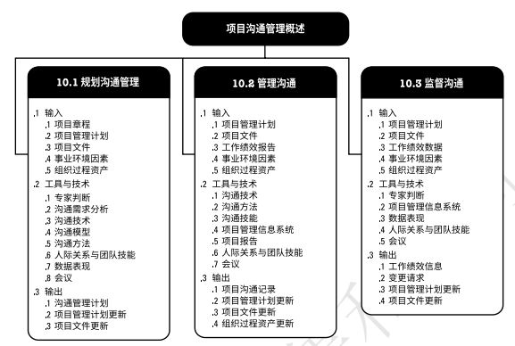
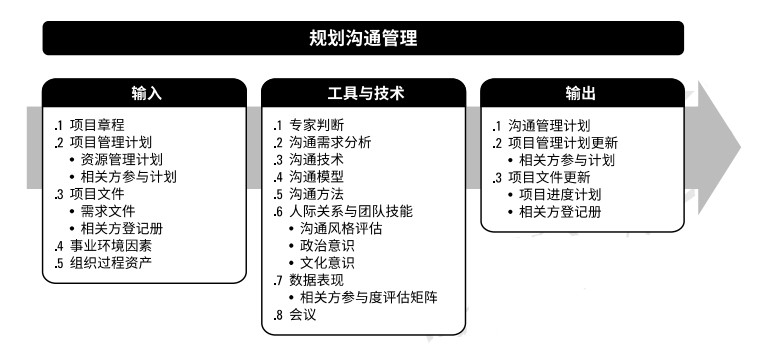
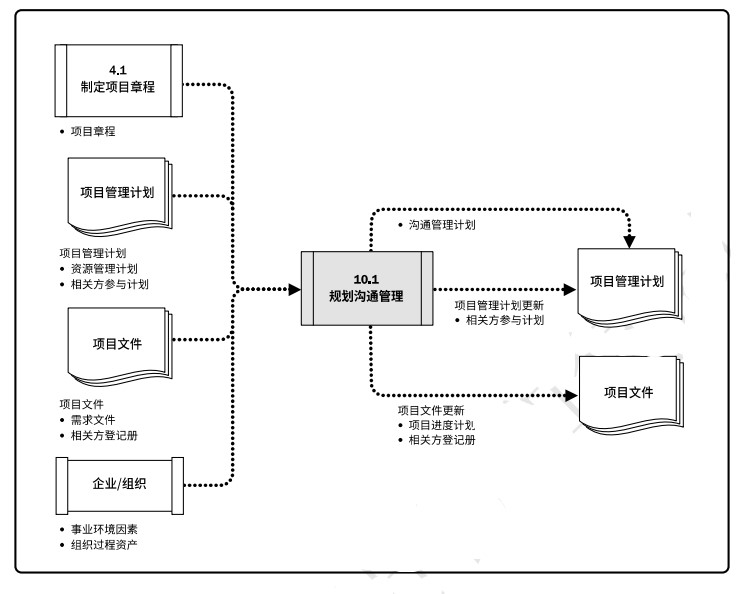
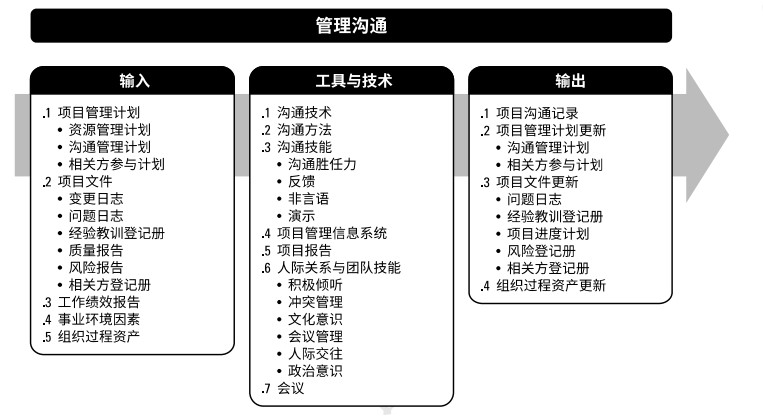
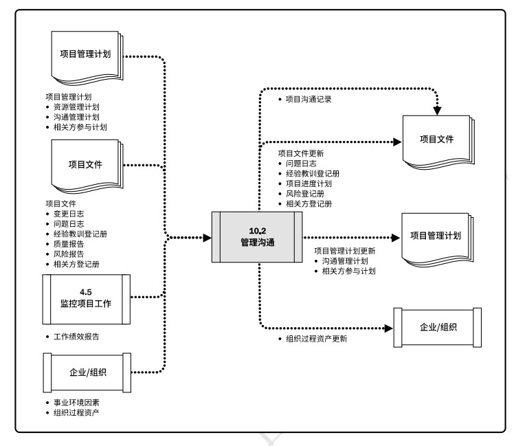

# 项目沟通管理
项目沟通管理包括通过开发工件，以及执行用于有效交换信息的各种活动，来确保项目及其相关方的信息需求得以满足的各个过程。项目沟通管理由两个部分组成：第一部分是制定策略，确保沟通对相关方行之有效；第二部分是执行必要活动，以落实沟通策略。  

项目沟通管理的过程包括：  
+ **10.1 规划沟通管理** - 基于每个相关方或相关方群体的信息需求、可用的组织资产，以及具体项目的需求，为项目沟通活动制定恰当的方法和计划的过程。  
+ **10.2 管理沟通** - 确保项目信息及时且恰当地收集、生成、发布、存储、检索、管理、监督和最终处置的过程。  
+ **10.3 监督沟通** - 确保满足项目及其相关方的信息需求的过程。  

  

**项目沟通管理的核心概念**
沟通是指有意或无意的信息交换，可以是想法、指示或情绪。信息交换的方法包括：书面形式；口头形式；正式或非正式形式；手势动作；媒体形式；遣词造句。  
项目经理的大多数时间用于与团队成员和其他项目相关方沟通，包括来自组织内部和组织外部的人员。沟通活动可按多种维度进行分类，包括但不限于：  
+ 内部。针对项目内部或组织内部的相关方。  
+ 外部。针对外部相关方。  
+ 正式。报告、正式会议(定期及临时)、会议议程和记录、相关方简报和演示。  
+ 非正式。采用电子邮件、社交媒体、网站，以及非正式临时讨论的一般沟通活动。  
+ 层级沟通。相关方或相关方群体相对于项目团队的位置，决定了是向上沟通、向下沟通和横向沟通。  
+ 官方沟通。年报，呈交监管机构或政府部门的报告。  
+ 非官方沟通。采用灵活的手段，来建立和维护项目团队及其相关方对项目情况的了解和认可，并在他们之间建立强有力的关系。  
+ 书面与口头沟通。口头及非口头，社交媒体和网站、媒体发布。  

成功的沟通包括两个部分。第一部分是根据项目及其相关方的需求而制定适当的沟通策略。从该策略出发，制定沟通管理计划，来确保用各种形式和手段把恰当的信息传递给相关方。这些信息构成了项目沟通-成功沟通的第二部分。  
在项目沟通中，需要尽力预防理解错误和沟通错误，并从规划过程所规定的各个方法、发送方、接收方和信息中做出谨慎选择。书面沟通的5C原则，可减轻但无法消除理解错误：  
+ **目的明确（Clear Purpose）**。    
+ **表达正确（Correct Expression）**。 
+ **表达简练（Concise Expression）**。
+ **逻辑连贯（Coherent Logic）**。  
+ **思路掌控（Controlling Ideas）**。

书面沟通的5C原则需要用到的沟通技巧：积极倾听；理解文化和个人差异；识别、设定并管理相关方期望；强化技能。  
## 10.1 规划沟通管理
规划沟通管理是基于每个相关方或相关方群体的信息需求、可用的组织资产，以及具体项目的需求，为项目沟通活动制定恰当的方法和计划的过程。主要作用是，为及时向相关方提供相关信息，引导相关方有效参与项目，而编制书面沟通计划。本过程应根据需要在整个项目期间定期开展。 

  

  

在本过程中，需要考虑并合理记录用来存储、检索和最终处置项目信息的方法。应该在整个项目期间，定期审查规划沟通管理过程的成果并做必要修改，以确保其持续适用。  
### 10.1.1 规划沟通管理：输入
#### 10.1.1.1 项目章程
项目章程中的主要相关方清单，其中可能还包含与相关方角色及职责有关的信息。
#### 10.1.1.2 项目管理计划
包括但不限于：资源管理计划、相关方参与计划。  
#### 10.1.1.3 项目文件
包括但不限于：需求文件；相关方登记册。  
#### 10.1.1.4 事业环境因素
包括但不限于：  
+ 组织文化、政治氛围和治理框架；
+ 人事管理政策；
+ 相关方风险临界值；
+ 已确立的沟通渠道、工具和系统；
+ 全球、区域或当地的趋势、实践或习俗；
+ 设施和资源的地理分布。  

#### 10.1.1.5 组织过程资产
包括但不限于：  
+ 组织的社交媒体、道德和安全政策及程序；
+ 组织的问题、风险、变更和数据管理政策及程序；
+ 组织对沟通的要求；
+ 制作、交换、储存和检索信息的标准化指南；
+ 历史信息和经验教训知识库；
+ 以往项目的相关方及沟通数据和信息。  

### 10.1.2 规划沟通管理：工具与技术
#### 10.1.2.1 专家判断
#### 10.1.2.2 沟通需求分析
分析沟通需求，确定项目相关方的信息需求，包括所需信息的类型和格式，以及信息对相关方的价值。  
#### 10.1.2.3 沟通技术
用于在项目相关方之间传递信息的常见方法包括对话、会议、书面文件、数据库、社交媒体和网站。  
可能影响沟通技术选择的因素包括：  
+ **信息需求的紧迫性**。  
+ **技术的可用性与可靠性**。
+ **易用性**。
+ **项目环境**。
+ **信息的敏感度和保密性**。

#### 10.1.2.4 沟通模型
沟通模型分为：
+ **基本的发送方和接收方沟通模型示例**，确保信息送达而非信息理解。步骤顺序为：编码、传递信息、解码。  
+ **互动沟通模型示例**，强调确保信息理解的必要性。步骤顺序为：编码、传递信息、确认已收到、解码、反馈/响应。  

#### 10.1.2.5 沟通方法
项目相关方之间用于分享信息的沟通方法大致分为：
+ **互动沟通**。在两方或多方之间进行的实时多向信息交换。使用诸如会议、电话、即时信息、社交媒体和视频会议等沟通工件。  
+ **推式沟通**。向需要接收信息的特定接收方发送或发布信息。可确保信息的发送，不能确保送达或理解。可采用的沟通工件包括：信件、备忘录、报告、电子邮件、传真、语言邮件、博客、新闻稿。  
+ **拉式沟通**。适用于大量复杂信息或大量信息受众的情况，要求接收方在遵守有关安全规定的前提下自行访问相关内容。包括门户网站、企业内网、电子在线课程、经验教训数据库或知识库。  

#### 10.1.2.6 人际关系与团队技能
包括但不限于：沟通风格评估；政治意识；文化意识。  

#### 10.1.2.7 数据表现
包括但不限于：相关方参与度评估矩阵。  

#### 10.1.2.8 会议
包括虚拟(网络)或面对面会议，且可用文档协同技术进行辅助，包括电子邮件信息和项目网站。  

### 10.1.3 规划沟通管理：输出
#### 10.1.3.1 沟通管理计划
沟通管理计划描述将如何规划、结构化、执行与监督项目沟通，以提高沟通的有效性。  
#### 10.1.3.2 项目管理计划更新
包括但不限于：相关方参与计划。需要更新相关方参与计划，反映会影响相关方参与项目决策和执行的任何过程、程序、工具或技术。  

#### 10.1.3.3 项目文件更新
包括但不限于：项目进度计划；相关方登记册。  

## 10.2 管理沟通
管理沟通是确保项目信息及时且恰当地收集、生成、发布、存储、检索、管理、监督和最终处置的过程。主要作用是，促进项目团队与相关方之间的有效信息流动。本过程需要在整个项目期间开展。  

   

  

## 10.3 监督沟通

[返回目录](../../00.目录.md)

