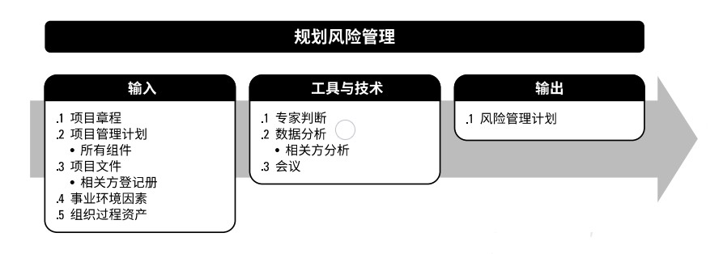

# 项目风险管理

项目风险管理的目标在于提高正面风险的概率和(或)影响，降低负面风险的概率和(或)影响，从而提高项目成功的可能性。  

项目风险管理的过程是：  
+ **11.1 规划风险管理** - 定义如何实施项目风险管理活动的过程。  
+ **11.2识别风险** - 识别单个项项目风险，以及整体项目风险的来源，并记录风险特征的过程。  
+ **11.3 实施定性风险分析** - 通过评估单个项目风险发生的概率和影响以及其他特征，对风险进行优先级排序，从而为后续分析或行动提供基础的过程。  
+ **11.4 实施定量风险分析** - 就已识别的单个项目风险和其他不确定性的来源对整体项目目标的综合影响进行定量分析的过程。  
+ **11.5 规划风险应对** - 为处理整体项目风险敞口，以及应对单个项目风险，而制定可选方案、选择应对策略并商定应对行动的过程。  
+ **11.6 实施风险应对** - 执行商定的风险应对计划的过程。  
+ **11.7 监督风险** - 在整个项目期间，监督商定的风险应对计划的实施、跟踪已识别风险、识别和分析新风险，以及评估风险管理有效性的过程。  

  

开展项目，不仅要面对各种制约因素和假设条件，而且还要应对可能相互冲突和不断变化的相关方期望。组织应该有目的地以可控方式去冒项目风险，以便平衡风险和回报，并创造价值。  

项目风险管理旨在识别和管理未被其他项目管理过程所管理的风险。项目风险管理的有效性直接关乎项目成功与否。  

每个项目都在两个层面上存在风险。定义如何：  
+ **单个项目风险**是一旦发生，会对一个或多个项目目标产生正面或负面影响的不确定事件或条件。
+ **整体项目风险**是不确定性对项目整体的影响，是相关方面临的项目结果正面和负面变异区间。源于包括单个风险在内的所有不确定性。  

管理整体项目风险旨在通过削弱负面变异的驱动因素，加强正面变异的驱动因素，以及最大化实现整体项目目标的概率，把项目风险敞口保持在可接受的范围之内。  

风险临界值反映了组织与项目相关方的风险偏好程度，是项目目标的可接受的变异程度。应该明确规定风险临界，并传达给项目团队，同时反映在项目的风险影响级别定义中。  

对项目风险管理过程的应用方式进行裁剪时应考虑如下因素：  
+ **项目规模**。  
+ **项目复杂性**。  
+ **项目重要性**。  
+ **开发方法**。  

## 11.1 规划风险管理
规划风险管理是定义如何实施项目风险管理活动的过程。主要作用是，确保风险管理的水平、方法和可见度与项目风险程度，以及项目对组织和其他相关方的重要程度相匹配。本过程仅开展一次或仅在项目的预定义点开展。  

  

  

### 11.1.1 规划风险管理：输入
#### 11.1.1.1 项目章程
#### 11.1.1.2 项目管理计划
应考虑所有已批准的子管理计划，使风险管理计划与之相协调。  
#### 11.1.1.3 项目文件
相关方登记册包括项目相关方的详细信息，并概述其在项目中的角色和对项目风险的态度；可用于确定项目风险管理的角色和职责，以及为项目设定风险临界值。  
#### 11.1.1.4 事业环境因素
由组织或关键相关方设定的整体风险临界值。  
#### 11.1.1.5 组织过程资产
包括但不限于：组织的风险政策；风险类别；风险概念和术语的通用定义；风险描述的格式；风险管理计划、风险登记册和风险报告的模板；角色与职责；决策所需的职权级别；经验教训知识库，其中包含以往类似项目的信息。  

### 11.1.2 规划风险管理：工具和技术
#### 11.1.2.1 专家判断
#### 11.1.2.2 数据分析
相关方分析。
#### 11.1.2.3 会议

### 11.1.3 规划风险管理：输出
#### 11.1.3.1 风险管理计划
风险管理计划描述如何安排与实施风险管理活动。可包括： 
+ **风险管理战略**。
+ **方法论**。
+ **角色与职责**。
+ **资金**。
+ **时间安排**。
+ **风险类别**。确定对单个项目风险进行分类的方式。通常借助风险分解结构(RBS)来构建风险类别。风险分解结构有助于项目团队考虑单个项目风险的全部可能来源，对识别风险或归类已识别风险特别有用。  
+ **相关方风险偏好**。相关方的风险偏好会影响规划风险管理过程的细节。特别是，应针对每个项目目标，把相关方的风险偏好表述成可测量的风险临界值。
+ **风险概率和影响定义**。根据具体的项目环境，组织和关键相关方的风险偏好和临界值，来制定风险概率和影响定义。通过将影响定义为负面威胁(工期延误、成本增加和绩效不佳)和正面机会(工期缩短、成本节约和绩效改善)，表格所示的量表可同时用于评估威胁和机会。    
+ **概率和影响矩阵**。组织可在项目开始前确定优先级排序规则，并将其纳入组织过程资产，或者也可为具体项目量身定制优先级规则。  
+ **报告格式**。
+ **跟踪**。

## 11.2 识别风险
识别风险是识别单个项目风险与整个项目风险的来源，并记录风险特征的过程。主要作用是，记录现有的单个项目风险，以及整体项目风险的来源；同时，汇集相关信息，以便项目团队能够恰当应对已识别的风险。本过程需要在整个项目期间开展。  

  

  

识别风险时，要同时考虑单个项目风险，以及整体项目风险的来源。应该采用统一的风险描述格式，来描述和记录单个项目风险，以确保每一项风险都被清楚、明确地理解，从而为有效的分析和风险应对措施制定提供支持。  

### 11.2.1 识别风险：输入
#### 11.2.1.1 项目管理计划
需求管理计划；进度管理计划；成本管理计划；质量管理计划；资源管理计划；风险管理计划；范围基准；进度基准；成本基准。  
#### 11.2.1.2 项目文件
假设日志；成本估算；持续时间估算；问题日志；经验教训登记册；需求文件；资源需求；相关方登记册。
#### 11.2.1.3 协议
如果需要从外部采购项目资源，协议所规定的里程碑日期、合同类型、验收标准和奖罚条款等，都可能造成威胁或创造条件。  
#### 11.2.1.4 采购文档
如果需要从外部采购项目资源，应该审查初始采购文档，因为从组织外部采购商品和服务可能提高或降低整体项目风险，并可能引发更多的单个项目风险。  
#### 11.2.1.5 事业环境因素
+ 已发布的材料，包括商业风险数据库或核对单；
+ 学术研究资料；
+ 标杆对照成果；
+ 类似项目的行业研究资料。  

#### 11.2.1.6 组织过程资产
+ 项目文档，包括实际数据；
+ 组织和项目的过程控制资料；
+ 风险描述的格式；
+ 以往类似项目的核对单。  

### 11.2.2 识别风险：工具与技术
#### 11.2.2.1 专家判断
#### 11.2.2.2 数据收集
头脑风暴；核对单；访谈。  
#### 11.2.2.3 数据分析
根本原因分析；假设条件和制约因素分析；SWOT分析；文件分析。
#### 11.2.2.4 人际关系与团队技能
引导能提高用于识别单个项目风险和整体项目风险来源的许多技术的有效性。   
#### 11.2.2.5 提示清单
提示清单是关于可能引发单个项目风险以及可作为整体项目风险来源的风险类别的预设清单。可作为框架用于协助项目团队形成想法。  
#### 11.2.2.6 会议
风险研讨会。  
### 11.2.3 识别风险：输出
#### 11.2.3.1 风险登记册
风险登记册记录已识别单个项目风险的详细信息。随着实施定性风险分析、规划风险应对、实施风险应对和监督风险等过程的开展，过程的结果也要记进风险登记册。当完成识别风险过程时，风险登记册的内容包括但不限于：  
+ **已识别风险的清单**。  
+ **潜在风险责任人**。
+ **潜在风险应对措施清单**。

#### 11.2.3.2 风险报告
风险报告提供关于整体项目风险的信息，以及关于已识别的单个项目风险的概述信息。风险报告的编制是一项渐进式的工作。在完成识别风险过程时，风险报告的内容可能包括但不限于：  
+ 整体项目风险的来源。  
+ 关于已识别单个项目风险的概述信息。  

#### 11.2.3.3 项目文件更新
+ **假设日志**。
+ **问题日志**。
+ **经验教训登记册**。  

[返回目录](../../00.目录.md)