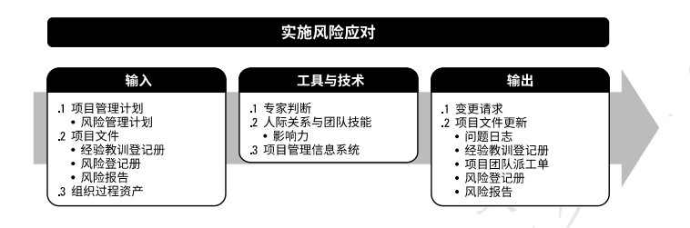
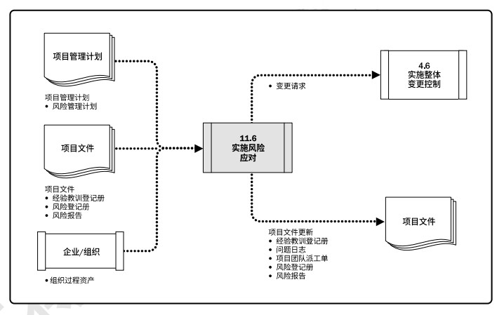

# 项目风险管理

项目风险管理的目标在于提高正面风险的概率和(或)影响，降低负面风险的概率和(或)影响，从而提高项目成功的可能性。  

项目风险管理的过程是：  
+ **11.1 规划风险管理** - 定义如何实施项目风险管理活动的过程。  
+ **11.2识别风险** - 识别单个项项目风险，以及整体项目风险的来源，并记录风险特征的过程。  
+ **11.3 实施定性风险分析** - 通过评估单个项目风险发生的概率和影响以及其他特征，对风险进行优先级排序，从而为后续分析或行动提供基础的过程。  
+ **11.4 实施定量风险分析** - 就已识别的单个项目风险和其他不确定性的来源对整体项目目标的综合影响进行定量分析的过程。  
+ **11.5 规划风险应对** - 为处理整体项目风险敞口，以及应对单个项目风险，而制定可选方案、选择应对策略并商定应对行动的过程。  
+ **11.6 实施风险应对** - 执行商定的风险应对计划的过程。  
+ **11.7 监督风险** - 在整个项目期间，监督商定的风险应对计划的实施、跟踪已识别风险、识别和分析新风险，以及评估风险管理有效性的过程。  

  

开展项目，不仅要面对各种制约因素和假设条件，而且还要应对可能相互冲突和不断变化的相关方期望。组织应该有目的地以可控方式去冒项目风险，以便平衡风险和回报，并创造价值。  

项目风险管理旨在识别和管理未被其他项目管理过程所管理的风险。项目风险管理的有效性直接关乎项目成功与否。  

每个项目都在两个层面上存在风险。定义如何：  
+ **单个项目风险**是一旦发生，会对一个或多个项目目标产生正面或负面影响的不确定事件或条件。
+ **整体项目风险**是不确定性对项目整体的影响，是相关方面临的项目结果正面和负面变异区间。源于包括单个风险在内的所有不确定性。  

管理整体项目风险旨在通过削弱负面变异的驱动因素，加强正面变异的驱动因素，以及最大化实现整体项目目标的概率，把项目风险敞口保持在可接受的范围之内。  

风险临界值反映了组织与项目相关方的风险偏好程度，是项目目标的可接受的变异程度。应该明确规定风险临界，并传达给项目团队，同时反映在项目的风险影响级别定义中。  

对项目风险管理过程的应用方式进行裁剪时应考虑如下因素：  
+ **项目规模**。  
+ **项目复杂性**。  
+ **项目重要性**。  
+ **开发方法**。  

## 11.1 规划风险管理
规划风险管理是定义如何实施项目风险管理活动的过程。主要作用是，确保风险管理的水平、方法和可见度与项目风险程度，以及项目对组织和其他相关方的重要程度相匹配。本过程仅开展一次或仅在项目的预定义点开展。  

  

  

### 11.1.1 规划风险管理：输入
#### 11.1.1.1 项目章程
#### 11.1.1.2 项目管理计划
应考虑所有已批准的子管理计划，使风险管理计划与之相协调。  
#### 11.1.1.3 项目文件
相关方登记册包括项目相关方的详细信息，并概述其在项目中的角色和对项目风险的态度；可用于确定项目风险管理的角色和职责，以及为项目设定风险临界值。  
#### 11.1.1.4 事业环境因素
由组织或关键相关方设定的整体风险临界值。  
#### 11.1.1.5 组织过程资产
包括但不限于：组织的风险政策；风险类别；风险概念和术语的通用定义；风险描述的格式；风险管理计划、风险登记册和风险报告的模板；角色与职责；决策所需的职权级别；经验教训知识库，其中包含以往类似项目的信息。  

### 11.1.2 规划风险管理：工具和技术
#### 11.1.2.1 专家判断
#### 11.1.2.2 数据分析
相关方分析。
#### 11.1.2.3 会议

### 11.1.3 规划风险管理：输出
#### 11.1.3.1 风险管理计划
风险管理计划描述如何安排与实施风险管理活动。可包括： 
+ **风险管理战略**。
+ **方法论**。
+ **角色与职责**。
+ **资金**。
+ **时间安排**。
+ **风险类别**。确定对单个项目风险进行分类的方式。通常借助风险分解结构(RBS)来构建风险类别。风险分解结构有助于项目团队考虑单个项目风险的全部可能来源，对识别风险或归类已识别风险特别有用。  
+ **相关方风险偏好**。相关方的风险偏好会影响规划风险管理过程的细节。特别是，应针对每个项目目标，把相关方的风险偏好表述成可测量的风险临界值。
+ **风险概率和影响定义**。根据具体的项目环境，组织和关键相关方的风险偏好和临界值，来制定风险概率和影响定义。通过将影响定义为负面威胁(工期延误、成本增加和绩效不佳)和正面机会(工期缩短、成本节约和绩效改善)，表格所示的量表可同时用于评估威胁和机会。    
+ **概率和影响矩阵**。组织可在项目开始前确定优先级排序规则，并将其纳入组织过程资产，或者也可为具体项目量身定制优先级规则。  
+ **报告格式**。
+ **跟踪**。

## 11.2 识别风险
识别风险是识别单个项目风险与整个项目风险的来源，并记录风险特征的过程。主要作用是，记录现有的单个项目风险，以及整体项目风险的来源；同时，汇集相关信息，以便项目团队能够恰当应对已识别的风险。本过程需要在整个项目期间开展。  

  

  

识别风险时，要同时考虑单个项目风险，以及整体项目风险的来源。应该采用统一的风险描述格式，来描述和记录单个项目风险，以确保每一项风险都被清楚、明确地理解，从而为有效的分析和风险应对措施制定提供支持。  

### 11.2.1 识别风险：输入
#### 11.2.1.1 项目管理计划
需求管理计划；进度管理计划；成本管理计划；质量管理计划；资源管理计划；风险管理计划；范围基准；进度基准；成本基准。  
#### 11.2.1.2 项目文件
假设日志；成本估算；持续时间估算；问题日志；经验教训登记册；需求文件；资源需求；相关方登记册。
#### 11.2.1.3 协议
如果需要从外部采购项目资源，协议所规定的里程碑日期、合同类型、验收标准和奖罚条款等，都可能造成威胁或创造条件。  
#### 11.2.1.4 采购文档
如果需要从外部采购项目资源，应该审查初始采购文档，因为从组织外部采购商品和服务可能提高或降低整体项目风险，并可能引发更多的单个项目风险。  
#### 11.2.1.5 事业环境因素
+ 已发布的材料，包括商业风险数据库或核对单；
+ 学术研究资料；
+ 标杆对照成果；
+ 类似项目的行业研究资料。  

#### 11.2.1.6 组织过程资产
+ 项目文档，包括实际数据；
+ 组织和项目的过程控制资料；
+ 风险描述的格式；
+ 以往类似项目的核对单。  

### 11.2.2 识别风险：工具与技术
#### 11.2.2.1 专家判断
#### 11.2.2.2 数据收集
头脑风暴；核对单；访谈。  
#### 11.2.2.3 数据分析
根本原因分析；假设条件和制约因素分析；SWOT分析；文件分析。
#### 11.2.2.4 人际关系与团队技能
引导能提高用于识别单个项目风险和整体项目风险来源的许多技术的有效性。   
#### 11.2.2.5 提示清单
提示清单是关于可能引发单个项目风险以及可作为整体项目风险来源的风险类别的预设清单。可作为框架用于协助项目团队形成想法。  
#### 11.2.2.6 会议
风险研讨会。  
### 11.2.3 识别风险：输出
#### 11.2.3.1 风险登记册
风险登记册记录已识别单个项目风险的详细信息。随着实施定性风险分析、规划风险应对、实施风险应对和监督风险等过程的开展，过程的结果也要记进风险登记册。当完成识别风险过程时，风险登记册的内容包括但不限于：  
+ **已识别风险的清单**。  
+ **潜在风险责任人**。
+ **潜在风险应对措施清单**。

#### 11.2.3.2 风险报告
风险报告提供关于整体项目风险的信息，以及关于已识别的单个项目风险的概述信息。风险报告的编制是一项渐进式的工作。在完成识别风险过程时，风险报告的内容可能包括但不限于：  
+ 整体项目风险的来源。  
+ 关于已识别单个项目风险的概述信息。  

#### 11.2.3.3 项目文件更新
+ **假设日志**。
+ **问题日志**。
+ **经验教训登记册**。  

## 11.3 实施定性风险分析
实施定性风险分析是通过评估单个项目风险发生的概率和影响以及其他特征，对风险进行优先级排序，从而为后续分析或行动提供基础的过程。主要作用是重点关注高优先级的风险。本过程需要在整个项目期间开展。  

  

实施定性风险分析具有与主观性。所以为了实现有效评估，需要认清和管理本过程关键参与者对风险所持的态度。风险感知会导致评估已识别风险时出现偏见，应注意找出偏见并加以纠正。同时，评估单个项目风险的现有信息的质量，也有助于澄清每个风险对项目的重要性的评估。  

实施定性风险分析能确定单个项目风险的相对优先级；为每个风险识别出责任人确定需要进行定量分析的风险。  

### 11.3.1 实施定性风险分析：输入
#### 11.3.1.1 项目管理计划
包括风险管理计划。特别注意：风险管理的角色和职责、预算和进度活动安排，以及风险类别、概率和影响定义、概率和影响矩阵和相关方的风险临界值。  

#### 11.3.1.2 项目文件
假设日志；风险登记册；相关方登记册。  

#### 11.3.1.3 事业环境因素
类似项目的行业研究资料；已发布的材料，包括商业风险数据库或核对单。  

#### 11.3.1.4 组织过程资产
已完成的类似项目的信息。  

### 11.3.2 实施定性风险分析：工具与技术
#### 11.3.2.1 专家判断

#### 11.3.2.2 数据收集
结构化或半结构化的访谈可用于评估单个项目风险的概率和影响，以及其他因素。  

#### 11.3.2.3 数据分析
风险数据质量评估、风险概率和影响评估、其他风险参数评估。  

#### 11.3.2.4 人际关系与团队技能
开展引导，能够提高对单个项目风险的定性分析的有效性。  

#### 11.3.2.5 风险分类
对风险进行分类，有助于把注意力和精力集中到风险敞口最大的领域，或针对一组相关的风险制定通用的风险应对措施，从而有利于更有效地开展风险应对。  

#### 11.3.2.6 数据表现
概率和影响矩阵、层级图。  

#### 11.3.2.7 会议
风险研讨会对已识别单个项目风险进行讨论。目标包括审查已识别的风险、评估概率和影响、对风险进行分类和优先级排序。风险责任人负责规划风险应对措施和报告风险管理工作的进展情况。  

### 11.3.3 实施定性风险分析：输出
#### 11.3.3.1 项目文件更新
假设日志、问题日志、风险登记册、风险报告。  

## 11.4 实施定量风险分析
实施定量风险分析是就已识别的单个项目风险和不确定性的其他来源对整体项目目标的影响进行定量分析的过程。主要作用是，量化整体项目风险敞口，并提供额外的定量风险信息，以支持风险应对规划。会在整个项目期间持续开展。  

  

  

并非所有项目都需要实施定量风险分析。取决于是否有关于单个项目风险和其他不确定性来源的高质量数据，以及与范围、进度和成本相关的扎实项目基准。  
在实施定量风险分析过程中，要使用被定性风险分析过程评估为对项目目标存在重大潜在影响的单个项目风险的信息。  
实施定量风险分析过程的输出，则要用作规划风险应对过程的输入，特别是要据此为整体项目风险和关键单个项目风险推荐应对措施。定量风险分析也可以在规划风险应对过程之后开展，以分析已规划的应对措施对降低整体项目风险敞口的有效性。  

### 11.4.1 实施定量风险分析：输入
#### 11.4.1.1 项目管理计划
风险管理计划；范围基准；进度基准；成本基准。  
#### 11.4.1.2 项目文件
假设日志；估算依据；成本估算；成本预测；持续时间估算；里程碑清单；资源需求；风险登记册；风险报告；进度预测。  
#### 11.4.1.3 事业环境因素
类似项目的行业研究资料；已发布的材料，包括商业风险数据库或核对单。  
### 11.4.1.4 组织过程资产
已完成的类似项目的信息。  

### 11.4.2 实施定量风险分析：工具与技术
#### 11.4.2.1 专家判断
#### 11.4.2.2 数据收集
访谈可用于针对单个项目风险和其他不确定性来源，生成定量风险分析的输入。  
#### 11.4.2.3 人际关系与团队技能
引导。  
#### 11.4.2.4 不确定性表现方式
要开展定量风险分析，就需要建立能反映单个项目风险和其他不确定性来源的定量风险分析模型，并为之提供输入。  

#### 11.4.2.5 数据分析
模拟；敏感性分析；决策树分析；影响图。  

  

### 11.4.3 实施定量风险分析：输出
#### 11.4.3.1 项目文件更新
更新风险报告，反映定量风险分析的结果，通常包括：  
+ 对整体项目风险敞口的评估接口。项目成功的可能性；项目固有的变异性。  
+ 项目详细概率分析的结果。所需的应急储备；对项目关键路径有最大影响的单个项目风险或其他不确定性有最大影响的因素。  
+ 单个项目风险优先级清单。
+ 定量风险分析结果的趋势。  
+ 风险应对建议。  

## 11.5 规划风险应对
规划风险应对是为处理整体项目风险敞口，以及应对单个项目风险，而制定可选方案、选择应对策略并商定应对行动的过程。主要作用是，制定应对整体项目风险和单个项目风险的适当方法；本过程还将分配资源，并根据需要将相关活动添加进项目文件和项目管理计划。本过程需要在整个项目期间开展。  

  

有效和适当的风险应对可以最小化单个威胁，最大化单个机会，并降低整体项目风险敞口；不恰当的风险应对则会适得其反。  
风险应对方案应该与风险的重要性相匹配、能经济有效地应对挑战、在当前项目背景下现实可行、能获得全体相关方的同意，并由一名责任人具体负责。  

要为实施商定的风险应对策略，包括主要策略和备用策略（若必要），制定具体的应对行动。如果选定的策略并不完全有效，或者发生了已接受的风险，就需要制定应急计划(或弹回计划)。  

### 11.5.1 规划风险应对：输入
#### 11.5.1.1 项目管理计划
资源管理计划；风险管理计划；成本基准。  
#### 11.5.1.2 项目文件
经验教训登记册；项目进度计划；项目团队派工单；资源日历；风险登记册；风险报告；相关方登记册。  

#### 11.5.1.3 事业环境因素
关键相关方的风险偏好和风险临界值。  

#### 11.5.1.4 组织过程资产
风险管理计划、风险登记册和风险报告的模板；历史数据库；类似项目的经验教训知识库。  

### 11.5.2 规划风险应对：工具或技术
#### 11.5.2.1 专家判断
#### 11.5.2.2 数据收集
访谈。单个项目风险和整体项目风险的应对措施可以在与风险责任人的结构化或半结构化的访谈中制定。  

#### 11.5.2.3 人际关系与团队技能
开展引导，能够提高单个项目风险和整体项目风险应对策略制定的有效性。  

#### 11.5.2.4 威胁应对策略
+ 上报。如果项目团队或项目发起人认为某威胁不在项目范围内，或提议的应对措施超出了项目经理的权限，应该采用上报策略。  
+ 规避。项目团队采取行动来消除威胁，或保护项目免受威胁的影响。可能适用于发生概率较高，且具有严重负面影响的高优先级威胁。  
+ 转移。转移涉及到将应对威胁的责任转移给第三方，让第三方管理风险并承担威胁发生的影响。采用转移策略，通常需要向承担威胁的一方支付风险转移费用。  
+ 减轻。采取措施来降低威胁发生的概率和(或)影响。提前采取减轻措施通常比威胁出现后尝试进行弥补更加有效。  
+ 接受。承认威胁的存在，但不主动采取措施。可用于低优先级威胁，也可用于无法以任何其他方式加以经济有效地应对的威胁。分为主动或被动方式。主动接受策略是建立应急储备，以便在激活出现时加以利用；被动接受策略则不会主动采取行动，只是定期对机会进行审查，确保其并未发生重大改变。  

#### 11.5.2.6 应急应对策略
设计一些仅在特定事件发生时才采用的应对措施。采用此技术制定的风险应对计划，通常称为应急计划或弹回计划，其中包括已识别的、用于启动计划的触发事件。  

#### 11.5.2.7 整体项目风险应对策略
规避；开拓；转移或分享；减轻或提高；接受。  

#### 11.5.2.8 数据分析
备选方案分析；成本收益分析。  

#### 11.5.2.9 决策
多标准决策分析，列入考虑范围的风险应对策略可能是一种或多种。决策技术有助于对多种风险应对策略进行优先级排序。  

### 11.5.3 规划风险应对：输出
#### 11.5.3.1 变更请求
#### 11.5.3.2 项目管理计划更新
进度管理计划；成本管理计划；质量管理计划；资源管理计划；采购管理计划；范围基准；进度基准；成本基准。  

#### 11.5.3.3 项目文件更新
假设日志；成本预测；经验教训登记册；项目进度计划；风险登记册；风险报告。  

## 11.6 实施风险应对
实施风险应对是执行商定的风险应对计划的过程。主要作用是，确保按计划执行商定的风险应对措施，来管理整体项目风险敞口、最小化单个项目威胁，以及最大化单个项目机会。本过程需要在整个项目期间开展。  

  

  

适当关注实施风险应对过程，能够确保已商定的风险应对措施得到实际执行。只有风险责任人以必要的努力去实施商定的应对措施，项目的整体风险敞口和单个威胁及机会才能得到主动管理。  

### 11.6.1 实施风险应对：输入
#### 11.6.1.1 项目管理计划
风险管理计划。

#### 11.6.1.2 项目文件
经验教训登记册；风险登记册；风险报告。  

#### 11.6.1.3 组织过程资产
已完成的类似项目的经验教训知识库。  

### 11.6.2 实施风险应对：工具与技术
#### 11.6.2.1 专家判断
#### 11.6.2.2 人际关系与团队技能
影响力。  
#### 11.6.2.3 项目管理信息系统(PMIS)  
项目管理信息系统可能包括进度、资源和成本软件，用于确保把商定的风险应对计划及其相关活动，连同其他项目活动，一并纳入整个项目。  

### 11.6.3 实施风险应对：输出
#### 11.6.3.1 变更请求

####  11.6.3.2 项目文件更新
问题日志；经验教训登记册；项目团队派工单；风险登记册；风险报告。  

[返回目录](../../00.目录.md)