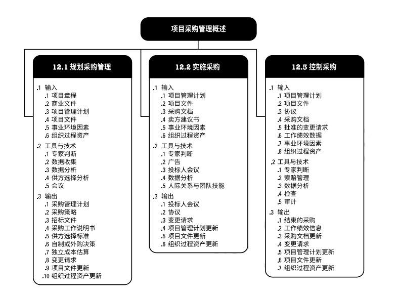

# 项目采购管理
项目采购管理包括从项目外部采购或获取所需产品、服务或成果的各个过程。项目采购管理包括编制和管理协议所需的管理和控制过程，例如，合同、订购单、协议备忘录(MOA)，或服务水平协议(SLA)。被授权采购项目所需货物和(或)服务的人员可以是项目团队、管理层或组织采购部的成员。  
项目采购管理过程包括：  
+ **12.1 规划采购管理** - 记录项目采购决策、明确采购方法，及识别潜在卖方的过程。  
+ **12.2 实施采购** - 获取卖方应答、选择卖方并授予合同的过程。  
+ **12.3 控制采购** - 管理采购关系、监督合同绩效、实施必要的变更和纠偏，以及关闭合同的过程。  

  

与采购过程相关的重大法律义务和惩罚，通常超出大多数其他的项目管理过程。通常情况下，项目经理无权签署对组织有约束力的法律协议，这项工作仅由具备相关职权的人员执行。  

项目采购管理过程涉及到用协议来描述买卖双方之间的关系。合同签署的方法和合同本身应提现可交付成果或所需人力投入的简单性或复杂性，其书写形式也应符合当地、所在国或国际法中关于合同签署的规定。  

合同应明确说明预期的可交付成果和结果，包括从卖方到买方的任何知识转移。合同中未规定的任何事项则不具法律强制力。  

采购合同中包括条款和条件，也可包括买方就卖方应实施工作或应交付产品的其他规定。  

虽然所有项目文件可能都要经过某种形式的审查与批准，但是，鉴于其法律约束力，合同或协议需要经过更多的审批程序，而且通常会涉及到法务部。在任何情况下，审批程序的主要目标都是确保合同充分描述将由卖方提供的产品、服务或成果，且符合法律法规关于采购的要求。  

在合同生命周期中，卖方首先是投标人，然后是中标人，之后是签约供应商或供货商。中标人可将所承揽的工作当作一个项目加以管理。    

在小型组织或初创企业，以及未设置购买、合同或采购部门的组织，项目经理可以拥有采购职权，能够直接谈判并签署合同(分散式采购)。在更成熟的组织中，由专设部门开展实际的采购和合同签署工作，即采购、谈判和签署合同(集中式采购)。  

[返回目录](../../00.目录.md)