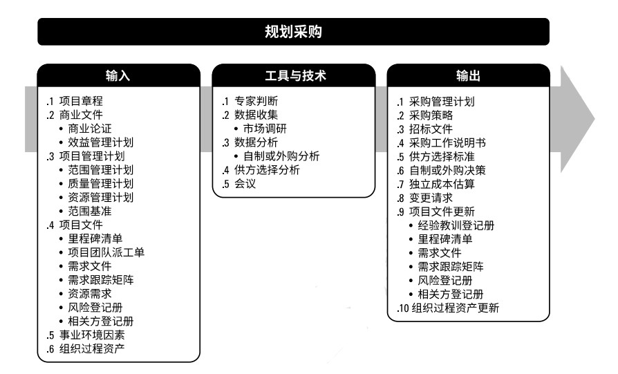
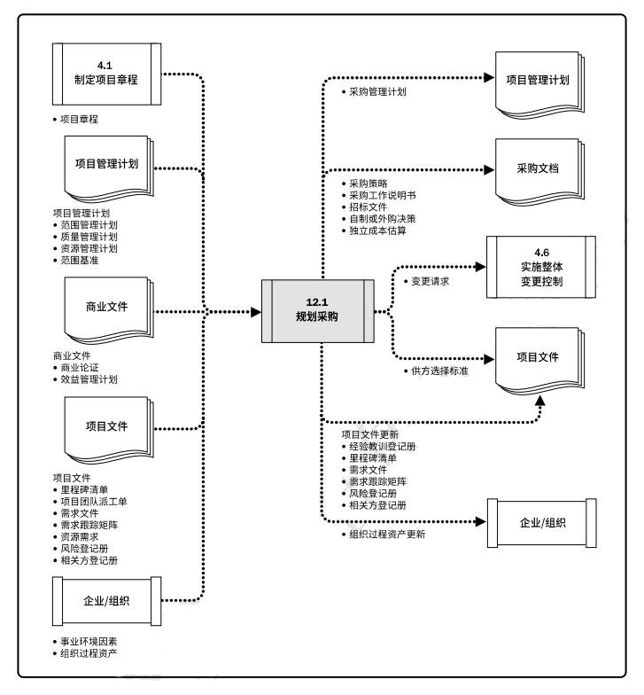
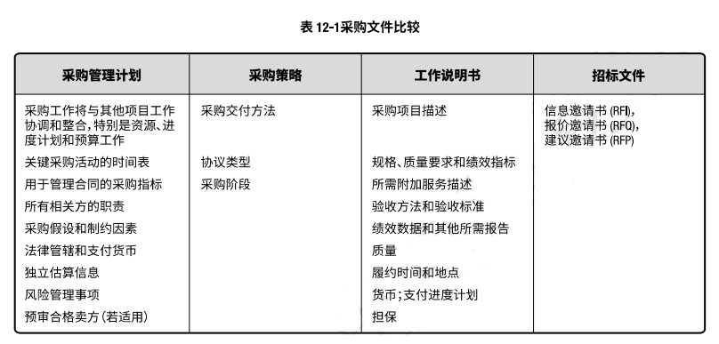
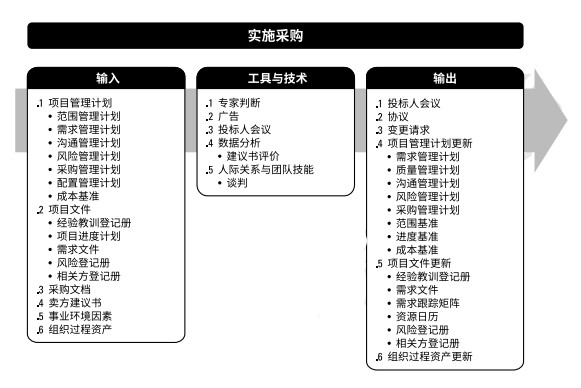
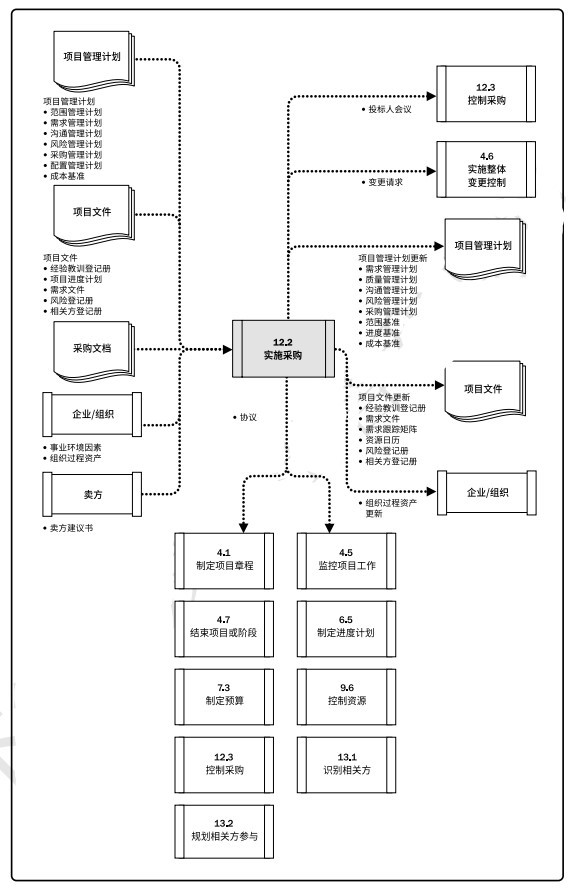

# 项目采购管理
项目采购管理包括从项目外部采购或获取所需产品、服务或成果的各个过程。项目采购管理包括编制和管理协议所需的管理和控制过程，例如，合同、订购单、协议备忘录(MOA)，或服务水平协议(SLA)。被授权采购项目所需货物和(或)服务的人员可以是项目团队、管理层或组织采购部的成员。  
项目采购管理过程包括：  
+ **12.1 规划采购管理** - 记录项目采购决策、明确采购方法，及识别潜在卖方的过程。  
+ **12.2 实施采购** - 获取卖方应答、选择卖方并授予合同的过程。  
+ **12.3 控制采购** - 管理采购关系、监督合同绩效、实施必要的变更和纠偏，以及关闭合同的过程。  

  

与采购过程相关的重大法律义务和惩罚，通常超出大多数其他的项目管理过程。通常情况下，项目经理无权签署对组织有约束力的法律协议，这项工作仅由具备相关职权的人员执行。  

项目采购管理过程涉及到用协议来描述买卖双方之间的关系。合同签署的方法和合同本身应提现可交付成果或所需人力投入的简单性或复杂性，其书写形式也应符合当地、所在国或国际法中关于合同签署的规定。  

合同应明确说明预期的可交付成果和结果，包括从卖方到买方的任何知识转移。合同中未规定的任何事项则不具法律强制力。  

采购合同中包括条款和条件，也可包括买方就卖方应实施工作或应交付产品的其他规定。  

虽然所有项目文件可能都要经过某种形式的审查与批准，但是，鉴于其法律约束力，合同或协议需要经过更多的审批程序，而且通常会涉及到法务部。在任何情况下，审批程序的主要目标都是确保合同充分描述将由卖方提供的产品、服务或成果，且符合法律法规关于采购的要求。  

在合同生命周期中，卖方首先是投标人，然后是中标人，之后是签约供应商或供货商。中标人可将所承揽的工作当作一个项目加以管理。    

在小型组织或初创企业，以及未设置购买、合同或采购部门的组织，项目经理可以拥有采购职权，能够直接谈判并签署合同(分散式采购)。在更成熟的组织中，由专设部门开展实际的采购和合同签署工作，即采购、谈判和签署合同(集中式采购)。  
裁剪项目采购管理过程应考虑的因素包括但不限于：  
+ 采购的复杂性。  
+ 物理地点。
+ 治理和法规环境。
+ 承包商的可用性。  

## 12.1 规划采购管理
规划采购管理是记录项目采购决策、明确采购方法，及识别潜在卖方的过程。主要作用是，确定是否从项目外部获取货物和服务，如果是，则还要确定将在什么时间、以什么方式获取什么货物和服务。货物和服务可从执行组织的其他部门采购，或者从外部渠道采购。本过程仅开展一次或仅在项目的预定义点开展。  

  

  

应该在规划采购管理过程的早期，确定与采购有关的角色和职责。项目经理应确保在项目团队中配备具有所需采购专业知识的人员。典型的步骤可能有：  
+ 准备采购工作说明书(SOW)或工作大纲(TOR)；
+ 准备高层级的成本估算，制定预算；
+ 发布招标广告；
+ 确定合格卖方的短名单；
+ 准备斌发布招标文件；
+ 由卖方准备并提交建议书；
+ 对建议书开展技术(包括质量)评估；
+ 对建议书开展成本评估；
+ 准备最终的综合评估报告(包括质量及成本)，选出中标建议书；
+ 结束谈判，买方和卖方签署合同。  

### 12.1.1 规划采购管理：输入
#### 12.1.1.1 项目章程
项目章程包括目标、项目描述、总体里程碑，以及预先批准的财务资源。  

#### 12.1.1.2 商业文件
包括：  
+ 商业论证。采购策略需要和商业论证保持一致，以确保商业论证的有效性。  
+ 收益管理计划。收益管理计划描述应在何时产出具体的项目收益，这将影响采购日期和合同条款的确定。  

#### 12.1.1.3 项目管理计划
+ 范围管理计划。范围管理计划说明如何在项目的实施阶段管理承包商的工作范围。  
+ 质量管理计划。质量管理计划包含项目需要遵循的行业标准与准则。这些标准与准则应写入招标文件，并将最终在合同中引用。也可用于供应商资格预审，或作为供应商甄选标准的一部分。  
+ 资源管理计划。资源管理计划包括关于哪些资源需要采购或租赁的信息，以及任何可能影响采购的假设条件或制约因素。  
+ 范围基准。范围基准包含范围说明书、WBS和WBS词典。在项目早期，项目范围可能仍要继续演进。应该针对项目范围中已知的工作，编制工作说明书(SOW)和工作大纲(TOR)。  

#### 12.1.1.4 项目文件
+ 里程碑清单。重要里程碑清单说明卖方需要在何时交付成果。  
+ 项目团队派工单。项目团队派工单包含关于项目团队技能和能力的信息，以及他们可用于支持采购活动的时间。如果不具备开展采购活动的能力，则需要外聘人员或对现有人员进行培训。  
+ 需求文件。可能包括：卖方需要满足的技术要求；具有合同和法律意义的需求，以及其他非技术要求。  
+ 需求跟踪矩阵。需求跟踪矩阵将产品需求从其来源连接到能满足需求的可交付成果。  
+ 资源需求。资源需求包含关于某些特定需求的信息，如可能需要采购的团队及实物资源。  
+ 风险登记册。风险登记册列明风险清单，以及风险分析和风险应对规划的结果。有些风险应通过采购协议转移给第三方。  
+ 相关方登记册。相关方登记册提供有关项目参与者及其项目利益的详细信息，包括监管机构、合同签署人员和法务人员。  

#### 12.1.1.5 事业环境因素
包括但不限于：市场条件；可从市场获得的产品、服务和成果；卖方，包括其以往绩效或声誉；关于产品、服务和成果的典型条款和条件，或适用于特定行业的典型条款和条件；特殊的当地要求；关于采购的法律建议；合同管理系统，包括合同变更控制程序；已有的多层级供应商系统；财务会计和合同支付系统。  

#### 12.1.1.6 组织过程资产
组织使用的各种合同协议类型会影响规划采购管理过程的决策。

### 12.1.2 规划采购管理：工具和技术
#### 12.1.2.1 专家判断

#### 12.1.2.2 数据收集
包括但不限于市场调研。市场调研包括考察行业情况和具体卖方的能力。  

#### 12.1.2.3 数据分析
包括但不限于自制或外购分析。自制或外购分析用于确定某项工作或可交付成果最好由项目团队自行完成，还是应该从外部采购。

#### 12.1.2.4 供方选择分析
在确定选择方法前，有必要审查项目竞争性需求的优先级。常用的选择方法包括：  
+ **最低成本**。最低成本法适用于标准化或常规采购。此类采购有成熟的实践与标准，有具体明确的预期成果，可以用不同的成本来取得。  
+ **仅凭资质**。仅凭资质的选择方法适用于采购价值相对较小，不值得花时间和成本开展完整选择过程的情况。  
+ **基于质量或技术方案得分**。邀请一些公司提交建议书，同时列明技术和成本详情；如果技术建议书可以接受，再邀请他们进行合同谈判。  
+ **基于质量和成本**。在基于质量和成本的方法中，成本也是用于选择卖方的一个考虑因素。  
+ **独有来源**。买方要求特定卖方准备技术和财务建议书，然后针对建议书开展谈判。没有竞争，仅在适当理由时才可采用。  
+ **固定预算**。固定预算法要求在建议邀请书中向受邀的卖方披露可用预算，然后在此预算内选择技术建议书得分最高的卖方。  

#### 12.1.2.5 会议
与潜在投标人的信息交流会。  

### 12.1.3 规划采购管理：输出
#### 12.1.3.1 采购管理计划
采购管理计划包含要在采购过程中开展的各种活动。应该记录是否要开展国际竞争性招标、国内竞争性招标、当地招标等。  

#### 12.1.3.2 采购策略
一旦完成自制或外购分析，并决定从项目外部渠道采购，就应制定一套采购策略。应该在采购策略中规定项目交付方法、具有法律约束力的协议类型，以及如何在采购阶段推动采购进展。  

#### 12.1.3.3 招标文件
招标文件用于向潜在卖方征求建议书。如果主要依据价格来选择卖方，通常使用标书、投标或报价等术语；如果其他考虑因素至关重要，则通常使用建议书之类的术语。  
取决于所需的货物或服务，招标文件可以是**信息邀请书(RFI)**、**报价邀请书(RFQ)**、**建议邀请书(RFP)**，或其他适当的采购文件。  

买方拟定的采购文件不仅应便于潜在卖方做出准确、完整的应答，还要便于买方对卖方应答进行评估。采购文件会包括规定的应答格式、相关的采购工作说明书，以及所需的合同条款。  

#### 12.1.3.4 采购工作说明书
根据项目范围基准，为每次采购编制工作说明书(SOW)，仅将要包含在相关合同中的那一部分项目范围进行定义。工作说明书的内容包括：规格、所需数量、质量水平、绩效数据、履约期间、工作地点和其他要求。  

#### 12.1.3.5 供方选择标准
在确定评估标准时，卖方要努力确保选出的建议书将提供最佳质量的所需服务。  

#### 12.1.3.6 自治或外购决策

#### 12.1.3.7 独立成本估算
对于大型的采购，采购组织可以自行准备独立估算，或聘用外部专业估算师做出成本估算，并将其作为评价卖方报价的对照基准。  

#### 12.1.3.8 变更请求
关于采购货物、服务或资源的决策，可能导致变更请求；规划采购期间的其他决策，也可能导致变更请求。

#### 12.1.3.9 项目文件更新
经验教训登记册；里程碑清单；需求文件；风险登记册；相关方登记册。  

#### 12.1.3.10 组织过程资产更新
包括但不限于：关于合格卖方的信息。  

  

## 12.2 实施采购
实施采购是获取卖方应答、选择卖方并授予合同的过程。主要作用是，选定合格卖方并签署关于货物或服务交付的法律协议。最后成果是签订的协议，包括正式合同。本过程应根据需要在整个项目期间定期开展。  

  

### 12.2.1 实施采购：输入
#### 12.2.1.1 项目管理计划
范围管理计划；需求管理计划；沟通管理计划；风险管理计划；采购管理计划；配置管理计划；成本基准。  

#### 12.2.1.2 项目文件
经验教训登记册；项目进度计划；需求文件；风险登记册；相关方登记册。  

#### 12.2.1.3 采购文档
招标文件；采购工作说明书；独立成本估算；供方选择标准。  

#### 12.2.1.4 卖方建议书

#### 12.2.1.5 事业环境因素

#### 12.2.1.6 组织过程资产

### 12.2.2 实施采购：工具与技术
#### 12.2.2.1 专家判断
#### 12.2.2.2 广告
#### 12.2.2.3 投标人会议
又称承包商会议、供应商会议或投标前会议。  
#### 12.2.2.4 数据分析
建议书分析。
#### 12.2.2.5 人际关系与团队技能
谈判。  

### 12.2.3 实施采购：输出
#### 12.2.3.1 选定的卖方
#### 12.2.3.2 协议
合同是对双方都有约束力的协议。强制卖方提供规定的产品、服务或成果，强制买方向卖方支付相应的报酬。  
#### 12.2.3.3 变更请求
#### 12.2.3.4 项目管理计划更新
需求管理计划；质量管理计划；沟通管理计划；风险管理计划；采购管理计划；范围基准；进度基准；成本基准。  
#### 12.2.3.5 项目文件更新
经验教训登记册；需求文件；需求跟踪矩阵；资源日历；风险登记册；相关方登记册。  
#### 12.2.3.6 组织过程资产更新

[返回目录](../../00.目录.md)