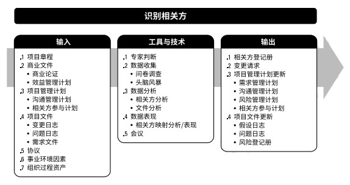
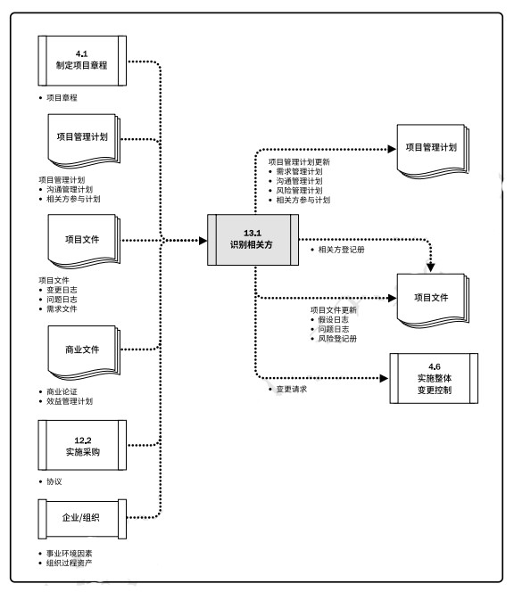
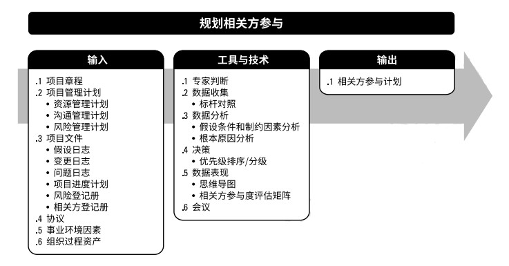
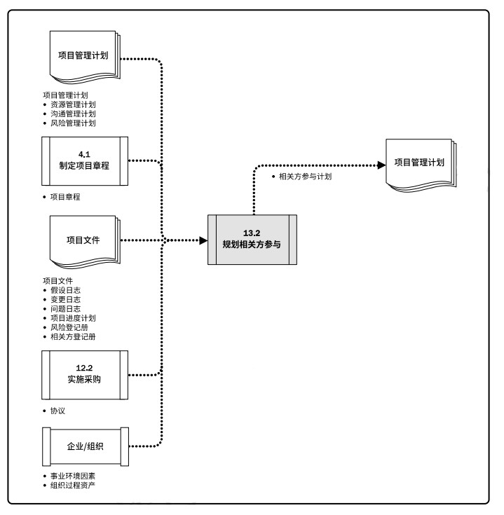
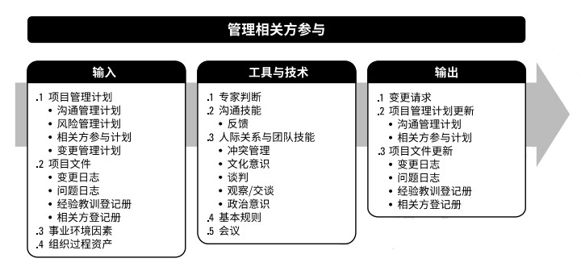
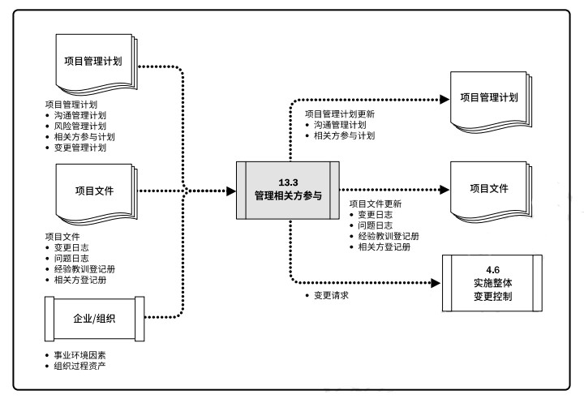
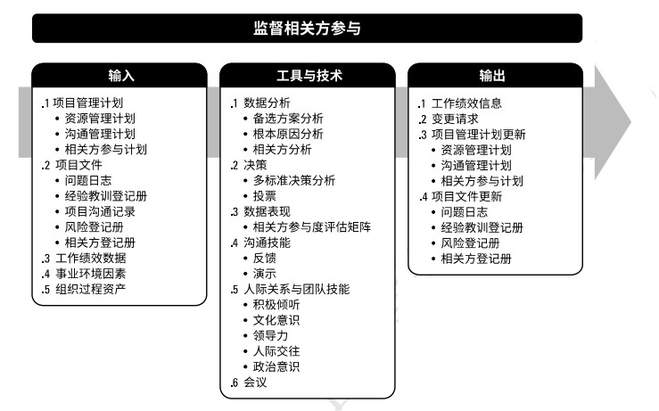
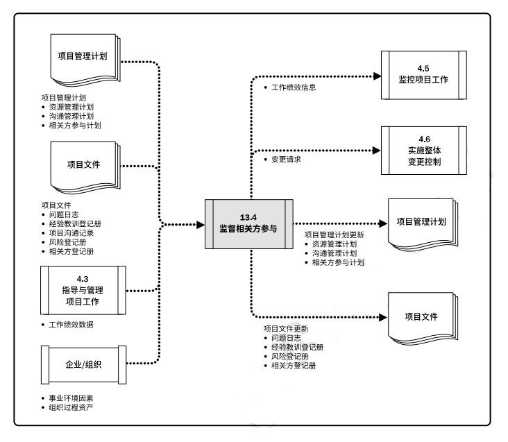

# 项目相关方管理
项目相关方管理的过程是：
+ **识别相关方** - 定期识别项目相关方，分析和记录他们的利益、参与度、相互依赖性、影响力和对项目成功的潜在影响的过程。  
+ **规划相关方参与** - 根据相关方的的需求、期望、利益和对项目的潜在影响，制定项目相关方参与项目的方法的过程。  
+ **管理相关方参与** - 与相关方进行沟通和协作，以满足其需求与期望，处理问题，并促进相关方合理参与的过程。  
+ **监督相关方参与** - 监督项目相关方关系，并通过修订参与策略和计划来引导相关方合理参与项目的过程。  

项目经理和团队正确识别并合理引导所有相关方参与的能力决定着项目的成败。为提高成功的可能性，应该在项目章程被批准、项目经理被委托，以及团队开始组建之后，尽早开始识别相关方并引导相关方参与。

相关方满意度应作为项目目标加以识别和管理。有效引导相关方参与的关键是重视与所有相关方保持持续沟通，以理解他们的需求和期望、处理所发生的问题、管理利益冲突，并促进相关方参与项目决策和活动。  

识别相关方和引导相关方参与的过程需要迭代开展，应该在以下时点开展这些活动：  
+ 项目进入其生命周期的不同阶段；
+ 当前相关方不再与项目工作有关，或在项目的相关方社区中出现了新的相关方成员；
+ 组织内部或更大区域的相关方社区发生重大变化。  

裁剪时应考虑的因素包括但不限于：相关方多样性；相关方关系的复杂性；沟通技术。  

适应型团队会直接与相关方互动，而不是通过层层的管理级别。在整个项目期间保持与相关方社区的互动，有利于降低风险、建立信任和尽早做出项目调整，从而节约成本，提高项目成功的可能性。  

为加快组织内部和组织之间的信息分享，敏捷型方法提倡高度透明。

## 13.1 识别相关方
识别相关方是定期识别项目相关方，分析和记录他们的利益、参与度、相互依赖性、影响力和对项目成功的潜在影响的过程。主要作用是，是项目团队能够建立对每个相关方或相关方群体的适度关注。本过程应根据需要在整个项目期间定期开展。  

### 13.1.1 识别相关方：输入
#### 13.1.1.1 项目章程
项目章程会列出关键相关方清单，还可能包含与相关方职责有关的信息。  
#### 13.1.1.2 商业文件
商业论证；收益管理计划。  
#### 13.1.1.3 项目管理计划
沟通管理计划；相关方参与计划。
#### 13.1.1.4 项目文件
变更日志；问题日志；需求文件。  
#### 13.1.1.5 协议
#### 13.1.1.6 事业环境因素
#### 13.1.1.7 组织过程资产

### 13.1.2 识别相关方：工具与技术
#### 13.1.2.1 专家判断
#### 13.1.2.2 数据收集
问卷调查；头脑风暴。  
#### 13.1.2.3 数据分析
相关方分析；文件分析。  
#### 13.1.2.4 数据表现
相关方映射分析/表现是一种利用不同方法对相关方进行分类的方法。常见的分类方法包括：  
+ 权利利益方格、权利影响方格，或作用影响方格。
+ 相关方立方体。
+ 凸显模型。
+ 影响方向。
+ 优先级排序。  

#### 13.1.2.5 会议

### 13.1.3 识别相关方：输出
#### 13.1.3.1 相关方登记册
相关方登记册记录关于已识别相关方的信息，包括但不限于：
+ 身份信息。
+ 评估信息。
+ 相关方分类。

#### 13.1.3.2 变更请求
#### 13.1.3.3 项目管理计划更新
需求管理计划；沟通管理计划；风险管理计划；相关方参与计划。  
#### 13.1.3.4 项目文件更新
假设日志；问题日志；风险登记册。  

## 13.2 规划相关方参与
规划相关方参与是根据相关方的需求、期望、利益和对项目的潜在影响，制定项目相关方参与项目的方法的过程。主要作用是，提供与相关方进行有效互动的可行计划。本过程应根据需要在整个项目期间定期开展。  

  

会触发相关方参与计划更新的典型情况包括但不限于：  
+ 项目新阶段开始；
+ 组织结构或行业内部发生变化；
+ 新的个人或群体成为相关方，现有相关方不再是相关方社区的成员，或特定相关方对项目成功的重要性发生变化；
+ 其他项目过程的输出导致需要重新审查相关方参与策略。  

### 13.2.1 规划相关方参与：输入
#### 13.2.1.1 项目章程
#### 13.2.1.2 项目管理计划
资源管理计划；沟通管理计划；风险管理计划。
#### 13.2.1.3 项目文件
假设日志；变更日志；问题日志；项目进度计划；风险登记册；相关方登记册。
#### 13.2.1.4 协议
#### 13.2.1.5 事业环境因素
#### 13.2.1.6 组织过程资产

### 13.2.2 规划相关方参与：工具与技术
#### 13.2.2.1 专家判断
#### 13.2.2.2 数据收集
标杆对照。
#### 13.2.2.3 数据分析
假设条件和制约因素分析；根本原因分析。
#### 13.2.2.4 决策
#### 13.2.2.5 数据表现
思维导图；相关方参与度评估矩阵（不了解型、抵制型、中立型、支持型、领导型）。
#### 13.2.2.6 会议

### 13.2.3 规划相关方参与：输出
#### 13.2.3.1 相关方参与计划
相关方参与计划确定用于促进相关方有效参与决策和执行的策略和行动。

## 13.3 管理相关方参与
管理相关方参与是与相关方进行沟通和协作以满足其需求与期望、处理问题，并促进相关方合理参与的过程。主要作用是，让项目经理能够提高相关方的支持，并尽可能降低相关方的抵制。本过程需要在整个项目期间开展。  

管理相关方参与有助于确保相关方明确了解项目目的、目标、收益和风险，以及他们的贡献将如何促进项目成功。  

### 13.3.1 管理相关方参与：输入
#### 13.3.1.1 项目管理计划
沟通管理计划；风险管理计划；相关方参与计划；变更管理计划。  
#### 13.3.1.2 项目文件
变更日志；问题日志；经验教训登记册；相关方登记册。  
#### 13.3.1.3 事业环境因素
#### 13.3.1.4 组织过程资产

### 13.3.2 管理相关方参与：工具与技术
#### 13.3.2.1 专家判断
#### 13.3.2.2 沟通技能
项目管理团队应该使用反馈机制，来了解相关方对各种项目管理活动和关键决策的反应。反馈的收集方式包括但不限于：正式与非正式对话；问题识别和讨论；会议；进展报告；调查。  
#### 13.3.2.4 人际关系与团队技能
冲突管理；文化意识；谈判；观察和交谈；政治意识。  
#### 13.3.2.5 基本规则
根据团队章程中定义的基本规则，来明确项目团队成员和其他相关方应该采取什么行为去引导相关方参与。  
#### 13.3.2.6 会议

### 13.3.3 管理相关方参与：输出
#### 13.3.3.1 变更请求
#### 13.3.3.2 项目管理计划更新
沟通管理计划；相关方参与计划。
#### 13.3.3.4 项目文件更新
变更日志；问题日志；经验教训登记册；相关方登记册。  

## 13.4 监督相关方参与
监督相关方参与是监督项目相关方关系，并通过修订参与策略和计划来引导相关方合理参与项目的过程。主要作用是，随着项目进展和环境变化，维持或提升相关方参与活动的效率和效果。本过程需要在整个项目期间开展。  

  

### 13.4.1监督相关方参与：输入
#### 13.4.1.1 项目管理计划
资源管理计划；沟通管理计划；相关方参与计划。  
#### 13.4.1.2 项目文件
问题日志；经验教训登记册；项目沟通记录；风险登记册；相关方登记册。  
#### 13.4.1.3 工作绩效数据
#### 13.4.1.4 事业环境因素
#### 13.4.1.5 组织过程资产

### 13.4.2 监督相关方参与：工具与技术
#### 13.4.2.1 数据分析
备选方案分析；根本原因分析；相关方分析。  
#### 13.4.2.2 决策
多标准决策分析；投票。  
#### 13.4.2.3 数据表现
相关方参与度评估矩阵。  
#### 13.4.2.4 沟通技能
反馈；演示。  
#### 13.4.2.5 人际关系与团队技能
积极倾听；文化意识；领导力；人际交往；政治意识。  
#### 13.4.2.6 会议

### 13.4.3 监督相关方参与：输出
#### 13.4.3.1 工作绩效信息
#### 13.4.3.2 变更请求
#### 13.4.3.3 项目管理计划更新
资源管理计划；沟通管理计划；相关方参与计划。  
#### 13.4.3.4 项目文件更新
问题日志；经验教训登记册；风险登记册；相关方登记册。  

[返回目录](../../00.目录.md)